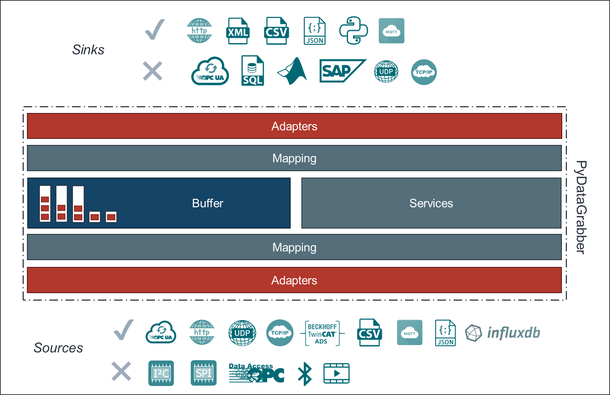
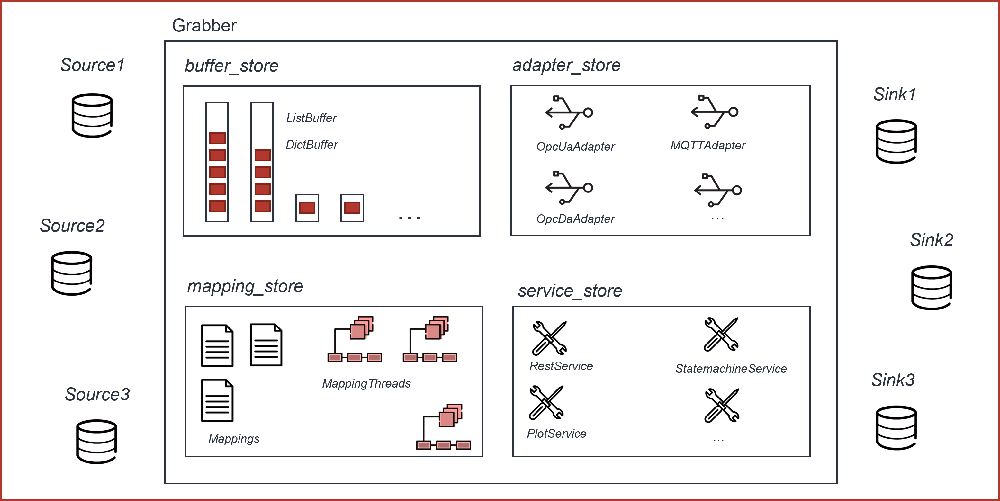

# PyDataAgents

<br>is a IIoT python framework to generate autonomous Data Agents for common industrial 
protocols, data sources and sinks or interaction with cloud services such as LLM API's, Microsoft Graph and more.<br>
Examples:<br>
- OPCUA
- ADS
- TCP/IP, UDP and SERIAL
- MQTT
- INFLUXDB

## architecture
the core element of the framework is a [(data)agent](pydag/agents/Agents.py)
<br>an agent can consists of one or more of the following [AgentElements](pydag/agents/AgentElement.py):
- adapters
- buffers
- mappings
- services

<br>each [AgentElement](pydag/agents/AgentElement.py) is dedicated for a special task within the data agents framework
<br>these tasks are highlighted below

### Agent
In order to create a `Agent` application, you create a `Agent` object with one or more of the elements described in the following sections.
The `Agent` application follows a strict lifecycle, when being initialized and started.

```python
from pydag.agents.Agent from Agent

agent = Agent()
agent.id = "G1"

agent.add_buffer(...) # add a buffer

agent.add_adapter(...) # add an adapter

agent.add_mapping(...) # add an mapping

agent.add_service(...) # add a service

agent.start_blocking() # starts a agent application and blocks until finished (runs forever)
# alterantive
# agent.start()

```

### AgentElement
All elements within a `Agent` application are derived from `AgentElement`.
<br>This class defines basic interface functions, that are inherited from each subclass and can be extended:
- install(agent : `Agent`)
- deinstall(agent : `Agent`)
- save()
- load()

The parent class also ensures a unique identifier for each `AgentElement` and the type declaration (fully qualified class path).
All `AgentElement` classes are supposed to be annotated with `@dataclass` and `field` declarations for their respective configuration properties. If these are used correctly, the properties can be set via YAML configuration files on startup or API and the method `config_options()` is exporting the configuration properties where needed. These properties are also used for auto-generated documentation.

### Buffer
an overview of all available buffers and their usage is given [here](docs/Buffers.md)
<br>A `Buffer` is the central element for data streaming and temporary storage inside a `Agent` application.
<br>All `Buffer`s follow the FiFo-principle and are specified with a maximum `capacity` and datatypes (optional).
<br>Whenever data is transfered, it moves through a buffer.
<br>All `Buffer`'s adhere to the same interface:

```python
from pydag.buffers.ListBuffer from ListBuffer

buffer = ListBuffer()
buffer.id = "BUF-1"
buffer.capacity = 10
buffer.datatype = "FLOAT"
buffer.description = "this is a float buffer"
buffer.unit = "mA"
buffer.initial_values = [0.02, 0.089]

elements = [1.0, 2.23, 9.01]
buffer.push(elements) # push new elements to buffer

buffer.data(n=0, persistent=True) # get the buffers data, or n samples, with persistent True/False you specify whether to keep the elements n buffer the return type depends on the buffer implementation

buffer.size() # returns the size of the buffer --> int: number of samples
       
buffer.data_with_meta(n = 0, persistent = True): # returns the buffer data and all its meta data inside a defined json schema as dictionary

```

```python
from pydag.buffers.DictBuffer from DictBuffer

buffer = DictBuffer()
buffer.id = "BUF-1"
buffer.capacity = 10
buffer.datatype = "FLOAT"
buffer.description = "this is a float buffer"
buffer.unit = "mA"
buffer.initial_values = {"A": [0.02], "B": [0.089]}

elements = {"A": 1.89, "B": 423.09}
buffer.push(elements) # push new elements to buffer

buffer.data(n=0, persistent=True) # get the buffers data, or n samples, with persistent True/False you specify whether to keep the elements n buffer the return type depends on the buffer implementation

buffer.size() # returns the size of the buffer --> int: number of samples
       
buffer.data_with_meta(n = 0, persistent = True): # returns the buffer data and all its meta data inside a defined json schema as dictionary

```

### Adapter
an overview of all available adapters and their usage is given [here](docs/Adapters.md)
<br>All `Adapter`'s adhere to the same composition of interfaces and their methods.
Every `Adapter` is initialized, installed, connected/disconnected and then depending on source or sink interaction: reads/subscribes from sources or writes/publishes to sinks. Therefor an Adapter can inherit from the following interfaces (abstract super classes):
- ReadAdapter
- WriteAdapter
- SubscribeAdapter
- PublishAdapter

It is paramount, that `Adapter` methods are always used in the right order. Within a `Agent` application, this is made sure by design, but when used outside, it must be taken care of by the developer.
<br>The following list outlines the correct order of method calls of an adpater:
- __init__ or __post_init__ (done by constructor call)
- install(...)
- connect()
- read_from_source(...) / write_to_sink(...) / subscribe(...) / publish(...)
- disconnect()
- deinstall(...)

<br>Here are some example workflows for the usage of an `Adapter`:

```python
from pydag.adapters.csv.CSVReadAdapter from CSVReadAdapter

adapter = CSVReadAdapter()
adapter.id = "CSV1",
adapter.file_path="path/to/file.txt",
adapter.delimiter=';',
adapter.has_header=True,
adapter.auto_detect=True,
adapter.force_numeric=True
adapter.mode = "LOOP"

adapter.install()

adapter.connect()

adapter.read_from_source(buffers, addresses, n)

adapter.disconnect()

adapter.deinstall()

```

```python
from pydag.adapters.csv.CSVWriteAdapter from CSVWriteAdapter

adapter = CSVWriteAdapter()
adapter.id = "CSV2",
adapter.folder="path/to/folder"
adapter.delimiter = ";"

adapter.install()

adapter.connect()

adapter.write_to_sink(buffers, addresses, n, persistent)

adapter.disconnect()

adapter.deinstall()

```

```python
from pydag.adapters.mqtt.MQTTAdapter from MQTTAdapter

adapter = MQTTAdapter()
adapter.id = "MQTT1"
adapter.endpoint = "localhost"
adapter.port = 1883
adapter.qos = 0

adapter.install()

adapter.connect()

adapter.subscribe(buffers, addresses, sampling_period, n)

adapter.disconnect()

adapter.deinstall()

```

```python
from pydag.adapters.* from *

adapter = <PublishAdapter>()
adapter.id = "PA1"

adapter.install()

adapter.connect()

adapter.publish(buffers, addresses, sampling_period, n, persistent)

adapter.disconnect()

adapter.deinstall()

```

### Mapping
an overview of all available mappings and their usage is given [here](docs/Mappings.md).
<br>In general a `Mapping` defines the interaction between an `Adapter` and one or more `Buffer`s in term of how often, how many samples and which data/information (`addresses`) in the source or sink are being accessed.
<br>The mapping defines this interaction and is used as data model to instantiate a background thread that runs for every specified `Mapping` and acquires or transfers the data from `Buffer`s to or from source or sinks. 

```python
from pydag.mappings.Mapping from Mapping

m1 = Mapping()
m1.id = "M1"
m1.adapter_id = "MQTT1"
m1.addresses = ["signals/sine", "signals/linear"]
m1.buffer_ids = ["SINE1", "LINEAR1"]
m1.thread_type = ThreadType.MILLI_SECOND.value
m1.mapping_type = MappingType.WRITE.value
m1.sampling_period = 1000
m1.n = 0
m1.persistent = False
```

### Service
an overview of all available services and their usage is given [here](docs/Services.md)
<br>In general `Service`s are standalone micro applications (services) within the Data `Agent`. Their tasks include observation of resources (like filesystem, an agent itself, ...),  background daemon services (copy files from one folder to another, ...) or the provision of REST API endpoints to monitor or maniplate the `Agent` application.
<br>Each `Service` must adhere to a very simple interface:
- service.start()
- service.stop()
Additionally, all services must spawn as a background task (means the start() method should start the logic in a separate thread), the start() method must be non-blocking

```python
from pydag.services.documents.CopyFileService from CopyFileService

s1 = CopyFileService()
s1.id = "S1"
s1.source_folders = ["c:\fake\path"]
target_folder  = "c:\other\fake\path"]
move = True
older_than_milliseconds = 2000
interval = 3600

s1.start()

...
# something else happens
...

s1.stop()

```


## Installation and Usage
In order to install `pydag` - pyd(ata)ag(ents) use pip:
```python
pip install git+https://github.com/jhillenbrand/PyDataAgents.git

# this will install the default branch, for a specific branch use

pip install git+https://github.com/jhillenbrand/PyDataAgents.git@<branch>

# if the repo was installed already, use an uninstall before installing again

pip uninstall pydag -y; pip install git+https://github.com/jhillenbrand/PyDataAgents.git
```

Project Dependencies can be found in [pyproject.toml](pyproject.toml)


## Examples and Testing
All Unittests and Examples are found in [tests](tests/)
