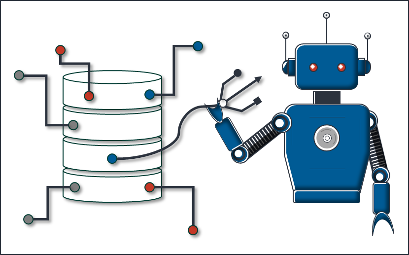

# PyDataGrabber

is a IIoT python framework to generate autonomous Data Acquisition Agents for common industrial 
protocols, data sources and sinks. 
Examples: 
- OPCUA
- ADS
- TCP/IP, UDP and SERIAL
- MQTT
- INFLUXDB

## architecture
the core element of the framework is a [(data)grabber](pydatagrabber/grabbers/Grabber.py)
a grabber can consists of one or more of the following [GrabberElements](pydatagrabber/grabbers/GrabberElement.py):
- adapters
- buffers
- mappings
- services

 each [GrabberElement](pydatagrabber/grabbers/GrabberElement.py) is dedicated for a special task within the datagrabber framework
 these tasks are highlighted below
### Grabber

### Adapter
an overview of all available adapters and their usage is given [here](docs/Adapters.md)

### Buffer
an overview of all available buffers and their usage is given [here](docs/Buffers.md)

### Mapping
an overview of all available mappings and their usage is given [here](docs/Mappings.md)

### Service
an overview of all available services and their usage is given [here](docs/Services.md)
