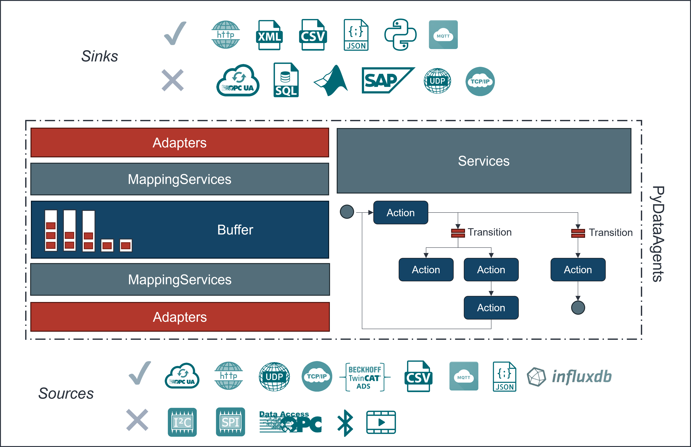

# PyDataAgents

<br>is an IIoT Python framework to build autonomous Data Agents for common industrial protocols
(ADS, serial, TCP/IP), data sources (OPC UA, MQTT), and sinks (InfluxDB, SQL, SQLite), as well as cloud services such as LLM APIs, Microsoft Graph, and more.<br>



DataAgents are autonomous software robots that interact with industrial data systems (e.g. Filesysten, ERP, MES, SCADA, historians, PLC/robot controllers) through openly accessible APIs.
Their primary purpose is to automate data-centric work such as data transformation, data visualization, process supervision, and other intelligent actions across connected systems.
DataAgents consist of standardized building blocks that are assembled to form a software robot.

Like physical robots in production, DataAgents mainly operate autonomously in the background to increase efficiency, consistency, and speed—executing routine tasks, monitoring conditions, and triggering actions without continuous human intervention.


Example use-cases:

*Sensor-data preprocessing for dashboards*
Continuously ingest sensor streams, clean and aggregate the data (e.g., filtering outliers, resampling), compute KPIs, and publish the results to a dashboard or BI layer.

*Document synchronization with classification and metadata enrichment*
Sync documents between two file systems (or DMS/SharePoint/S3), automatically classify file types and content, extract key fields (e.g., order number, supplier, machine ID), and write standardized metadata back to the target system.

*Machine-condition classification (OK/NOK) from controller signals*
Read PLC or machine controller values, apply rule-based or ML-based thresholds, label each cycle as OK/NOK, and store results for traceability and quality reporting.

*Object recognition with automated database update*
Identify objects from camera images or scanner data, map them to a product/material class, and write the classification result into an ERP/MES database for tracking and downstream processing.

*Robot/IoT sensor integration with real-time transformation*
Connect robot sensors to an external information system, transform units and formats, enrich with context (cell, shift, work order), and route the data to the correct endpoint (ERP/MES/historian).

*Automated anomaly detection with alerting and ticket creation*
Monitor process signals and detect anomalies. When detected, automatically notify responsible teams.

*Predictive maintenance feature generation and scheduling*
Extract relevant features from vibration/temperature/current signals, update a predictive model and automatically schedule inspections or maintenance actions in the maintenance system based on risk thresholds.

## Important Concepts
- `Agent` lifecycle:
  An `Agent` installs all registered elements, connects adapters, starts services via `release(...)`, and can be shut down cleanly via `terminate()`.
- `Buffer` as data backbone:
  Buffers are the primary data exchange mechanism between adapters, services, and nodes.
- `Adapter` interaction modes:
  Adapters follow a consistent interface model: `read`, `write`, `subscribe`, and `publish`.
- `Service` concept:
  Services are long-running, usually background components (e.g., REST APIs, schedulers, observers, model/tool providers) that encapsulate reusable runtime capabilities.
- `Node` / `Action` concept:
  Nodes represent compact workflow steps. `Action` nodes execute tasks, `Transition` nodes evaluate flow conditions, and both are composed to build deterministic automation pipelines.
- `MappingService` as orchestrator:
  `MappingService` links adapters and buffers and executes recurring data transfer logic.
- `StatemachineService` for workflows:
  Complex automation flows are built from small `Action` and `Transition` nodes.


## How to Contribute?
Have a look at [Contribute.md](Contribute.md)


## Architecture
The core element of the framework is a [(data)agent](pydag/agents/Agent.py).
<br>An agent can consist of one or more of the following [AgentElements](pydag/agents/AgentElement.py):
- buffers
- adapters
- services
- actions and transitions
<br>Each [AgentElement](pydag/agents/AgentElement.py) is dedicated to a specific task within the framework.
<br>These tasks are highlighted below.

### Agent
To create an `Agent` application, instantiate an `Agent` object with one or more of the elements described in the following sections.
The `Agent` application follows a clear lifecycle from initialization to runtime.

```python
from pydag.agents.Agent import Agent

agent = Agent()
agent.id = "G1"

agent.add_buffer(...) # add a buffer
agent.add_adapter(...) # add an adapter
agent.add_service(...) # add a service

buf = agent.get_buffer(id) # get a buffer reference
ad = agent.get_adapter(id) # get an adapter reference
s = agent.get_service(id) # get a service reference

adapters = agent.adapter_store    # get a reference to all adapters stored in a dict[str, Adapter]
buffers = agent.buffer_store    # get a reference to all buffers stored in a dict[str, Buffer]
services = agent.service_store    # get a reference to all services stored in a dict[str, Service]

agent.release() # starts an agent application and blocks until finished (runs forever)

# alternative
agent.release(blocking=False) # non-blocking call

```

### AgentElement
All elements within an `Agent` application are derived from `AgentElement`.
<br>This class defines core functions that should be called by each subclass implementation.
<br>These functions are:
- install(agent : `Agent`): method used to connect the `AgentElement` with its `Agent` and initialize required internal objects
- uninstall(agent : `Agent`): method used to undo any previous installations
- save(): method used to the current `AgentElement` configuration to file (the file is generated with the element's id as filename in current working directory)
- load(): configures the `AgentElement` from file, if a file with the `AgentElement`'s id as filename is present in current working directory
- config_options(): returns all configuration properties as dictionary

<br>In order to ensure a consistent interface and behavior of all `AgentElement`s, a couple of interface methods are defined as abstract, private methods and must be implemented by each subclass:
- _on_install(agent : `Agent`): internal method called by install(...)
- _on_uninstall(agent : `Agent`): internal method called by uninstall(...)

The parent class also ensures a unique identifier for each `AgentElement` and the type declaration (fully qualified class path).
All `AgentElement` classes are supposed to be annotated with `@dataclass` and `field` declarations for their respective configuration properties. If these are used correctly, properties can be set via configuration files or API and the method `config_options()` exports the configuration properties where needed. These properties are also used for auto-generated documentation.

In addition to defining basic interface methods, `AgentElement` classes can also include a `__post_init__()` method that is called after dataclass initialization. This method can be used to initialize internal objects. By convention, `__post_init__()` should contain internal objects required for the specific `AgentElement` but not part of its configuration properties. By convention, all configuration properties should be defined as dataclass fields and internal objects should be initialized in `__post_init__()` with a leading `_`.

### Buffer
An overview of all available buffers and their usage is given [here](pydag/_docs/Buffers.md).
<br>A `Buffer` is the central element for data streaming and temporary storage inside an `Agent` application.
<br>All `Buffer`s follow the FIFO principle and are specified with a maximum `capacity` and optional datatypes.
<br>Whenever data is transferred, it moves through a buffer.
<br>The following methods are the standard way to interact with all `Buffer`s:
- push(elements): method to push new data elements to the buffer
- data(n : int, persistent : bool) -> any: method to retrieve data from the
- size() -> int: method to get the current size of the buffer
- data_with_meta(n : int, persistent : bool) -> dict: method to retrieve data along with all meta data in a defined json schema as dictionary
- clear(): method to clear the buffer content

<br>In order to ensure a consistent interface and behavior of all `Buffer`s, a couple of interface methods are defined as abstract, private methods and must be implemented by each subclass:
- _on_push(elements): internal method called by push(...)
- _on_data(n : int, persistent : bool) -> any: internal method called by data(...)

On top of that, the interface methods from `AgentElement` must be implemented as well (_on_install(...), _on_uninstall(...)).

```python
from pydag.buffers.ListBuffer import ListBuffer

buffer = ListBuffer(
    id = "BUF-1",
    capacity = 10,
    datatype = "FLOAT",
    description = "this is a float buffer",
    unit = "mA",
    initial_values = [0.02, 0.089]
)

buffer.install(agent)

# for a list buffer, only lists of single values of primitives or a single primitive can be pushed
elements = [1.0, 2.23, 9.01]
buffer.push(elements) # push new elements to buffer

buffer.data(n=0, persistent=True) # get buffer data (all or n samples); return type depends on the buffer implementation

buffer.size() # returns the size of the buffer --> int: number of samples
       
buffer.data_with_meta(n = 0, persistent = True) # returns buffer data and metadata in a defined JSON schema

```

```python
from pydag.buffers.DictBuffer import DictBuffer

buffer = DictBuffer(
    id = "BUF-1",
    capacity = 10,
    datatype = "FLOAT",
    description = "this is a float buffer",
    unit = "mA",
    initial_values = {"A": [0.02], "B": [0.089]}
)

buffer.install(agent)

# for a dict buffer, only dictionaries or list of dictionaries can be pushed
elements = {"A": 1.89, "B": 423.09}
buffer.push(elements) # push new elements to buffer

elements = [{"A": 1.89, "B": 423.09}, {"A": 5.67, "B": 123.45}]
buffer.push(elements) # push new elements to buffer

buffer.data(n=0, persistent=True) # get buffer data (all or n samples); return type depends on the buffer implementation

buffer.size() # returns the size of the buffer --> int: number of samples
       
buffer.data_with_meta(n = 0, persistent = True) # returns buffer data and metadata in a defined JSON schema

```

### Adapter
An overview of all available adapters and their usage is given [here](pydag/_docs/Adapters.md).
<br>An `Adapter` is a specialized connector for a single data source or sink. It connects an `Agent` with the respective source/sink and retrieves data from a source or transfers data to a sink using `Buffer`s. You can view adapters as universal plugs for different source/sink systems.
<br>All `Adapter`s adhere to the same interface composition and method flow.
Every `Adapter` is initialized, installed, connected/disconnected and then, depending on source or sink interaction, reads/subscribes from sources or writes/publishes to sinks. Therefore an adapter can inherit from the following interfaces (abstract super classes):
- ReadAdapter
- WriteAdapter
- SubscribeAdapter
- PublishAdapter

It is important that `Adapter` methods are always used in the correct order. Within an `Agent` application this is ensured by design, but when used outside that context it must be handled by the developer.
<br>The following list outlines the correct method order of an adapter:
- install(...)
- connect()
- read_from_source(...) / write_to_sink(...) / subscribe(...) / publish(...)
- disconnect()
- uninstall(...)

<br>The `Adapter` class itself defines the following interface methods, that are common to all `Adapter`s and must be implemented by each subclass:
- _on_install(agent : `Agent`): internal method called by install(...)
- _on_uninstall(agent : `Agent`): internal method called by uninstall(...)
- _on_connect(): internal method called by connect(...)
- _on_disconnect(): internal method called by disconnect(...)
<br>Additionally, depending on the inherited interface(s), the following methods must be implemented as well:
- _on_read(buffers : dict[str, Buffer], addresses : list[str],  n : int): internal method called by read_from_source(...)
- _on_write(buffers : dict[str, Buffer], addresses : list[str],  n : int, persistent : bool): internal method called by write_to_sink(...)
- _on_subscribe(buffers : dict[str, Buffer], addresses : list[str], sampling_period : int, n : int): internal method called by subscribe(...)
- _on_unsubscribe(): internal method called by unsubscribe(...)
- _on_publish(buffers : dict[str, Buffer], addresses : list[str], sampling_period : int, n : int, persistent : bool): internal method called by publish(...)
- _on_unpublish(): internal method called by unpublish(...)


<br>Here are some example workflows for the usage of an `Adapter`:

```python
from pydag.adapters.csv.CsvReadAdapter import CsvReadAdapter

adapter = CsvReadAdapter(
    id = "CSV1",
    file_path="path/to/file.txt",
    delimiter=';',
    has_header=True,
    auto_detect=True,
    force_numeric=True,
    mode = "LOOP"
)

adapter.install()

adapter.connect()

# buffers : dict[str, Buffer]
# addresses : list[str] the schema and content of addresses depends on the adapter implementation
# n : int number of samples to read, 0 means all available samples
adapter.read_from_source(buffers, addresses, n)

adapter.disconnect()

adapter.uninstall()

```

```python
from pydag.adapters.csv.CsvWriteAdapter import CsvWriteAdapter

adapter = CsvWriteAdapter(
    id = "CSV2",
    folder="path/to/folder",
    delimiter = ";"
)

adapter.install()

adapter.connect()

# buffers : dict[str, Buffer]
# addresses : list[str] the schema and content of addresses depends on the adapter implementation
# n : int number of samples to read, 0 means all available samples
# persistent : bool whether to keep the data in the buffer after writing
adapter.write_to_sink(buffers, addresses, n, persistent)

adapter.disconnect()

adapter.uninstall()

```

```python
from pydag.adapters.mqtt.MQTTAdapter import MQTTAdapter

adapter = MQTTAdapter()
adapter.id = "MQTT1"
adapter.endpoint = "localhost"
adapter.port = 1883
adapter.qos = 0

adapter.install()

adapter.connect()

adapter.subscribe(buffers, addresses, sampling_period, n)

adapter.disconnect()

adapter.uninstall()

```

```python
from pydag.adapters.PublishAdapter import PublishAdapter

adapter = PublishAdapter()
adapter.id = "PA1"

adapter.install()

adapter.connect()

adapter.publish(buffers, addresses, sampling_period, n, persistent)

adapter.disconnect()

adapter.uninstall()

```

### Service
An overview of all available services and their usage is given [here](pydag/_docs/Services.md).
<br>In general, `Service`s are standalone micro applications within the `Agent`. Their tasks include observing resources (filesystem, agent state, ...), background daemon services (copy files from one folder to another, ...), providing reusable resources for other `AgentElement`s (browser, vector store, LLM model, ...), or providing REST API endpoints to monitor or manipulate the `Agent` application. `Service`s usually have no direct interaction with other parts of the `Agent` and run in a closed loop.

If one of the following criteria is met, a `Service` should be implemented (instead of a `Node`):
- the process/task is running in the background continuously or on a defined interval
- the process/task needs to access other elements of the `Agent` during runtime (e.g. `Buffer`s, `Adapter`s, etc.); `Node`s do not have access to other `AgentElement`s except for other `Node`s within a `StatemachineService` and the `Agent` itself during `install()`
- the process/task needs to provide an API endpoint for external applications
- optional: the process/task implements a third party library that requires credentials and this object can be reused in other `Node`s

<br>Each `Service` has the methods:
- install(agent : `Agent`): method used to connect the `Service` with its `Agent` and initialize required internal objects
- uninstall(agent : `Agent`): method used to undo any previous installations
- start()
- stop()
Additionally, all services must spawn as a background task (means the start() method should start the logic in a separate thread), the start() method must be non-blocking

<br>In order to ensure a consistent interface and behavior of all `Service`s, a couple of interface methods are defined as abstract, private methods and must be implemented by each subclass:
- _on_install(agent : `Agent`): internal method called by install(...)
- _on_uninstall(agent : `Agent`): internal method called by uninstall(...)
- _on_start(): internal method called by start(...)
- _on_stop(): internal method called by stop(...)


```python
from pydag.services.documents.CopyFileService import CopyFileService

s1 = CopyFileService(
    id = "S1",
    source_folders = ["c:\\fake\\path"],
    target_folder  = "c:\\other\\fake\\path",
    move = True,
    older_than_milliseconds = 2000,
    observing_time = 3600,
    auto_start = True
)

s1.install(agent)
s1.start()

...
# something else happens
...

s1.stop()

```

#### MappingService
A special service is the `MappingService`.
<br>In general a `MappingService` defines the interaction between an `Adapter` and one or more `Buffer`s in terms of how often, how many samples and which data/information (`addresses`) in the source or sink are being accessed.
<br>The mapping defines this interaction and is used as data model to instantiate a background thread that runs for every specified `MappingService` and acquires or transfers data from `Buffer`s to or from source/sinks using their respective `Adapter`s. You can view a `MappingService` as the recipe of a specific data connection to or from a system.

```python
from pydag.services.mappings.MappingService import MappingService

m1 = MappingService(
    id="M1",
    adapter_id="MQTT1",
    addresses=["signals/sine", "signals/linear"],
    buffer_ids=["SINE1", "LINEAR1"],
    thread_type=ThreadType.MILLI_SECOND.value,
    mapping_type=MappingType.WRITE.value,
    observing_time=1000,
    n=0,
    persistent=False,
    auto_start=True
)

# or

m2 = MappingService(
    id="M1",
    addresses=["signals/sine", "signals/linear"],
    thread_type=ThreadType.MILLI_SECOND.value,
    mapping_type=MappingType.WRITE.value,
    observing_time=1000,
    n=0,
    persistent=False
)
m2.set_adapter(adapter)
m2.add_buffer(buf)
# or
m2.set_buffers(buffers)

```


### Nodes - Actions and Transitions
With a special `Service`, called `StatemachineService`, a number of predefined `Action`s and `Transition`s can be executed.
<br>The `StatemachineService` is a `Service` container to define workflows with various small, compact and closed tasks.
<br>Each task, the so called `Action`s are `execute`d based on their graph-based connection (children and parents).
<br>Whether and how often an `Action` is executed, can be controlled via `Transition`s and the connection of the `Action` and `Transition` `Node`s. The execution logic for these `Node`s is based on the Sequential Function Chart logic for PLC's [Wikipedia](https://en.wikipedia.org/wiki/Sequential_function_chart). These `Node`s can be used to define statemachines, workflows, signal processing pipelines, data transformation pipelines and more.
<br>An overview of all `Action`s and `Transition`s is given [here](pydag/_docs/Actions%20and%20Transitions.md)

If one of the following criteria is met, a `Node` should be implemented (instead of a `Service`):
- the process/task is a single, compact task that can be executed and finished quickly (within milliseconds or a few seconds)
- the process/task requires input data from other processes/tasks or generates output data for other processes/tasks
- the process/task needs to be executed based on certain conditions or in a defined order with other processes/tasks (`StatemachineService`)
- the process/task provides data transformations on `Buffer` data (such as FFT, RMS, filtering, etc.)

<br>All `Action`s can be executed by the following method:
- execute()
This method's purpose is to execute the single task that this `Action` was dedicated to. Within the `execute()` implementation, other `AgentElement`s can be accessed (e.g. `Buffer`s, `Adapter`s, etc.). This way `Action`s can retrieve data from previous `Action`s or `Buffer`s, or generate data and store it in `Buffer`s.
<br>All `Transition`s can be executed by using the method:
- check() -> bool

<br>In order to ensure a consistent interface and behavior of all `Node`s, a couple of interface methods are defined as abstract, private methods and must be implemented by each subclass:
- _on_install(agent : `Agent`): internal method called by install(...)
- _on_uninstall(agent : `Agent`): internal method called by uninstall(...)
- _on_execute(): internal method called by execute() (for `Action`s)
- _on_check() -> bool: internal method called by check() (for `Transition`s)

There are the following specialized `Node`s for specific functionalities:
- `BufferNode`: base node type, that provides access to `Buffer`s or provides an internal `Buffer` for data intermediate/temporary storage
- `AdapterNode`: base node type, that provides access to `Adapter`s
- `ServiceNode`: base node type, that provides access to `Service`s
- `TransformNode`: ...
- `LearningNode`: ...


## Installation and Usage
In order to install `pydag` - pyd(ata)ag(ents), use pip:
```bash
pip install git+https://github.com/PyDataAgents/PyDataAgents.git

# this will install the default branch, for a specific branch use

pip install git+https://github.com/PyDataAgents/PyDataAgents.git@<branch>

# if the repo was installed already, use an uninstall before installing again

pip uninstall pydag -y; pip install git+https://github.com/PyDataAgents/PyDataAgents.git
```

Project Dependencies can be found in [pyproject.toml](pyproject.toml)


## Example Applications
PyDataAgents can be used to build a wide variety of applications. Some examples include:
- Watchdogs for filesystem monitoring and automated file processing (e.g. move files, extract metadata, classify content, etc.)
- remote monitoring of testbenches or machines with automated data collection, preprocessing and dashboarding (using Grafana)
- Mail Alerts for Project Management based on ERP data or project management database
- IIoT gateways for data collection, transformation and routing in production environments
or smarthome applications
- CAD configurators for automatic generation of CAD files based on user input and predefined templates (Solidworks, STEP, ...)
- Backends for Web Product Configurators with complex computation engines for automatic generation of product configurations based on user input and predefined templates (e.g. for e-commerce)
- Digital Shadows of Machine Elements with data collection and physics based modeling for predictive maintenance and simulation purposes
- LLM based querying of database content with automated data retrieval
- LLM based document processing with automated document retrieval and information extraction (image to text applications, PDF processing, etc.)
- ... and many more

## Testing
All unit tests and examples are found in [unit](tests/unit) and [regression](tests/regression) folders.

## License
This project is licensed under the MIT License - see the [LICENSE](LICENSE) file for details

## What's new? | Upcoming Features
- prompt based generation of Agents
  in form of executable scripts, a CLI or REST API (as Developer Feature)
