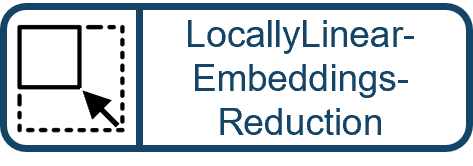

# Actions and Transitions Documentation

## Summary

| Class | Description | Icon |
|-------|-------------|------|
| [`Action`](#action-in-pydagnodesactionpy) |  | 
| [`AdapterNode`](#adapternode-in-pydagnodesadapternodepy) | AdapterNode is a specialized BufferNode that integrates an adapter for data processing.It inherits from BufferNode to manage buffers and provides methods to interact with the adapter. | 
| [`AgentNode`](#agentnode-in-pydagnodesagentnodepy) |  | 
| [`BufferNode`](#buffernode-in-pydagnodesbuffernodepy) |  | 
| [`LearningNode`](#learningnode-in-pydagnodeslearningnodepy) | LearningNode is a base class for elements that require a learning step in their pipeline execution.It extends the TransformNode class and provides additional functionality specific to learning tasks. | 
| [`Node`](#node-in-pydagnodesnodepy) |  | 
| [`ServiceNode`](#servicenode-in-pydagnodesservicenodepy) | A class representing a service node in a state machine.Inherits from Node and adds functionality specific to service nodes. | 
| [`TransformNode`](#transformnode-in-pydagnodestransformnodepy) | Base class for Transformer data elements.This class is intended to be extended by specific transformer implementations. | 
| [`Transition`](#transition-in-pydagnodestransitionpy) | A `Transition` `Node` that defines conditions for state transitions in a state machine.     | 
| [`TriggerAction`](#triggeraction-in-pydagnodestriggeractionpy) | Abstract `Action` `Node`that defines the interface for `Node`s with trigger logic, that are not executed directly within a `StatemachineService`,but are rather started from external events and trigger the execution `StatemachineService`. | 
| [`AdapterReadAction`](#adapterreadaction-in-pydagnodesadaptersadapterreadactionpy) | Action to read data from an adapter. | 
| [`AdapterWriteAction`](#adapterwriteaction-in-pydagnodesadaptersadapterwriteactionpy) | Action to write data with an adapter. | 
| [`BrowserAutomationAction`](#browserautomationaction-in-pydagnodesbrowserbrowserautomationactionpy) |  | 
| [`BrowserClickElementAction`](#browserclickelementaction-in-pydagnodesbrowserbrowserclickelementactionpy) |  | 
| [`BrowserGetElementAction`](#browsergetelementaction-in-pydagnodesbrowserbrowsergetelementactionpy) |  | 
| [`BrowserSetElementAction`](#browsersetelementaction-in-pydagnodesbrowserbrowsersetelementactionpy) |  | 
| [`BrowserUrlNavigateAction`](#browserurlnavigateaction-in-pydagnodesbrowserbrowserurlnavigateactionpy) | `Action` for navigating a Browser Automation Object to a new urlRaises:    NodeException: if referenced `self._service`  is not of type `BrowserAutomationService` | 
| [`AddBufferAction`](#addbufferaction-in-pydagnodesbuffersaddbufferactionpy) | Action to add a buffer to the agent node. | 
| [`BufferEmptyTransition`](#bufferemptytransition-in-pydagnodesbuffersbufferemptytransitionpy) | A transition that checks if specified buffer is empty.If the buffer is empty, the transition is successful. | 
| [`BufferExtractAction`](#bufferextractaction-in-pydagnodesbuffersbufferextractactionpy) | `Action` for extracting data from a specified buffer and to store the extracted data into this buffer.This `Action` can only be applied on if the specified buffer is of type `DictBuffer`. | 
| [`BufferInRangeTransition`](#bufferinrangetransition-in-pydagnodesbuffersbufferinrangetransitionpy) | A transition that compares the current buffer with a target value.If the buffer matches the target, the transition is successful. | 
| [`BufferNotEmptyTransition`](#buffernotemptytransition-in-pydagnodesbuffersbuffernotemptytransitionpy) | A transition that checks if specified buffer is not empty.If the buffer is not empty, the transition is successful. | 
| [`ClearBufferAction`](#clearbufferaction-in-pydagnodesbuffersclearbufferactionpy) |  | 
| [`CompareBufferTransition`](#comparebuffertransition-in-pydagnodesbufferscomparebuffertransitionpy) | A transition that compares the current buffer with a target value.If the buffer matches the target, the transition is successful. | 
| [`CopyBufferAction`](#copybufferaction-in-pydagnodesbufferscopybufferactionpy) | `Action` that copies the entire parent buffer to this `Node`'s `Buffer` whenever executed.The copy procedure makes a deep of all the parent's `Buffer` elements | 
| [`CopyDataAction`](#copydataaction-in-pydagnodesbufferscopydataactionpy) | `Action` that makes a copy of the data in all parent `Buffer`s found amongst this `Node`s parents.If this `Node`'s parents contains more than one `BufferNode`, all data is merged and copied.Before this `Node`s `Buffer` is filled, all other elements are cleared. | 
| [`DataFrameFilterAction`](#dataframefilteraction-in-pydagnodesbuffersdataframefilteractionpy) |  | 
| [`DataToBuffersAction`](#datatobuffersaction-in-pydagnodesbuffersdatatobuffersactionpy) | `Action` that copies data of the `Buffer` specified via `buffer_id` or found in the first `BufferNode` found amongst this `Node`s parents to all the buffers specified via `buffer_ids`.If this `Node`'s parents contain more than one `BufferNode`, only the first is respected. | 
| [`FormatBufferColumnAction`](#formatbuffercolumnaction-in-pydagnodesbuffersformatbuffercolumnactionpy) |  | 
| [`FormattedStringAction`](#formattedstringaction-in-pydagnodesbuffersformattedstringactionpy) | `Action` to compose a formatted string and store it in this `Action`'s bufferusing its parent's buffer to create the new string | 
| [`LinkBufferAction`](#linkbufferaction-in-pydagnodesbufferslinkbufferactionpy) | `Action` that's only function is to link a buffer from agent to the statemachinetherefore an empty execute method is provided | 
| [`SampledSignalAction`](#sampledsignalaction-in-pydagnodesbufferssampledsignalactionpy) |  | 
| [`ShiftMonitoring`](#shiftmonitoring-in-pydagnodesclusteringshiftmonitoringpy) | ShiftMonitoring is a LearningNode that monitors distributional shifts in incoming data. It uses statistical methods to compare the distribution of new data against learned distributions and can identify when a significant shift occurs.Returns the deviation as well as the outlier-decision to the first distribution "A", even if n_distributions > 2. | 
| [`SQLAction`](#sqlaction-in-pydagnodesdbsqlactionpy) | `Action` node to perform SQL operations using the referenced `SQLService`.     | 
| [`IsomapDimReduction`](#isomapdimreduction-in-pydagnodesdimreductionisomapdimreductionpy) | Dimensionality reduction using Isomap algorithm. Mind, that the Algorithms is trained on two dimensional data with shape (n_samples, n_features). Hence sample_length should be larger than the number of dimensions.  | 
| [`LocallyLinearEmbeddingsReduction`](#locallylinearembeddingsreduction-in-pydagnodesdimreductionlocallylinearembeddingsreductionpy) | Dimensionality reduction using LocallyLinearEmbeddings algorithm. Mind, that the Algorithms is trained on two dimensional data with shape (n_samples, n_features). Hence sample_length should be larger than the number of dimensions.  | 
| [`PCADimReduction`](#pcadimreduction-in-pydagnodesdimreductionpcadimreductionpy) | Dimensionality reduction using PCA algorithm. Mind, that the Algorithms is trained on two dimensional data with shape (n_samples, n_features). Hence sample_length should be larger than the number of dimensions.  | 
| [`CompressAction`](#compressaction-in-pydagnodesdocumentscompressactionpy) | `Action` that converts the specified `source_file` to compressed archive file under the new filepath `target_file`         | 
| [`ConvertFile2Base64Action`](#convertfile2base64action-in-pydagnodesdocumentsconvertfile2base64actionpy) |  | 
| [`CopyFilesAction`](#copyfilesaction-in-pydagnodesdocumentscopyfilesactionpy) |  | 
| [`DecompressAction`](#decompressaction-in-pydagnodesdocumentsdecompressactionpy) | `Action` that decompresses the specified `source_file` under the new filepath `target_dir`         | 
| [`DocxTemplateAction`](#docxtemplateaction-in-pydagnodesdocumentsdocxtemplateactionpy) | `Action` for writing data to DOCX template document.buffers of parent elements can be used to populate the docx file, if `buffer_id` or `set_buffer(...)` is specified then only this buffer is used | 
| [`ICalAction`](#icalaction-in-pydagnodesdocumentsicalactionpy) |  | 
| [`ListFilesAction`](#listfilesaction-in-pydagnodesdocumentslistfilesactionpy) |  | 
| [`MoveFilesAction`](#movefilesaction-in-pydagnodesdocumentsmovefilesactionpy) | `Action` that moves files to a new `target_folder`<br>this `Action` either needs a parent `Node` with a `ListBuffer` with filepaths or a reference to a `Buffer` via `buffer_id` or its `buffer`variableRaises:    StatemachineException: if folder does not exist or wrong `Buffer` is provided | 
| [`PlotlifyAction`](#plotlifyaction-in-pydagnodesdocumentsplotlifyactionpy) | `Action` that generates a plotly file based on the data and layout specified and extracted from the specified buffer or its parents `Buffer`s.     | 
| [`ReadCsvAction`](#readcsvaction-in-pydagnodesdocumentsreadcsvactionpy) |  | 
| [`ReadExcelRangeAction`](#readexcelrangeaction-in-pydagnodesdocumentsreadexcelrangeactionpy) |  | 
| [`ReadExcelTableAction`](#readexceltableaction-in-pydagnodesdocumentsreadexceltableactionpy) |  | 
| [`ReadJsonAction`](#readjsonaction-in-pydagnodesdocumentsreadjsonactionpy) |  | 
| [`ReadNpzAction`](#readnpzaction-in-pydagnodesdocumentsreadnpzactionpy) |  | 
| [`ReadXMLAction`](#readxmlaction-in-pydagnodesdocumentsreadxmlactionpy) |  | 
| [`CNN1DAutoencoder`](#cnn1dautoencoder-in-pydagnodesfeatureextractioncnn1dautoencoderpy) | This `DataElement` represents a time series feature extraction model using a 1D CNN Autoencoder. | 
| [`ChronosExtractor`](#chronosextractor-in-pydagnodesfeatureextractionchronosextractorpy) | Chronos Extractor for time series data. Returns 384-dimensional embeddings for each input time series sample using a pretrained Chronos model. | 
| [`PSDExtractor`](#psdextractor-in-pydagnodesfeatureextractionpsdextractorpy) | PSD for time series data. Returns 261-dimensional embeddings for each input time series sample using the Welch method from https://docs.scipy.org/doc/scipy/reference/generated/scipy.signal.welch.html.257 frequency bins + peak frequency + peak power + mean power + std power = 261 features per time series sample. | 
| [`RIFEExtractor`](#rifeextractor-in-pydagnodesfeatureextractionrifeextractorpy) | Random Interval Feature Extractor for time series data.Produces a 320 dimensional feature vector per input time series sample usingsktime's RandomIntervalFeatureExtractor with:    - n_intervals = 64    - features = [np.median, np.std, iqr, np.min, np.max]yielding 64 * 5 = 320 features. Deterministic with random_state=42.Notes:    - No learning required (pure feature extraction).    - Accepts input dictionary with one or multiple keys; each key's value must      be a 1D array-like time series. Generates a single feature vector per key.    - Output keys follow the pattern: "<orig_key>-feature-rife-<i>" where i is the      index (0..255) of the feature.    - The extractor samples random start–end pairs. Depending on the sktime version, intervals that are invalid (e.g. zero or 1-length after an internal constraint) can get skipped. In such cases, the output feature vector is zero-padded to 320 length. | 
| [`ROCKETExtractor`](#rocketextractor-in-pydagnodesfeatureextractionrocketextractorpy) | ROCKET feature extractor.https://www.sktime.net/en/stable/api_reference/auto_generated/sktime.transformations.panel.rocket.Rocket.html | 
| [`TirexExtractor`](#tirexextractor-in-pydagnodesfeatureextractiontirexextractorpy) | This `DataElement` represents a time series feature extraction model using the TiREx framework.Read: https://github.com/NX-AI/tirexfor more information. | 
| [`HttpGetAction`](#httpgetaction-in-pydagnodeshttphttpgetactionpy) |  | 
| [`HttpPostAction`](#httppostaction-in-pydagnodeshttphttppostactionpy) |      | 
| [`HttpPutAction`](#httpputaction-in-pydagnodeshttphttpputactionpy) |      | 
| [`LLMChatAction`](#llmchataction-in-pydagnodesllmllmchatactionpy) | `Action` to chat with an `LLMService` and store the response in its `Buffer`.     | 
| [`LLMImageAnalysisAction`](#llmimageanalysisaction-in-pydagnodesllmllmimageanalysisactionpy) | `Action` to retrieve information from an image and store the response in its `Buffer`.The Action analyses arbitrary images for its content (not only text documents like OCR). Hence it is powerful for image understanding tasks. If you specifically want to extract text as well as its formatting from images, consider using the LLMOCRAction instead.The parent Buffer Node is expected to provide file paths to images or PDFs.The allowed inpus formats for the file paths are:- A fully qualified file path as a string- an image as a Base64-encoded data URL - For OpanAI models: a file ID (created with the Files API (https://platform.openai.com/docs/api-reference/files))The OpenAI API is used.Keep in mind that the provided model must support image inputs, e.g. for OpenAI use "gpt-4o" or "gpt-4o-mini" or "gpt-4.1-mini" or "gpt-4.1" or "gpt-5".For more models and providers refer to their documentation, e.g. OpenAI: https://platform.openai.com/docs/models".The output has the following format:{    "question": <the question asked>,    "answer": <the answer from the LLM>    "filepath": <file path for each processed input>} | 
| [`LLMOCRAction`](#llmocraction-in-pydagnodesllmllmocractionpy) | `Action` to retrieve text from an image or PDF and store the extracted text in its `Buffer`.The parent Buffer Node is expected to provide file paths to images or PDFs.The allowed input formats for the file paths are:- A fully qualified file path as a string- an image as a Base64-encoded data URL The Mistral OCR-3 model is used to extract text from the images or PDFs.For more information about the Mistral OCR-3 model: https://mistral.ai/news/mistral-ocr-3".The output has the following format:{    "documents": <String of extracted text pages creatred from the contents of the origial OCRPageObject returned by Mistral>,    "filepath": <file path for each processed input>}Where the original OCRPageObject has the following format:    {    "pages": [ # The content of each page        {        "index": int, # The index of the corresponding page        "markdown": str, # The main output and raw markdown content        "images": list, # Image information when images are extracted        "tables": list, # Table information when using `table_format=html`        "hyperlinks": list, # Hyperlinks detected        "header": str|null, # Header content when using `extract_header=True`        "footer": str|null, # Footer content when using `extract_footer=True`        "dimensions": dict # The dimensions of the page        }    ],    "model": str, # The model used for the OCR    "document_annotation": dict|null, # Document annotation information when used, visit the Annotations documentation for more information    "usage_info": dict # Usage information    }See https://docs.mistral.ai/capabilities/document_ai/basic_ocr for more details. | 
| [`LLMScriptElement`](#llmscriptelement-in-pydagnodesllmllmscriptelementpy) | `DataElement` to generate Code for data processing using LLM on a specified input     | 
| [`RegressionTransform`](#regressiontransform-in-pydagnodesregressionregressiontransformpy) | Code Service to do Regression on Inputs     | 
| [`ScriptAction`](#scriptaction-in-pydagnodesscriptscriptactionpy) | `Action` for executing a custom script to process data from the parents' `Buffer`s and to store the processed data back into this `Buffer`.<br>The script must be a valid Python code snippet that runs properly.<br>The function takes the current buffer data and injects data from it by the specified `input_keys`.<br>The same way the `Action`returns data by the specified `output_keys` back to its `Buffer`.<br>Note that the script is executed in its own local scope, so variables defined in the script do not interfere with variables outside the script.<br>Also note that all output variables should be converted to primitives (e.g. int, float, str, list, dict) or list of primitives inside the script. Do not leave them as numpy arrays or dataframes. | 
| [`Transform`](#transform-in-pydagnodestransformstransformpy) |  | 
| [`FFTTransform`](#ffttransform-in-pydagnodestransformsfrequencyffttransformpy) |  | 
| [`ZScore`](#zscore-in-pydagnodestransformsstatisticszscorepy) |  | 
| [`NanToNumTransform`](#nantonumtransform-in-pydagnodestransformsutilsnantonumtransformpy) | Transform that replaces NaN and +/-Inf values in each entry with finite numbers (default 0.0).Parameters----------nan_value : float    Value to substitute for NaN.posinf_value : float    Value to substitute for +Inf.neginf_value : float    Value to substitute for -Inf.as_list : bool    If True, output is converted back to list when original value was list-like. | 
| [`ReshapeTransform`](#reshapetransform-in-pydagnodestransformsutilsreshapetransformpy) | `Transform` that reshapes each sample to the specified shape. Sample length is the length of the last dimension of the data, e.g. for time series data, it is the length of the time series.If sample_length is 0, no reshaping is applied. If sample_length is greater than 0, each sample is reshaped to (..., -1, sample_length). That is, the last dimension is reshaped to have the specified sample_length, and the second to last dimension is adjusted accordingly.The other dimensions are kept the same. If the total number of elements in the last dimension is not divisible by sample_length, the remainder is discarded. | 
| [`ScriptTransform`](#scripttransform-in-pydagnodestransformsutilsscripttransformpy) | `Transform` that executes a user-defined script that transforms or computes based on the input data. | 
| [`SplitKeyTransform`](#splitkeytransform-in-pydagnodestransformsutilssplitkeytransformpy) | `Transform` that extracts the specified keys from data dictionary     | 
| [`FileTriggerAction`](#filetriggeraction-in-pydagnodestriggersfiletriggeractionpy) |  | 
| [`ObserverTriggerAction`](#observertriggeraction-in-pydagnodestriggersobservertriggeractionpy) | A `TriggerAction`, that connects to a `ObserverService` and executes the `Observer` notification everytime thetrigger event occurs. This `Node` does not define `start_trigger`, but rather expects being triggered externally from application or for example REST API. | 
| [`ConfigureElementAction`](#configureelementaction-in-pydagnodesutilsconfigureelementactionpy) | this `Action` configures a `GrabberElement` property by the provided `element_id` and name of the `option`, which is the class' property<br>the new property value is derived from the `Node`'s `buffer`Args:    GrabberNode (_type_): inherits from class GrabberNode    BufferNode (_type_): inherits from class BufferNodeRaises:    StatemachineException: if an error occurs during execute | 
| [`CountAction`](#countaction-in-pydagnodesutilscountactionpy) | Action that counts the number of times it has been called. | 
| [`CountTransition`](#counttransition-in-pydagnodesutilscounttransitionpy) | A transition that counts the number of times it has been triggered. | 
| [`FalseTransition`](#falsetransition-in-pydagnodesutilsfalsetransitionpy) | A transition that always returns False. | 
| [`JoinTransition`](#jointransition-in-pydagnodesutilsjointransitionpy) |  | 
| [`MailAction`](#mailaction-in-pydagnodesutilsmailactionpy) |  | 
| [`MailBufferAction`](#mailbufferaction-in-pydagnodesutilsmailbufferactionpy) | An `Action` that send emails based on data from parent `Buffer`.This action expects the parent buffer to provide exactly three input keys(in this fixed order): `recipients`, `subject`, and `body`.Behavior:    - `recipients` may be a single email address (string) or a comma-separated        string / list of addresses accepted by the underlying SMTP `sendmail` call.    - `subject` and `body` are used to populate the message's Subject header        and HTML body respectively.    - The action connects to `smtp_server`:`port` and optionally starts TLS        (when `tls` is True). If `pw` is provided the action will attempt to        authenticate using `mail_account`/`pw`.    - When `debug_mode` is True, messages are not sent but logged for        inspection.Raises:        NodeException: if input keys are missing/invalid or if sending fails. | 
| [`OSKillProcessAction`](#oskillprocessaction-in-pydagnodesutilsoskillprocessactionpy) | `Node` that kills a specified OS process by its executable name.     | 
| [`OSProcessAction`](#osprocessaction-in-pydagnodesutilsosprocessactionpy) |  | 
| [`PrintAction`](#printaction-in-pydagnodesutilsprintactionpy) | An action that prints a message when executed. | 
| [`PrintBufferAction`](#printbufferaction-in-pydagnodesutilsprintbufferactionpy) | utility `Action` to print the parents' resultsArgs:    BufferNode (_type_): _description_    Action (_type_): _description_ | 
| [`SleepAction`](#sleepaction-in-pydagnodesutilssleepactionpy) | An action that sleeps for a specified number of seconds. | 
| [`SleepUntilAction`](#sleepuntilaction-in-pydagnodesutilssleepuntilactionpy) | An action that sleeps until the specified daytime. | 
| [`StartAction`](#startaction-in-pydagnodesutilsstartactionpy) | An action that starts the state machine. | 
| [`StopAction`](#stopaction-in-pydagnodesutilsstopactionpy) | An action that stops the state machine. | 
| [`TrueTransition`](#truetransition-in-pydagnodesutilstruetransitionpy) | A transition that always returns True.This is used to test the statemachine without any conditions. | 
| [`OCRAction`](#ocraction-in-pydagnodesvisionocractionpy) | `Action` to perform OCR on images or pdfs that loaded from filepaths of parent `BufferNode`s and stored as extracted text in its `Buffer`.the action outputs extracted text and the source path with the keys ["path", "text"]Requirements:- make sure poopler is installed and on PATH (in windows)https://github.com/oschwartz10612/poppler-windows/releases/tag/v25.11.0-0- make sure tesseract is installed and on PATH (in windows)https://tesseract-ocr.github.io/tessdoc/Installation.html and https://github.com/UB-Mannheim/tesseract/wiki (for windows) | 


## `Action` (in `pydag\nodes\Action.py`)

| Field | Type | Default | Description |
|-------|------|---------|-------------|
| `child_ids` | `list[str]` | `'list()'` | List of child node IDs |
| `id` | `str` | `` | unique identifier of element in DataGrabber application |
| `load_on_install` | `bool` | `False` | specifies whether the GrabberElement should try to load from local json config file on install |


```python
# Example usage of `Action`
from pydag.nodes.Action import Action  # Adjust import if needed

obj = Action()
obj.child_ids='list()'
obj.id="<string>"
obj.load_on_install=False
```

[Go to Summary](#summary)
## `AdapterNode` (in `pydag\nodes\AdapterNode.py`)

AdapterNode is a specialized BufferNode that integrates an adapter for data processing.
It inherits from BufferNode to manage buffers and provides methods to interact with the adapter.
| Field | Type | Default | Description |
|-------|------|---------|-------------|
| `child_ids` | `list[str]` | `'list()'` | List of child node IDs |
| `buffer_id` | `str` | `` | unique ID of the buffer |
| `persistent` | `bool` | `True` | specifies whether data is removed (False) from parent or not (True) |
| `n` | `int` | `0` | specifies how much data is retrieved from parent buffer. Default 0 -> all data |
| `input_keys` | `list[str]` | `'list()'` | list of keys to extract from parent buffers, defaults to empty and all the keys are returned |
| `output_keys` | `list[str]` | `'list()'` | optional explicit output keys; if empty, default naming is used |
| `ignore_keys` | `list[str]` | `'list()'` | list of keys to ignore when extracting from parent buffers, ignore_keys are applied after input_keys |
| `id` | `str` | `` | unique identifier of element in DataGrabber application |
| `load_on_install` | `bool` | `False` | specifies whether the GrabberElement should try to load from local json config file on install |
| `adapter_id` | `str` | `` | ID of the adapter |


```python
# Example usage of `AdapterNode`
from pydag.nodes.AdapterNode import AdapterNode  # Adjust import if needed

obj = AdapterNode()
obj.child_ids='list()'
obj.buffer_id="<string>"
obj.persistent=True
obj.n=0
obj.input_keys='list()'
obj.output_keys='list()'
obj.ignore_keys='list()'
obj.id="<string>"
obj.load_on_install=False
obj.adapter_id="<string>"
```

[Go to Summary](#summary)
## `AgentNode` (in `pydag\nodes\AgentNode.py`)

| Field | Type | Default | Description |
|-------|------|---------|-------------|
| `child_ids` | `list[str]` | `'list()'` | List of child node IDs |
| `id` | `str` | `` | unique identifier of element in DataGrabber application |
| `load_on_install` | `bool` | `False` | specifies whether the GrabberElement should try to load from local json config file on install |


```python
# Example usage of `AgentNode`
from pydag.nodes.AgentNode import AgentNode  # Adjust import if needed

obj = AgentNode()
obj.child_ids='list()'
obj.id="<string>"
obj.load_on_install=False
```

[Go to Summary](#summary)
## `BufferNode` (in `pydag\nodes\BufferNode.py`)

| Field | Type | Default | Description |
|-------|------|---------|-------------|
| `child_ids` | `list[str]` | `'list()'` | List of child node IDs |
| `id` | `str` | `` | unique identifier of element in DataGrabber application |
| `load_on_install` | `bool` | `False` | specifies whether the GrabberElement should try to load from local json config file on install |
| `buffer_id` | `str` | `` | unique ID of the buffer |
| `persistent` | `bool` | `True` | specifies whether data is removed (False) from parent or not (True) |
| `n` | `int` | `0` | specifies how much data is retrieved from parent buffer. Default 0 -> all data |
| `input_keys` | `list[str]` | `'list()'` | list of keys to extract from parent buffers, defaults to empty and all the keys are returned |
| `output_keys` | `list[str]` | `'list()'` | optional explicit output keys; if empty, default naming is used |
| `ignore_keys` | `list[str]` | `'list()'` | list of keys to ignore when extracting from parent buffers, ignore_keys are applied after input_keys |


```python
# Example usage of `BufferNode`
from pydag.nodes.BufferNode import BufferNode  # Adjust import if needed

obj = BufferNode()
obj.child_ids='list()'
obj.id="<string>"
obj.load_on_install=False
obj.buffer_id="<string>"
obj.persistent=True
obj.n=0
obj.input_keys='list()'
obj.output_keys='list()'
obj.ignore_keys='list()'
```

[Go to Summary](#summary)
## `LearningNode` (in `pydag\nodes\LearningNode.py`)

LearningNode is a base class for elements that require a learning step in their pipeline execution.
It extends the TransformNode class and provides additional functionality specific to learning tasks.
| Field | Type | Default | Description |
|-------|------|---------|-------------|
| `child_ids` | `list[str]` | `'list()'` | List of child node IDs |
| `buffer_id` | `str` | `` | unique ID of the buffer |
| `persistent` | `bool` | `True` | specifies whether data is removed (False) from parent or not (True) |
| `n` | `int` | `0` | specifies how much data is retrieved from parent buffer. Default 0 -> all data |
| `input_keys` | `list[str]` | `'list()'` | list of keys to extract from parent buffers, defaults to empty and all the keys are returned |
| `output_keys` | `list[str]` | `'list()'` | optional explicit output keys; if empty, default naming is used |
| `ignore_keys` | `list[str]` | `'list()'` | list of keys to ignore when extracting from parent buffers, ignore_keys are applied after input_keys |
| `transforms` | `list[Transform]` | `'list()'` | List of preprocessing transformations to apply before learning or inference. |
| `id` | `str` | `` | unique identifier of element in DataGrabber application |
| `load_on_install` | `bool` | `False` | specifies whether the GrabberElement should try to load from local json config file on install |
| `min_learning_samples` | `int` | `0` | Minimum number of samples required for learning. |
| `min_inference_samples` | `int` | `0` | Number of Samples to do inference on. |
| `sample_length` | `int` | `0` | Expected length of each sample. If 0, a sample with shape (1, min_learning_samples) is assumed. Otherwise, (1, sample_length) is assumed. |
| `normalize` | `bool` | `False` | Flag to indicate whether to normalize the input data using z-score normalization on the input batch. |
| `nan_to_num` | `bool` | `False` | If True, replace NaN/Inf values with finite numbers (0.0). |


```python
# Example usage of `LearningNode`
from pydag.nodes.LearningNode import LearningNode  # Adjust import if needed

obj = LearningNode()
obj.child_ids='list()'
obj.buffer_id="<string>"
obj.persistent=True
obj.n=0
obj.input_keys='list()'
obj.output_keys='list()'
obj.ignore_keys='list()'
obj.transforms='list()'
obj.id="<string>"
obj.load_on_install=False
obj.min_learning_samples=0
obj.min_inference_samples=0
obj.sample_length=0
obj.normalize=False
obj.nan_to_num=False
```

[Go to Summary](#summary)
## `Node` (in `pydag\nodes\Node.py`)

| Field | Type | Default | Description |
|-------|------|---------|-------------|
| `id` | `str` | `` | unique identifier of element in DataGrabber application |
| `load_on_install` | `bool` | `False` | specifies whether the GrabberElement should try to load from local json config file on install |
| `child_ids` | `list[str]` | `'list()'` | List of child node IDs |


```python
# Example usage of `Node`
from pydag.nodes.Node import Node  # Adjust import if needed

obj = Node()
obj.id="<string>"
obj.load_on_install=False
obj.child_ids='list()'
```

[Go to Summary](#summary)
## `ServiceNode` (in `pydag\nodes\ServiceNode.py`)

A class representing a service node in a state machine.
Inherits from Node and adds functionality specific to service nodes.
| Field | Type | Default | Description |
|-------|------|---------|-------------|
| `child_ids` | `list[str]` | `'list()'` | List of child node IDs |
| `id` | `str` | `` | unique identifier of element in DataGrabber application |
| `load_on_install` | `bool` | `False` | specifies whether the GrabberElement should try to load from local json config file on install |
| `service_id` | `str` | `` | ID of the service |


```python
# Example usage of `ServiceNode`
from pydag.nodes.ServiceNode import ServiceNode  # Adjust import if needed

obj = ServiceNode()
obj.child_ids='list()'
obj.id="<string>"
obj.load_on_install=False
obj.service_id="<string>"
```

[Go to Summary](#summary)
## `TransformNode` (in `pydag\nodes\TransformNode.py`)

Base class for Transformer data elements.
This class is intended to be extended by specific transformer implementations.
| Field | Type | Default | Description |
|-------|------|---------|-------------|
| `child_ids` | `list[str]` | `'list()'` | List of child node IDs |
| `buffer_id` | `str` | `` | unique ID of the buffer |
| `persistent` | `bool` | `True` | specifies whether data is removed (False) from parent or not (True) |
| `n` | `int` | `0` | specifies how much data is retrieved from parent buffer. Default 0 -> all data |
| `input_keys` | `list[str]` | `'list()'` | list of keys to extract from parent buffers, defaults to empty and all the keys are returned |
| `output_keys` | `list[str]` | `'list()'` | optional explicit output keys; if empty, default naming is used |
| `ignore_keys` | `list[str]` | `'list()'` | list of keys to ignore when extracting from parent buffers, ignore_keys are applied after input_keys |
| `id` | `str` | `` | unique identifier of element in DataGrabber application |
| `load_on_install` | `bool` | `False` | specifies whether the GrabberElement should try to load from local json config file on install |
| `transforms` | `list[Transform]` | `'list()'` | List of preprocessing transformations to apply before learning or inference. |


```python
# Example usage of `TransformNode`
from pydag.nodes.TransformNode import TransformNode  # Adjust import if needed

obj = TransformNode()
obj.child_ids='list()'
obj.buffer_id="<string>"
obj.persistent=True
obj.n=0
obj.input_keys='list()'
obj.output_keys='list()'
obj.ignore_keys='list()'
obj.id="<string>"
obj.load_on_install=False
obj.transforms='list()'
```

[Go to Summary](#summary)
## `Transition` (in `pydag\nodes\Transition.py`)

A `Transition` `Node` that defines conditions for state transitions in a state machine.
    
| Field | Type | Default | Description |
|-------|------|---------|-------------|
| `child_ids` | `list[str]` | `'list()'` | List of child node IDs |
| `id` | `str` | `` | unique identifier of element in DataGrabber application |
| `load_on_install` | `bool` | `False` | specifies whether the GrabberElement should try to load from local json config file on install |


```python
# Example usage of `Transition`
from pydag.nodes.Transition import Transition  # Adjust import if needed

obj = Transition()
obj.child_ids='list()'
obj.id="<string>"
obj.load_on_install=False
```

[Go to Summary](#summary)
## `TriggerAction` (in `pydag\nodes\TriggerAction.py`)

Abstract `Action` `Node`that defines the interface for `Node`s with trigger logic, that are not executed directly within a `StatemachineService`,
but are rather started from external events and trigger the execution `StatemachineService`.
| Field | Type | Default | Description |
|-------|------|---------|-------------|
| `child_ids` | `list[str]` | `'list()'` | List of child node IDs |
| `id` | `str` | `` | unique identifier of element in DataGrabber application |
| `load_on_install` | `bool` | `False` | specifies whether the GrabberElement should try to load from local json config file on install |


```python
# Example usage of `TriggerAction`
from pydag.nodes.TriggerAction import TriggerAction  # Adjust import if needed

obj = TriggerAction()
obj.child_ids='list()'
obj.id="<string>"
obj.load_on_install=False
```

[Go to Summary](#summary)
## `AdapterReadAction` (in `pydag\nodes\adapters\AdapterReadAction.py`)

Action to read data from an adapter.
| Field | Type | Default | Description |
|-------|------|---------|-------------|
| `child_ids` | `list[str]` | `'list()'` | List of child node IDs |
| `buffer_id` | `str` | `` | unique ID of the buffer |
| `persistent` | `bool` | `True` | specifies whether data is removed (False) from parent or not (True) |
| `n` | `int` | `0` | specifies how much data is retrieved from parent buffer. Default 0 -> all data |
| `input_keys` | `list[str]` | `'list()'` | list of keys to extract from parent buffers, defaults to empty and all the keys are returned |
| `output_keys` | `list[str]` | `'list()'` | optional explicit output keys; if empty, default naming is used |
| `ignore_keys` | `list[str]` | `'list()'` | list of keys to ignore when extracting from parent buffers, ignore_keys are applied after input_keys |
| `adapter_id` | `str` | `` | ID of the adapter |
| `id` | `str` | `` | unique identifier of element in DataGrabber application |
| `load_on_install` | `bool` | `False` | specifies whether the GrabberElement should try to load from local json config file on install |
| `address` | `str` | `` | The address to read from the adapter. |


```python
# Example usage of `AdapterReadAction`
from pydag.nodes.adapters.AdapterReadAction import AdapterReadAction  # Adjust import if needed

obj = AdapterReadAction()
obj.child_ids='list()'
obj.buffer_id="<string>"
obj.persistent=True
obj.n=0
obj.input_keys='list()'
obj.output_keys='list()'
obj.ignore_keys='list()'
obj.adapter_id="<string>"
obj.id="<string>"
obj.load_on_install=False
obj.address="<string>"
```

[Go to Summary](#summary)
## `AdapterWriteAction` (in `pydag\nodes\adapters\AdapterWriteAction.py`)

Action to write data with an adapter.
| Field | Type | Default | Description |
|-------|------|---------|-------------|
| `child_ids` | `list[str]` | `'list()'` | List of child node IDs |
| `buffer_id` | `str` | `` | unique ID of the buffer |
| `persistent` | `bool` | `True` | specifies whether data is removed (False) from parent or not (True) |
| `n` | `int` | `0` | specifies how much data is retrieved from parent buffer. Default 0 -> all data |
| `input_keys` | `list[str]` | `'list()'` | list of keys to extract from parent buffers, defaults to empty and all the keys are returned |
| `output_keys` | `list[str]` | `'list()'` | optional explicit output keys; if empty, default naming is used |
| `ignore_keys` | `list[str]` | `'list()'` | list of keys to ignore when extracting from parent buffers, ignore_keys are applied after input_keys |
| `adapter_id` | `str` | `` | ID of the adapter |
| `id` | `str` | `` | unique identifier of element in DataGrabber application |
| `load_on_install` | `bool` | `False` | specifies whether the GrabberElement should try to load from local json config file on install |
| `address` | `str` | `` | The address to read from the adapter. |


```python
# Example usage of `AdapterWriteAction`
from pydag.nodes.adapters.AdapterWriteAction import AdapterWriteAction  # Adjust import if needed

obj = AdapterWriteAction()
obj.child_ids='list()'
obj.buffer_id="<string>"
obj.persistent=True
obj.n=0
obj.input_keys='list()'
obj.output_keys='list()'
obj.ignore_keys='list()'
obj.adapter_id="<string>"
obj.id="<string>"
obj.load_on_install=False
obj.address="<string>"
```

[Go to Summary](#summary)
## `BrowserAutomationAction` (in `pydag\nodes\browser\BrowserAutomationAction.py`)

| Field | Type | Default | Description |
|-------|------|---------|-------------|
| `child_ids` | `list[str]` | `'list()'` | List of child node IDs |
| `service_id` | `str` | `` | ID of the service |
| `id` | `str` | `` | unique identifier of element in DataGrabber application |
| `load_on_install` | `bool` | `False` | specifies whether the GrabberElement should try to load from local json config file on install |


```python
# Example usage of `BrowserAutomationAction`
from pydag.nodes.browser.BrowserAutomationAction import BrowserAutomationAction  # Adjust import if needed

obj = BrowserAutomationAction()
obj.child_ids='list()'
obj.service_id="<string>"
obj.id="<string>"
obj.load_on_install=False
```

[Go to Summary](#summary)
## `BrowserClickElementAction` (in `pydag\nodes\browser\BrowserClickElementAction.py`)

| Field | Type | Default | Description |
|-------|------|---------|-------------|
| `child_ids` | `list[str]` | `'list()'` | List of child node IDs |
| `service_id` | `str` | `` | ID of the service |
| `id` | `str` | `` | unique identifier of element in DataGrabber application |
| `load_on_install` | `bool` | `False` | specifies whether the GrabberElement should try to load from local json config file on install |
| `xpath` | `str` | `` | XPath definition to locate the element to get a value from |
| `wait` | `int` | `0` | maximum wait time before the UI element is accessed |
| `scroll_into_view` | `bool` | `False` | scrolls the element into view before attempting click |
| `force_click` | `bool` | `False` | forces click via javascript |
| `wait_for_modal` | `str` | `` | waits for the modal element specified by class |


```python
# Example usage of `BrowserClickElementAction`
from pydag.nodes.browser.BrowserClickElementAction import BrowserClickElementAction  # Adjust import if needed

obj = BrowserClickElementAction()
obj.child_ids='list()'
obj.service_id="<string>"
obj.id="<string>"
obj.load_on_install=False
obj.xpath="<string>"
obj.wait=0
obj.scroll_into_view=False
obj.force_click=False
obj.wait_for_modal="<string>"
```

[Go to Summary](#summary)
## `BrowserGetElementAction` (in `pydag\nodes\browser\BrowserGetElementAction.py`)

| Field | Type | Default | Description |
|-------|------|---------|-------------|
| `child_ids` | `list[str]` | `'list()'` | List of child node IDs |
| `service_id` | `str` | `` | ID of the service |
| `buffer_id` | `str` | `` | unique ID of the buffer |
| `persistent` | `bool` | `True` | specifies whether data is removed (False) from parent or not (True) |
| `n` | `int` | `0` | specifies how much data is retrieved from parent buffer. Default 0 -> all data |
| `input_keys` | `list[str]` | `'list()'` | list of keys to extract from parent buffers, defaults to empty and all the keys are returned |
| `ignore_keys` | `list[str]` | `'list()'` | list of keys to ignore when extracting from parent buffers, ignore_keys are applied after input_keys |
| `id` | `str` | `` | unique identifier of element in DataGrabber application |
| `load_on_install` | `bool` | `False` | specifies whether the GrabberElement should try to load from local json config file on install |
| `xpath` | `str` | `` | XPath definition to locate the element to get a value from |
| `attribute` | `str` | `` | specifies the name of the attribute to retrieve data from, defaults to None, then only the inner text of element is retrieved |
| `output_keys` | `list[str]` | `"lambda: ['tags', 'values']()"` |  |


```python
# Example usage of `BrowserGetElementAction`
from pydag.nodes.browser.BrowserGetElementAction import BrowserGetElementAction  # Adjust import if needed

obj = BrowserGetElementAction()
obj.child_ids='list()'
obj.service_id="<string>"
obj.buffer_id="<string>"
obj.persistent=True
obj.n=0
obj.input_keys='list()'
obj.ignore_keys='list()'
obj.id="<string>"
obj.load_on_install=False
obj.xpath="<string>"
obj.attribute="<string>"
obj.output_keys="lambda: ['tags', 'values']()"
```

[Go to Summary](#summary)
## `BrowserSetElementAction` (in `pydag\nodes\browser\BrowserSetElementAction.py`)

| Field | Type | Default | Description |
|-------|------|---------|-------------|
| `child_ids` | `list[str]` | `'list()'` | List of child node IDs |
| `service_id` | `str` | `` | ID of the service |
| `buffer_id` | `str` | `` | unique ID of the buffer |
| `input_keys` | `list[str]` | `'list()'` | list of keys to extract from parent buffers, defaults to empty and all the keys are returned |
| `output_keys` | `list[str]` | `'list()'` | optional explicit output keys; if empty, default naming is used |
| `ignore_keys` | `list[str]` | `'list()'` | list of keys to ignore when extracting from parent buffers, ignore_keys are applied after input_keys |
| `id` | `str` | `` | unique identifier of element in DataGrabber application |
| `load_on_install` | `bool` | `False` | specifies whether the GrabberElement should try to load from local json config file on install |
| `xpath` | `str` | `` | XPath definition to locate the element to set a value to |
| `persistent` | `bool` | `False` | specifies whether data is removed (False) from parent or not (True) |
| `n` | `int` | `1` | specifies how much data is retrieved from parent buffer. Here Default 1 -> only one value per Set Action |


```python
# Example usage of `BrowserSetElementAction`
from pydag.nodes.browser.BrowserSetElementAction import BrowserSetElementAction  # Adjust import if needed

obj = BrowserSetElementAction()
obj.child_ids='list()'
obj.service_id="<string>"
obj.buffer_id="<string>"
obj.input_keys='list()'
obj.output_keys='list()'
obj.ignore_keys='list()'
obj.id="<string>"
obj.load_on_install=False
obj.xpath="<string>"
obj.persistent=False
obj.n=1
```

[Go to Summary](#summary)
## `BrowserUrlNavigateAction` (in `pydag\nodes\browser\BrowserUrlNavigateAction.py`)

`Action` for navigating a Browser Automation Object to a new url

Raises:
    NodeException: if referenced `self._service`  is not of type `BrowserAutomationService`
| Field | Type | Default | Description |
|-------|------|---------|-------------|
| `child_ids` | `list[str]` | `'list()'` | List of child node IDs |
| `service_id` | `str` | `` | ID of the service |
| `id` | `str` | `` | unique identifier of element in DataGrabber application |
| `load_on_install` | `bool` | `False` | specifies whether the GrabberElement should try to load from local json config file on install |
| `url` | `str` | `` | url to navigate to in browser |
| `sleep_time` | `float` | `0.0` | time to wait after navigation (in seconds) |


```python
# Example usage of `BrowserUrlNavigateAction`
from pydag.nodes.browser.BrowserUrlNavigateAction import BrowserUrlNavigateAction  # Adjust import if needed

obj = BrowserUrlNavigateAction()
obj.child_ids='list()'
obj.service_id="<string>"
obj.id="<string>"
obj.load_on_install=False
obj.url="https://example.com"
obj.sleep_time=0.0
```

[Go to Summary](#summary)
## `AddBufferAction` (in `pydag\nodes\buffers\AddBufferAction.py`)

Action to add a buffer to the agent node.
| Field | Type | Default | Description |
|-------|------|---------|-------------|
| `child_ids` | `list[str]` | `'list()'` | List of child node IDs |
| `id` | `str` | `` | unique identifier of element in DataGrabber application |
| `load_on_install` | `bool` | `False` | specifies whether the GrabberElement should try to load from local json config file on install |
| `config` | `dict` | `` | Configuration for the buffer to be added. |


```python
# Example usage of `AddBufferAction`
from pydag.nodes.buffers.AddBufferAction import AddBufferAction  # Adjust import if needed

obj = AddBufferAction()
obj.child_ids='list()'
obj.id="<string>"
obj.load_on_install=False
obj.config={}
```

[Go to Summary](#summary)
## `BufferEmptyTransition` (in `pydag\nodes\buffers\BufferEmptyTransition.py`)

A transition that checks if specified buffer is empty.
If the buffer is empty, the transition is successful.
| Field | Type | Default | Description |
|-------|------|---------|-------------|
| `child_ids` | `list[str]` | `'list()'` | List of child node IDs |
| `buffer_id` | `str` | `` | unique ID of the buffer |
| `persistent` | `bool` | `True` | specifies whether data is removed (False) from parent or not (True) |
| `n` | `int` | `0` | specifies how much data is retrieved from parent buffer. Default 0 -> all data |
| `input_keys` | `list[str]` | `'list()'` | list of keys to extract from parent buffers, defaults to empty and all the keys are returned |
| `output_keys` | `list[str]` | `'list()'` | optional explicit output keys; if empty, default naming is used |
| `ignore_keys` | `list[str]` | `'list()'` | list of keys to ignore when extracting from parent buffers, ignore_keys are applied after input_keys |
| `id` | `str` | `` | unique identifier of element in DataGrabber application |
| `load_on_install` | `bool` | `False` | specifies whether the GrabberElement should try to load from local json config file on install |


```python
# Example usage of `BufferEmptyTransition`
from pydag.nodes.buffers.BufferEmptyTransition import BufferEmptyTransition  # Adjust import if needed

obj = BufferEmptyTransition()
obj.child_ids='list()'
obj.buffer_id="<string>"
obj.persistent=True
obj.n=0
obj.input_keys='list()'
obj.output_keys='list()'
obj.ignore_keys='list()'
obj.id="<string>"
obj.load_on_install=False
```

[Go to Summary](#summary)
## `BufferExtractAction` (in `pydag\nodes\buffers\BufferExtractAction.py`)

`Action` for extracting data from a specified buffer and to store the extracted data into this buffer.
This `Action` can only be applied on if the specified buffer is of type `DictBuffer`.
| Field | Type | Default | Description |
|-------|------|---------|-------------|
| `child_ids` | `list[str]` | `'list()'` | List of child node IDs |
| `buffer_id` | `str` | `` | unique ID of the buffer |
| `persistent` | `bool` | `True` | specifies whether data is removed (False) from parent or not (True) |
| `n` | `int` | `0` | specifies how much data is retrieved from parent buffer. Default 0 -> all data |
| `input_keys` | `list[str]` | `'list()'` | list of keys to extract from parent buffers, defaults to empty and all the keys are returned |
| `output_keys` | `list[str]` | `'list()'` | optional explicit output keys; if empty, default naming is used |
| `ignore_keys` | `list[str]` | `'list()'` | list of keys to ignore when extracting from parent buffers, ignore_keys are applied after input_keys |
| `id` | `str` | `` | unique identifier of element in DataGrabber application |
| `load_on_install` | `bool` | `False` | specifies whether the GrabberElement should try to load from local json config file on install |
| `extract_buffer_id` | `str` | `` | id of the buffer to extract data from |


```python
# Example usage of `BufferExtractAction`
from pydag.nodes.buffers.BufferExtractAction import BufferExtractAction  # Adjust import if needed

obj = BufferExtractAction()
obj.child_ids='list()'
obj.buffer_id="<string>"
obj.persistent=True
obj.n=0
obj.input_keys='list()'
obj.output_keys='list()'
obj.ignore_keys='list()'
obj.id="<string>"
obj.load_on_install=False
obj.extract_buffer_id="<string>"
```

[Go to Summary](#summary)
## `BufferInRangeTransition` (in `pydag\nodes\buffers\BufferInRangeTransition.py`)

A transition that compares the current buffer with a target value.
If the buffer matches the target, the transition is successful.
| Field | Type | Default | Description |
|-------|------|---------|-------------|
| `child_ids` | `list[str]` | `'list()'` | List of child node IDs |
| `buffer_id` | `str` | `` | unique ID of the buffer |
| `persistent` | `bool` | `True` | specifies whether data is removed (False) from parent or not (True) |
| `n` | `int` | `0` | specifies how much data is retrieved from parent buffer. Default 0 -> all data |
| `input_keys` | `list[str]` | `'list()'` | list of keys to extract from parent buffers, defaults to empty and all the keys are returned |
| `output_keys` | `list[str]` | `'list()'` | optional explicit output keys; if empty, default naming is used |
| `ignore_keys` | `list[str]` | `'list()'` | list of keys to ignore when extracting from parent buffers, ignore_keys are applied after input_keys |
| `id` | `str` | `` | unique identifier of element in DataGrabber application |
| `load_on_install` | `bool` | `False` | specifies whether the GrabberElement should try to load from local json config file on install |
| `comparator` | `str` | `` | the comparison operator to use |
| `upper_limit` | `any` | `` | the upper limit of the range |
| `lower_limit` | `any` | `` | the lower limit of the range |


```python
# Example usage of `BufferInRangeTransition`
from pydag.nodes.buffers.BufferInRangeTransition import BufferInRangeTransition  # Adjust import if needed

obj = BufferInRangeTransition()
obj.child_ids='list()'
obj.buffer_id="<string>"
obj.persistent=True
obj.n=0
obj.input_keys='list()'
obj.output_keys='list()'
obj.ignore_keys='list()'
obj.id="<string>"
obj.load_on_install=False
obj.comparator="<string>"
obj.upper_limit="<value>"
obj.lower_limit="<value>"
```

[Go to Summary](#summary)
## `BufferNotEmptyTransition` (in `pydag\nodes\buffers\BufferNotEmptyTransition.py`)

A transition that checks if specified buffer is not empty.
If the buffer is not empty, the transition is successful.
| Field | Type | Default | Description |
|-------|------|---------|-------------|
| `child_ids` | `list[str]` | `'list()'` | List of child node IDs |
| `buffer_id` | `str` | `` | unique ID of the buffer |
| `persistent` | `bool` | `True` | specifies whether data is removed (False) from parent or not (True) |
| `n` | `int` | `0` | specifies how much data is retrieved from parent buffer. Default 0 -> all data |
| `input_keys` | `list[str]` | `'list()'` | list of keys to extract from parent buffers, defaults to empty and all the keys are returned |
| `output_keys` | `list[str]` | `'list()'` | optional explicit output keys; if empty, default naming is used |
| `ignore_keys` | `list[str]` | `'list()'` | list of keys to ignore when extracting from parent buffers, ignore_keys are applied after input_keys |
| `id` | `str` | `` | unique identifier of element in DataGrabber application |
| `load_on_install` | `bool` | `False` | specifies whether the GrabberElement should try to load from local json config file on install |


```python
# Example usage of `BufferNotEmptyTransition`
from pydag.nodes.buffers.BufferNotEmptyTransition import BufferNotEmptyTransition  # Adjust import if needed

obj = BufferNotEmptyTransition()
obj.child_ids='list()'
obj.buffer_id="<string>"
obj.persistent=True
obj.n=0
obj.input_keys='list()'
obj.output_keys='list()'
obj.ignore_keys='list()'
obj.id="<string>"
obj.load_on_install=False
```

[Go to Summary](#summary)
## `ClearBufferAction` (in `pydag\nodes\buffers\ClearBufferAction.py`)

| Field | Type | Default | Description |
|-------|------|---------|-------------|
| `child_ids` | `list[str]` | `'list()'` | List of child node IDs |
| `buffer_id` | `str` | `` | unique ID of the buffer |
| `persistent` | `bool` | `True` | specifies whether data is removed (False) from parent or not (True) |
| `n` | `int` | `0` | specifies how much data is retrieved from parent buffer. Default 0 -> all data |
| `input_keys` | `list[str]` | `'list()'` | list of keys to extract from parent buffers, defaults to empty and all the keys are returned |
| `output_keys` | `list[str]` | `'list()'` | optional explicit output keys; if empty, default naming is used |
| `ignore_keys` | `list[str]` | `'list()'` | list of keys to ignore when extracting from parent buffers, ignore_keys are applied after input_keys |
| `id` | `str` | `` | unique identifier of element in DataGrabber application |
| `load_on_install` | `bool` | `False` | specifies whether the GrabberElement should try to load from local json config file on install |


```python
# Example usage of `ClearBufferAction`
from pydag.nodes.buffers.ClearBufferAction import ClearBufferAction  # Adjust import if needed

obj = ClearBufferAction()
obj.child_ids='list()'
obj.buffer_id="<string>"
obj.persistent=True
obj.n=0
obj.input_keys='list()'
obj.output_keys='list()'
obj.ignore_keys='list()'
obj.id="<string>"
obj.load_on_install=False
```

[Go to Summary](#summary)
## `CompareBufferTransition` (in `pydag\nodes\buffers\CompareBufferTransition.py`)

A transition that compares the current buffer with a target value.
If the buffer matches the target, the transition is successful.
| Field | Type | Default | Description |
|-------|------|---------|-------------|
| `child_ids` | `list[str]` | `'list()'` | List of child node IDs |
| `buffer_id` | `str` | `` | unique ID of the buffer |
| `persistent` | `bool` | `True` | specifies whether data is removed (False) from parent or not (True) |
| `n` | `int` | `0` | specifies how much data is retrieved from parent buffer. Default 0 -> all data |
| `input_keys` | `list[str]` | `'list()'` | list of keys to extract from parent buffers, defaults to empty and all the keys are returned |
| `output_keys` | `list[str]` | `'list()'` | optional explicit output keys; if empty, default naming is used |
| `ignore_keys` | `list[str]` | `'list()'` | list of keys to ignore when extracting from parent buffers, ignore_keys are applied after input_keys |
| `id` | `str` | `` | unique identifier of element in DataGrabber application |
| `load_on_install` | `bool` | `False` | specifies whether the GrabberElement should try to load from local json config file on install |
| `comparator` | `str` | `` | The comparison operator to use. |
| `value` | `any` | `` | The value to compare against the buffer. |


```python
# Example usage of `CompareBufferTransition`
from pydag.nodes.buffers.CompareBufferTransition import CompareBufferTransition  # Adjust import if needed

obj = CompareBufferTransition()
obj.child_ids='list()'
obj.buffer_id="<string>"
obj.persistent=True
obj.n=0
obj.input_keys='list()'
obj.output_keys='list()'
obj.ignore_keys='list()'
obj.id="<string>"
obj.load_on_install=False
obj.comparator="<string>"
obj.value="<value>"
```

[Go to Summary](#summary)
## `CopyBufferAction` (in `pydag\nodes\buffers\CopyBufferAction.py`)

`Action` that copies the entire parent buffer to this `Node`'s `Buffer` whenever executed.
The copy procedure makes a deep of all the parent's `Buffer` elements
| Field | Type | Default | Description |
|-------|------|---------|-------------|
| `child_ids` | `list[str]` | `'list()'` | List of child node IDs |
| `buffer_id` | `str` | `` | unique ID of the buffer |
| `persistent` | `bool` | `True` | specifies whether data is removed (False) from parent or not (True) |
| `n` | `int` | `0` | specifies how much data is retrieved from parent buffer. Default 0 -> all data |
| `input_keys` | `list[str]` | `'list()'` | list of keys to extract from parent buffers, defaults to empty and all the keys are returned |
| `output_keys` | `list[str]` | `'list()'` | optional explicit output keys; if empty, default naming is used |
| `ignore_keys` | `list[str]` | `'list()'` | list of keys to ignore when extracting from parent buffers, ignore_keys are applied after input_keys |
| `id` | `str` | `` | unique identifier of element in DataGrabber application |
| `load_on_install` | `bool` | `False` | specifies whether the GrabberElement should try to load from local json config file on install |


```python
# Example usage of `CopyBufferAction`
from pydag.nodes.buffers.CopyBufferAction import CopyBufferAction  # Adjust import if needed

obj = CopyBufferAction()
obj.child_ids='list()'
obj.buffer_id="<string>"
obj.persistent=True
obj.n=0
obj.input_keys='list()'
obj.output_keys='list()'
obj.ignore_keys='list()'
obj.id="<string>"
obj.load_on_install=False
```

[Go to Summary](#summary)
## `CopyDataAction` (in `pydag\nodes\buffers\CopyDataAction.py`)

`Action` that makes a copy of the data in all parent `Buffer`s found amongst this `Node`s parents.
If this `Node`'s parents contains more than one `BufferNode`, all data is merged and copied.
Before this `Node`s `Buffer` is filled, all other elements are cleared.
| Field | Type | Default | Description |
|-------|------|---------|-------------|
| `child_ids` | `list[str]` | `'list()'` | List of child node IDs |
| `buffer_id` | `str` | `` | unique ID of the buffer |
| `persistent` | `bool` | `True` | specifies whether data is removed (False) from parent or not (True) |
| `n` | `int` | `0` | specifies how much data is retrieved from parent buffer. Default 0 -> all data |
| `input_keys` | `list[str]` | `'list()'` | list of keys to extract from parent buffers, defaults to empty and all the keys are returned |
| `output_keys` | `list[str]` | `'list()'` | optional explicit output keys; if empty, default naming is used |
| `ignore_keys` | `list[str]` | `'list()'` | list of keys to ignore when extracting from parent buffers, ignore_keys are applied after input_keys |
| `id` | `str` | `` | unique identifier of element in DataGrabber application |
| `load_on_install` | `bool` | `False` | specifies whether the GrabberElement should try to load from local json config file on install |
| `clear_first` | `bool` | `True` | if set to true, this Buffer's content is cleared before copying |


```python
# Example usage of `CopyDataAction`
from pydag.nodes.buffers.CopyDataAction import CopyDataAction  # Adjust import if needed

obj = CopyDataAction()
obj.child_ids='list()'
obj.buffer_id="<string>"
obj.persistent=True
obj.n=0
obj.input_keys='list()'
obj.output_keys='list()'
obj.ignore_keys='list()'
obj.id="<string>"
obj.load_on_install=False
obj.clear_first=True
```

[Go to Summary](#summary)
## `DataFrameFilterAction` (in `pydag\nodes\buffers\DataFrameFilterAction.py`)

| Field | Type | Default | Description |
|-------|------|---------|-------------|
| `child_ids` | `list[str]` | `'list()'` | List of child node IDs |
| `buffer_id` | `str` | `` | unique ID of the buffer |
| `persistent` | `bool` | `True` | specifies whether data is removed (False) from parent or not (True) |
| `n` | `int` | `0` | specifies how much data is retrieved from parent buffer. Default 0 -> all data |
| `input_keys` | `list[str]` | `'list()'` | list of keys to extract from parent buffers, defaults to empty and all the keys are returned |
| `output_keys` | `list[str]` | `'list()'` | optional explicit output keys; if empty, default naming is used |
| `ignore_keys` | `list[str]` | `'list()'` | list of keys to ignore when extracting from parent buffers, ignore_keys are applied after input_keys |
| `id` | `str` | `` | unique identifier of element in DataGrabber application |
| `load_on_install` | `bool` | `False` | specifies whether the GrabberElement should try to load from local json config file on install |
| `row_filter` | `str` | `` | pandas filter command to apply to filter the rows of the buffer converted to dataframe |
| `column_filter` | `list[str]` | `'list()'` | list of columns to filter for |


```python
# Example usage of `DataFrameFilterAction`
from pydag.nodes.buffers.DataFrameFilterAction import DataFrameFilterAction  # Adjust import if needed

obj = DataFrameFilterAction()
obj.child_ids='list()'
obj.buffer_id="<string>"
obj.persistent=True
obj.n=0
obj.input_keys='list()'
obj.output_keys='list()'
obj.ignore_keys='list()'
obj.id="<string>"
obj.load_on_install=False
obj.row_filter="<string>"
obj.column_filter='list()'
```

[Go to Summary](#summary)
## `DataToBuffersAction` (in `pydag\nodes\buffers\DataToBuffersAction.py`)

`Action` that copies data of the `Buffer` specified via `buffer_id` or found in the first `BufferNode` found amongst this `Node`s parents to all the buffers specified via `buffer_ids`.
If this `Node`'s parents contain more than one `BufferNode`, only the first is respected.
| Field | Type | Default | Description |
|-------|------|---------|-------------|
| `child_ids` | `list[str]` | `'list()'` | List of child node IDs |
| `buffer_id` | `str` | `` | unique ID of the buffer |
| `persistent` | `bool` | `True` | specifies whether data is removed (False) from parent or not (True) |
| `n` | `int` | `0` | specifies how much data is retrieved from parent buffer. Default 0 -> all data |
| `input_keys` | `list[str]` | `'list()'` | list of keys to extract from parent buffers, defaults to empty and all the keys are returned |
| `output_keys` | `list[str]` | `'list()'` | optional explicit output keys; if empty, default naming is used |
| `ignore_keys` | `list[str]` | `'list()'` | list of keys to ignore when extracting from parent buffers, ignore_keys are applied after input_keys |
| `id` | `str` | `` | unique identifier of element in DataGrabber application |
| `load_on_install` | `bool` | `False` | specifies whether the GrabberElement should try to load from local json config file on install |
| `clear_first` | `bool` | `True` | if set to true, this Buffer's content is cleared before copying |
| `buffer_ids` | `list[str]` | `'list()'` | ids of the buffers to copy data to |


```python
# Example usage of `DataToBuffersAction`
from pydag.nodes.buffers.DataToBuffersAction import DataToBuffersAction  # Adjust import if needed

obj = DataToBuffersAction()
obj.child_ids='list()'
obj.buffer_id="<string>"
obj.persistent=True
obj.n=0
obj.input_keys='list()'
obj.output_keys='list()'
obj.ignore_keys='list()'
obj.id="<string>"
obj.load_on_install=False
obj.clear_first=True
obj.buffer_ids='list()'
```

[Go to Summary](#summary)
## `FormatBufferColumnAction` (in `pydag\nodes\buffers\FormatBufferColumnAction.py`)

| Field | Type | Default | Description |
|-------|------|---------|-------------|
| `child_ids` | `list[str]` | `'list()'` | List of child node IDs |
| `buffer_id` | `str` | `` | unique ID of the buffer |
| `persistent` | `bool` | `True` | specifies whether data is removed (False) from parent or not (True) |
| `n` | `int` | `0` | specifies how much data is retrieved from parent buffer. Default 0 -> all data |
| `input_keys` | `list[str]` | `'list()'` | list of keys to extract from parent buffers, defaults to empty and all the keys are returned |
| `output_keys` | `list[str]` | `'list()'` | optional explicit output keys; if empty, default naming is used |
| `ignore_keys` | `list[str]` | `'list()'` | list of keys to ignore when extracting from parent buffers, ignore_keys are applied after input_keys |
| `id` | `str` | `` | unique identifier of element in DataGrabber application |
| `load_on_install` | `bool` | `False` | specifies whether the GrabberElement should try to load from local json config file on install |
| `create_new` | `bool` | `True` | specifies whether to create a new Buffer or append the referenced one |
| `format_keys` | `list[str]` | `'list[str]()'` | specifies the keys to use from original buffer(s) to format new column |
| `new_key` | `str` | `` | specifies the new column key for the formatted data |
| `format_pattern` | `str` | `` | specifies the format pattern for the new column |


```python
# Example usage of `FormatBufferColumnAction`
from pydag.nodes.buffers.FormatBufferColumnAction import FormatBufferColumnAction  # Adjust import if needed

obj = FormatBufferColumnAction()
obj.child_ids='list()'
obj.buffer_id="<string>"
obj.persistent=True
obj.n=0
obj.input_keys='list()'
obj.output_keys='list()'
obj.ignore_keys='list()'
obj.id="<string>"
obj.load_on_install=False
obj.create_new=True
obj.format_keys='list[str]()'
obj.new_key="<string>"
obj.format_pattern="<string>"
```

[Go to Summary](#summary)
## `FormattedStringAction` (in `pydag\nodes\buffers\FormattedStringAction.py`)

`Action` to compose a formatted string and store it in this `Action`'s buffer
using its parent's buffer to create the new string
| Field | Type | Default | Description |
|-------|------|---------|-------------|
| `child_ids` | `list[str]` | `'list()'` | List of child node IDs |
| `buffer_id` | `str` | `` | unique ID of the buffer |
| `persistent` | `bool` | `True` | specifies whether data is removed (False) from parent or not (True) |
| `n` | `int` | `0` | specifies how much data is retrieved from parent buffer. Default 0 -> all data |
| `input_keys` | `list[str]` | `'list()'` | list of keys to extract from parent buffers, defaults to empty and all the keys are returned |
| `output_keys` | `list[str]` | `'list()'` | optional explicit output keys; if empty, default naming is used |
| `ignore_keys` | `list[str]` | `'list()'` | list of keys to ignore when extracting from parent buffers, ignore_keys are applied after input_keys |
| `id` | `str` | `` | unique identifier of element in DataGrabber application |
| `load_on_install` | `bool` | `False` | specifies whether the GrabberElement should try to load from local json config file on install |
| `template` | `str` | `` | string template to insert the data from the parent buffer into, e.g. 'Hi {}, are you from {}' |


```python
# Example usage of `FormattedStringAction`
from pydag.nodes.buffers.FormattedStringAction import FormattedStringAction  # Adjust import if needed

obj = FormattedStringAction()
obj.child_ids='list()'
obj.buffer_id="<string>"
obj.persistent=True
obj.n=0
obj.input_keys='list()'
obj.output_keys='list()'
obj.ignore_keys='list()'
obj.id="<string>"
obj.load_on_install=False
obj.template="<string>"
```

[Go to Summary](#summary)
## `LinkBufferAction` (in `pydag\nodes\buffers\LinkBufferAction.py`)

`Action` that's only function is to link a buffer from agent to the statemachine
therefore an empty execute method is provided
| Field | Type | Default | Description |
|-------|------|---------|-------------|
| `child_ids` | `list[str]` | `'list()'` | List of child node IDs |
| `buffer_id` | `str` | `` | unique ID of the buffer |
| `persistent` | `bool` | `True` | specifies whether data is removed (False) from parent or not (True) |
| `n` | `int` | `0` | specifies how much data is retrieved from parent buffer. Default 0 -> all data |
| `input_keys` | `list[str]` | `'list()'` | list of keys to extract from parent buffers, defaults to empty and all the keys are returned |
| `output_keys` | `list[str]` | `'list()'` | optional explicit output keys; if empty, default naming is used |
| `ignore_keys` | `list[str]` | `'list()'` | list of keys to ignore when extracting from parent buffers, ignore_keys are applied after input_keys |
| `id` | `str` | `` | unique identifier of element in DataGrabber application |
| `load_on_install` | `bool` | `False` | specifies whether the GrabberElement should try to load from local json config file on install |


```python
# Example usage of `LinkBufferAction`
from pydag.nodes.buffers.LinkBufferAction import LinkBufferAction  # Adjust import if needed

obj = LinkBufferAction()
obj.child_ids='list()'
obj.buffer_id="<string>"
obj.persistent=True
obj.n=0
obj.input_keys='list()'
obj.output_keys='list()'
obj.ignore_keys='list()'
obj.id="<string>"
obj.load_on_install=False
```

[Go to Summary](#summary)
## `SampledSignalAction` (in `pydag\nodes\buffers\SampledSignalAction.py`)

| Field | Type | Default | Description |
|-------|------|---------|-------------|
| `child_ids` | `list[str]` | `'list()'` | List of child node IDs |
| `buffer_id` | `str` | `` | unique ID of the buffer |
| `persistent` | `bool` | `True` | specifies whether data is removed (False) from parent or not (True) |
| `n` | `int` | `0` | specifies how much data is retrieved from parent buffer. Default 0 -> all data |
| `input_keys` | `list[str]` | `'list()'` | list of keys to extract from parent buffers, defaults to empty and all the keys are returned |
| `output_keys` | `list[str]` | `'list()'` | optional explicit output keys; if empty, default naming is used |
| `ignore_keys` | `list[str]` | `'list()'` | list of keys to ignore when extracting from parent buffers, ignore_keys are applied after input_keys |
| `id` | `str` | `` | unique identifier of element in DataGrabber application |
| `load_on_install` | `bool` | `False` | specifies whether the GrabberElement should try to load from local json config file on install |
| `signal` | `SampledSignal` | `` |  |


```python
# Example usage of `SampledSignalAction`
from pydag.nodes.buffers.SampledSignalAction import SampledSignalAction  # Adjust import if needed

obj = SampledSignalAction()
obj.child_ids='list()'
obj.buffer_id="<string>"
obj.persistent=True
obj.n=0
obj.input_keys='list()'
obj.output_keys='list()'
obj.ignore_keys='list()'
obj.id="<string>"
obj.load_on_install=False
obj.signal="<value>"
```

[Go to Summary](#summary)
## `ShiftMonitoring` (in `pydag\nodes\clustering\ShiftMonitoring.py`)

ShiftMonitoring is a LearningNode that monitors distributional shifts in incoming data. It uses statistical methods to compare the distribution of new data against learned distributions and can identify when a significant shift occurs.
Returns the deviation as well as the outlier-decision to the first distribution "A", even if n_distributions > 2.
| Field | Type | Default | Description |
|-------|------|---------|-------------|
| `child_ids` | `list[str]` | `'list()'` | List of child node IDs |
| `buffer_id` | `str` | `` | unique ID of the buffer |
| `persistent` | `bool` | `True` | specifies whether data is removed (False) from parent or not (True) |
| `n` | `int` | `0` | specifies how much data is retrieved from parent buffer. Default 0 -> all data |
| `input_keys` | `list[str]` | `'list()'` | list of keys to extract from parent buffers, defaults to empty and all the keys are returned |
| `output_keys` | `list[str]` | `'list()'` | optional explicit output keys; if empty, default naming is used |
| `ignore_keys` | `list[str]` | `'list()'` | list of keys to ignore when extracting from parent buffers, ignore_keys are applied after input_keys |
| `transforms` | `list[Transform]` | `'list()'` | List of preprocessing transformations to apply before learning or inference. |
| `min_learning_samples` | `int` | `0` | Minimum number of samples required for learning. |
| `min_inference_samples` | `int` | `0` | Number of Samples to do inference on. |
| `sample_length` | `int` | `0` | Expected length of each sample. If 0, a sample with shape (1, min_learning_samples) is assumed. Otherwise, (1, sample_length) is assumed. |
| `normalize` | `bool` | `False` | Flag to indicate whether to normalize the input data using z-score normalization on the input batch. |
| `nan_to_num` | `bool` | `False` | If True, replace NaN/Inf values with finite numbers (0.0). |
| `id` | `str` | `` | unique identifier of element in DataGrabber application |
| `load_on_install` | `bool` | `False` | specifies whether the GrabberElement should try to load from local json config file on install |
| `inference_buffer_size` | `int` | `10000000.0` | Size of the buffer for the inference data. This is the data which is appended to the training data to calculate the distribution to compare with the distribution of the training data. |
| `bin_count` | `int` | `10` | number of bins per dimension of the grid. Each dimension is spanned by one value of the input data, e.g. if you have data like [[10,2,2],....,[12,2,5]], the first dimension is spanned by the values [10, ..., 12 ] and so on. Can be imagined as the # of squares in x and y direction. The features are binned to the number of bins to calculate the distribution. |
| `compare_mode` | `str` | `'CompareMode.JSD.value'` | The comparison function which is used to compare the distribution of the training data with the distribution of the inference data. |
| `n_distributions` | `int` | `2` | The number of distributions which can be calculated from the data. If set to 2, all points which deviate from A are put to A'. This is similar to distribution shift monitoring from an initial base distribution, like e.g. an Process in OK-State or the like. If set to n, points which deviate from A .... A^(n-1) are put to A^n. n > 2 is not implemented yet. |
| `return_input` | `bool` | `False` | if True the input data is returned in the output dictionary as well |
| `sensitivity` | `float` | `1.0` | Sensitivity factor for threshold calculation in units of standard deviations. Higher values make the detection less sensitive. |
| `shift_name` | `str` | `'shift'` | The name of the shift feature in the output dictionary. |
| `decision_name` | `str` | `'decision'` | The name of the decision feature in the output dictionary. |


```python
# Example usage of `ShiftMonitoring`
from pydag.nodes.clustering.ShiftMonitoring import ShiftMonitoring  # Adjust import if needed

obj = ShiftMonitoring()
obj.child_ids='list()'
obj.buffer_id="<string>"
obj.persistent=True
obj.n=0
obj.input_keys='list()'
obj.output_keys='list()'
obj.ignore_keys='list()'
obj.transforms='list()'
obj.min_learning_samples=0
obj.min_inference_samples=0
obj.sample_length=0
obj.normalize=False
obj.nan_to_num=False
obj.id="<string>"
obj.load_on_install=False
obj.inference_buffer_size=10000000.0
obj.bin_count=10
obj.compare_mode='CompareMode.JSD.value'
obj.n_distributions=2
obj.return_input=False
obj.sensitivity=1.0
obj.shift_name='shift'
obj.decision_name='decision'
```

[Go to Summary](#summary)
## `SQLAction` (in `pydag\nodes\db\SQLAction.py`)

`Action` node to perform SQL operations using the referenced `SQLService`.
    
| Field | Type | Default | Description |
|-------|------|---------|-------------|
| `child_ids` | `list[str]` | `'list()'` | List of child node IDs |
| `service_id` | `str` | `` | ID of the service |
| `buffer_id` | `str` | `` | unique ID of the buffer |
| `persistent` | `bool` | `True` | specifies whether data is removed (False) from parent or not (True) |
| `n` | `int` | `0` | specifies how much data is retrieved from parent buffer. Default 0 -> all data |
| `input_keys` | `list[str]` | `'list()'` | list of keys to extract from parent buffers, defaults to empty and all the keys are returned |
| `output_keys` | `list[str]` | `'list()'` | optional explicit output keys; if empty, default naming is used |
| `ignore_keys` | `list[str]` | `'list()'` | list of keys to ignore when extracting from parent buffers, ignore_keys are applied after input_keys |
| `id` | `str` | `` | unique identifier of element in DataGrabber application |
| `load_on_install` | `bool` | `False` | specifies whether the GrabberElement should try to load from local json config file on install |
| `query` | `str` | `` |  |


```python
# Example usage of `SQLAction`
from pydag.nodes.db.SQLAction import SQLAction  # Adjust import if needed

obj = SQLAction()
obj.child_ids='list()'
obj.service_id="<string>"
obj.buffer_id="<string>"
obj.persistent=True
obj.n=0
obj.input_keys='list()'
obj.output_keys='list()'
obj.ignore_keys='list()'
obj.id="<string>"
obj.load_on_install=False
obj.query="<string>"
```

[Go to Summary](#summary)
## `IsomapDimReduction` (in `pydag\nodes\dimreduction\IsomapDimReduction.py`)

Dimensionality reduction using Isomap algorithm. Mind, that the Algorithms is trained on two dimensional data with shape (n_samples, n_features). 
Hence sample_length should be larger than the number of dimensions. 
| Field | Type | Default | Description |
|-------|------|---------|-------------|
| `child_ids` | `list[str]` | `'list()'` | List of child node IDs |
| `buffer_id` | `str` | `` | unique ID of the buffer |
| `persistent` | `bool` | `True` | specifies whether data is removed (False) from parent or not (True) |
| `n` | `int` | `0` | specifies how much data is retrieved from parent buffer. Default 0 -> all data |
| `input_keys` | `list[str]` | `'list()'` | list of keys to extract from parent buffers, defaults to empty and all the keys are returned |
| `ignore_keys` | `list[str]` | `'list()'` | list of keys to ignore when extracting from parent buffers, ignore_keys are applied after input_keys |
| `transforms` | `list[Transform]` | `'list()'` | List of preprocessing transformations to apply before learning or inference. |
| `min_learning_samples` | `int` | `0` | Minimum number of samples required for learning. |
| `min_inference_samples` | `int` | `0` | Number of Samples to do inference on. |
| `sample_length` | `int` | `0` | Expected length of each sample. If 0, a sample with shape (1, min_learning_samples) is assumed. Otherwise, (1, sample_length) is assumed. |
| `normalize` | `bool` | `False` | Flag to indicate whether to normalize the input data using z-score normalization on the input batch. |
| `nan_to_num` | `bool` | `False` | If True, replace NaN/Inf values with finite numbers (0.0). |
| `id` | `str` | `` | unique identifier of element in DataGrabber application |
| `load_on_install` | `bool` | `False` | specifies whether the GrabberElement should try to load from local json config file on install |
| `dimensions` | `int` | `2` | number of dimensions to reduce the data to |
| `output_keys` | `list[str]` | `'list()'` | optional explicit output keys; if empty, default naming is used |


```python
# Example usage of `IsomapDimReduction`
from pydag.nodes.dimreduction.IsomapDimReduction import IsomapDimReduction  # Adjust import if needed

obj = IsomapDimReduction()
obj.child_ids='list()'
obj.buffer_id="<string>"
obj.persistent=True
obj.n=0
obj.input_keys='list()'
obj.ignore_keys='list()'
obj.transforms='list()'
obj.min_learning_samples=0
obj.min_inference_samples=0
obj.sample_length=0
obj.normalize=False
obj.nan_to_num=False
obj.id="<string>"
obj.load_on_install=False
obj.dimensions=2
obj.output_keys='list()'
```

[Go to Summary](#summary)
## `LocallyLinearEmbeddingsReduction` (in `pydag\nodes\dimreduction\LocallyLinearEmbeddingsReduction.py`)

Dimensionality reduction using LocallyLinearEmbeddings algorithm. Mind, that the Algorithms is trained on two dimensional data with shape (n_samples, n_features). 
Hence sample_length should be larger than the number of dimensions. 
| Field | Type | Default | Description |
|-------|------|---------|-------------|
| `child_ids` | `list[str]` | `'list()'` | List of child node IDs |
| `buffer_id` | `str` | `` | unique ID of the buffer |
| `persistent` | `bool` | `True` | specifies whether data is removed (False) from parent or not (True) |
| `n` | `int` | `0` | specifies how much data is retrieved from parent buffer. Default 0 -> all data |
| `input_keys` | `list[str]` | `'list()'` | list of keys to extract from parent buffers, defaults to empty and all the keys are returned |
| `ignore_keys` | `list[str]` | `'list()'` | list of keys to ignore when extracting from parent buffers, ignore_keys are applied after input_keys |
| `transforms` | `list[Transform]` | `'list()'` | List of preprocessing transformations to apply before learning or inference. |
| `min_learning_samples` | `int` | `0` | Minimum number of samples required for learning. |
| `min_inference_samples` | `int` | `0` | Number of Samples to do inference on. |
| `sample_length` | `int` | `0` | Expected length of each sample. If 0, a sample with shape (1, min_learning_samples) is assumed. Otherwise, (1, sample_length) is assumed. |
| `normalize` | `bool` | `False` | Flag to indicate whether to normalize the input data using z-score normalization on the input batch. |
| `nan_to_num` | `bool` | `False` | If True, replace NaN/Inf values with finite numbers (0.0). |
| `id` | `str` | `` | unique identifier of element in DataGrabber application |
| `load_on_install` | `bool` | `False` | specifies whether the GrabberElement should try to load from local json config file on install |
| `dimensions` | `int` | `2` |  |
| `output_keys` | `list[str]` | `'list()'` | optional explicit output keys; if empty, default naming is used |


```python
# Example usage of `LocallyLinearEmbeddingsReduction`
from pydag.nodes.dimreduction.LocallyLinearEmbeddingsReduction import LocallyLinearEmbeddingsReduction  # Adjust import if needed

obj = LocallyLinearEmbeddingsReduction()
obj.child_ids='list()'
obj.buffer_id="<string>"
obj.persistent=True
obj.n=0
obj.input_keys='list()'
obj.ignore_keys='list()'
obj.transforms='list()'
obj.min_learning_samples=0
obj.min_inference_samples=0
obj.sample_length=0
obj.normalize=False
obj.nan_to_num=False
obj.id="<string>"
obj.load_on_install=False
obj.dimensions=2
obj.output_keys='list()'
```

[Go to Summary](#summary)
## `PCADimReduction` (in `pydag\nodes\dimreduction\PCADimReduction.py`)

Dimensionality reduction using PCA algorithm. Mind, that the Algorithms is trained on two dimensional data with shape (n_samples, n_features). 
Hence sample_length should be larger than the number of dimensions. 
| Field | Type | Default | Description |
|-------|------|---------|-------------|
| `child_ids` | `list[str]` | `'list()'` | List of child node IDs |
| `buffer_id` | `str` | `` | unique ID of the buffer |
| `persistent` | `bool` | `True` | specifies whether data is removed (False) from parent or not (True) |
| `n` | `int` | `0` | specifies how much data is retrieved from parent buffer. Default 0 -> all data |
| `input_keys` | `list[str]` | `'list()'` | list of keys to extract from parent buffers, defaults to empty and all the keys are returned |
| `ignore_keys` | `list[str]` | `'list()'` | list of keys to ignore when extracting from parent buffers, ignore_keys are applied after input_keys |
| `transforms` | `list[Transform]` | `'list()'` | List of preprocessing transformations to apply before learning or inference. |
| `min_learning_samples` | `int` | `0` | Minimum number of samples required for learning. |
| `min_inference_samples` | `int` | `0` | Number of Samples to do inference on. |
| `sample_length` | `int` | `0` | Expected length of each sample. If 0, a sample with shape (1, min_learning_samples) is assumed. Otherwise, (1, sample_length) is assumed. |
| `normalize` | `bool` | `False` | Flag to indicate whether to normalize the input data using z-score normalization on the input batch. |
| `nan_to_num` | `bool` | `False` | If True, replace NaN/Inf values with finite numbers (0.0). |
| `id` | `str` | `` | unique identifier of element in DataGrabber application |
| `load_on_install` | `bool` | `False` | specifies whether the GrabberElement should try to load from local json config file on install |
| `dimensions` | `int` | `2` |  |
| `output_keys` | `list[str]` | `'list()'` | optional explicit output keys; if empty, default naming is used |


```python
# Example usage of `PCADimReduction`
from pydag.nodes.dimreduction.PCADimReduction import PCADimReduction  # Adjust import if needed

obj = PCADimReduction()
obj.child_ids='list()'
obj.buffer_id="<string>"
obj.persistent=True
obj.n=0
obj.input_keys='list()'
obj.ignore_keys='list()'
obj.transforms='list()'
obj.min_learning_samples=0
obj.min_inference_samples=0
obj.sample_length=0
obj.normalize=False
obj.nan_to_num=False
obj.id="<string>"
obj.load_on_install=False
obj.dimensions=2
obj.output_keys='list()'
```

[Go to Summary](#summary)
## `CompressAction` (in `pydag\nodes\documents\CompressAction.py`)

`Action` that converts the specified `source_file` to compressed archive file under the new filepath `target_file`    
    
| Field | Type | Default | Description |
|-------|------|---------|-------------|
| `child_ids` | `list[str]` | `'list()'` | List of child node IDs |
| `id` | `str` | `` | unique identifier of element in DataGrabber application |
| `load_on_install` | `bool` | `False` | specifies whether the GrabberElement should try to load from local json config file on install |
| `source_file` | `str` | `` | path of the source file for being compressed. If source_file is a folder, the whole folder will be compressed. |
| `target_file` | `str` | `` | new target filepath. If a folder is specified, the name of the source file is used. If no target filepath is specified, the file is compressed in place. |


```python
# Example usage of `CompressAction`
from pydag.nodes.documents.CompressAction import CompressAction  # Adjust import if needed

obj = CompressAction()
obj.child_ids='list()'
obj.id="<string>"
obj.load_on_install=False
obj.source_file="path/to/file.txt"
obj.target_file="path/to/file.txt"
```

[Go to Summary](#summary)
## `ConvertFile2Base64Action` (in `pydag\nodes\documents\ConvertFile2Base64Action.py`)

| Field | Type | Default | Description |
|-------|------|---------|-------------|
| `child_ids` | `list[str]` | `'list()'` | List of child node IDs |
| `buffer_id` | `str` | `` | unique ID of the buffer |
| `persistent` | `bool` | `True` | specifies whether data is removed (False) from parent or not (True) |
| `n` | `int` | `0` | specifies how much data is retrieved from parent buffer. Default 0 -> all data |
| `input_keys` | `list[str]` | `'list()'` | list of keys to extract from parent buffers, defaults to empty and all the keys are returned |
| `output_keys` | `list[str]` | `'list()'` | optional explicit output keys; if empty, default naming is used |
| `ignore_keys` | `list[str]` | `'list()'` | list of keys to ignore when extracting from parent buffers, ignore_keys are applied after input_keys |
| `id` | `str` | `` | unique identifier of element in DataGrabber application |
| `load_on_install` | `bool` | `False` | specifies whether the GrabberElement should try to load from local json config file on install |
| `file_paths` | `list[str]` | `'list()'` | path to the file to convert to base64, e.g. PNG | JPG | PDF | MP4 | AVI | MOV | MP3 |


```python
# Example usage of `ConvertFile2Base64Action`
from pydag.nodes.documents.ConvertFile2Base64Action import ConvertFile2Base64Action  # Adjust import if needed

obj = ConvertFile2Base64Action()
obj.child_ids='list()'
obj.buffer_id="<string>"
obj.persistent=True
obj.n=0
obj.input_keys='list()'
obj.output_keys='list()'
obj.ignore_keys='list()'
obj.id="<string>"
obj.load_on_install=False
obj.file_paths='list()'
```

[Go to Summary](#summary)
## `CopyFilesAction` (in `pydag\nodes\documents\CopyFilesAction.py`)

| Field | Type | Default | Description |
|-------|------|---------|-------------|
| `child_ids` | `list[str]` | `'list()'` | List of child node IDs |
| `buffer_id` | `str` | `` | unique ID of the buffer |
| `persistent` | `bool` | `True` | specifies whether data is removed (False) from parent or not (True) |
| `n` | `int` | `0` | specifies how much data is retrieved from parent buffer. Default 0 -> all data |
| `input_keys` | `list[str]` | `'list()'` | list of keys to extract from parent buffers, defaults to empty and all the keys are returned |
| `output_keys` | `list[str]` | `'list()'` | optional explicit output keys; if empty, default naming is used |
| `ignore_keys` | `list[str]` | `'list()'` | list of keys to ignore when extracting from parent buffers, ignore_keys are applied after input_keys |
| `id` | `str` | `` | unique identifier of element in DataGrabber application |
| `load_on_install` | `bool` | `False` | specifies whether the GrabberElement should try to load from local json config file on install |
| `target_folder` | `str` | `` | target folder to copy all the files to in Buffer |


```python
# Example usage of `CopyFilesAction`
from pydag.nodes.documents.CopyFilesAction import CopyFilesAction  # Adjust import if needed

obj = CopyFilesAction()
obj.child_ids='list()'
obj.buffer_id="<string>"
obj.persistent=True
obj.n=0
obj.input_keys='list()'
obj.output_keys='list()'
obj.ignore_keys='list()'
obj.id="<string>"
obj.load_on_install=False
obj.target_folder="path/to/folder"
```

[Go to Summary](#summary)
## `DecompressAction` (in `pydag\nodes\documents\DecompressAction.py`)

`Action` that decompresses the specified `source_file` under the new filepath `target_dir`    
    
| Field | Type | Default | Description |
|-------|------|---------|-------------|
| `child_ids` | `list[str]` | `'list()'` | List of child node IDs |
| `id` | `str` | `` | unique identifier of element in DataGrabber application |
| `load_on_install` | `bool` | `False` | specifies whether the GrabberElement should try to load from local json config file on install |
| `source_file` | `str` | `` | path of the source file for being compressed. If source_file is a folder, the whole folder will be compressed. |
| `target_dir` | `str` | `` | new target filepath. If a folder is specified, the name of the source file is used. If no target filepath is specified, the file is compressed in place. |


```python
# Example usage of `DecompressAction`
from pydag.nodes.documents.DecompressAction import DecompressAction  # Adjust import if needed

obj = DecompressAction()
obj.child_ids='list()'
obj.id="<string>"
obj.load_on_install=False
obj.source_file="path/to/file.txt"
obj.target_dir="<string>"
```

[Go to Summary](#summary)
## `DocxTemplateAction` (in `pydag\nodes\documents\DocxTemplateAction.py`)

`Action` for writing data to DOCX template document.

buffers of parent elements can be used to populate the docx file, if `buffer_id` or `set_buffer(...)` is specified then only this buffer is used
| Field | Type | Default | Description |
|-------|------|---------|-------------|
| `child_ids` | `list[str]` | `'list()'` | List of child node IDs |
| `buffer_id` | `str` | `` | unique ID of the buffer |
| `persistent` | `bool` | `True` | specifies whether data is removed (False) from parent or not (True) |
| `n` | `int` | `0` | specifies how much data is retrieved from parent buffer. Default 0 -> all data |
| `input_keys` | `list[str]` | `'list()'` | list of keys to extract from parent buffers, defaults to empty and all the keys are returned |
| `output_keys` | `list[str]` | `'list()'` | optional explicit output keys; if empty, default naming is used |
| `ignore_keys` | `list[str]` | `'list()'` | list of keys to ignore when extracting from parent buffers, ignore_keys are applied after input_keys |
| `id` | `str` | `` | unique identifier of element in DataGrabber application |
| `load_on_install` | `bool` | `False` | specifies whether the GrabberElement should try to load from local json config file on install |
| `output_path` | `str` | `'output.docx'` | output path for the template to be saved to |
| `template_path` | `str` | `` | template file path |


```python
# Example usage of `DocxTemplateAction`
from pydag.nodes.documents.DocxTemplateAction import DocxTemplateAction  # Adjust import if needed

obj = DocxTemplateAction()
obj.child_ids='list()'
obj.buffer_id="<string>"
obj.persistent=True
obj.n=0
obj.input_keys='list()'
obj.output_keys='list()'
obj.ignore_keys='list()'
obj.id="<string>"
obj.load_on_install=False
obj.output_path='output.docx'
obj.template_path="<string>"
```

[Go to Summary](#summary)
## `ICalAction` (in `pydag\nodes\documents\ICalAction.py`)

| Field | Type | Default | Description |
|-------|------|---------|-------------|
| `child_ids` | `list[str]` | `'list()'` | List of child node IDs |
| `buffer_id` | `str` | `` | unique ID of the buffer |
| `persistent` | `bool` | `True` | specifies whether data is removed (False) from parent or not (True) |
| `n` | `int` | `0` | specifies how much data is retrieved from parent buffer. Default 0 -> all data |
| `input_keys` | `list[str]` | `'list()'` | list of keys to extract from parent buffers, defaults to empty and all the keys are returned |
| `output_keys` | `list[str]` | `'list()'` | optional explicit output keys; if empty, default naming is used |
| `ignore_keys` | `list[str]` | `'list()'` | list of keys to ignore when extracting from parent buffers, ignore_keys are applied after input_keys |
| `id` | `str` | `` | unique identifier of element in DataGrabber application |
| `load_on_install` | `bool` | `False` | specifies whether the GrabberElement should try to load from local json config file on install |
| `ical_path` | `str` | `` | path for ics file export, full path to the file |
| `date_format` | `str` | `'%d.%m.%Y'` | date format to parse the incoming date fields from |
| `name_key` | `str` | `` | name of the key that contains the event name |
| `start_key` | `str` | `` | name of the key that contains the start date |
| `end_key` | `str` | `` | name of the key that contains the end date |
| `description_key` | `str` | `` | name of the key that contains the event description |
| `location_key` | `str` | `` | name of the key that contains the location of the event |
| `time_zone` | `str` | `'Europe/Berlin'` | name of the key that contains the time zone info |


```python
# Example usage of `ICalAction`
from pydag.nodes.documents.ICalAction import ICalAction  # Adjust import if needed

obj = ICalAction()
obj.child_ids='list()'
obj.buffer_id="<string>"
obj.persistent=True
obj.n=0
obj.input_keys='list()'
obj.output_keys='list()'
obj.ignore_keys='list()'
obj.id="<string>"
obj.load_on_install=False
obj.ical_path="<string>"
obj.date_format='%d.%m.%Y'
obj.name_key="John Doe"
obj.start_key="<string>"
obj.end_key="<string>"
obj.description_key="<string>"
obj.location_key="<string>"
obj.time_zone='Europe/Berlin'
```

[Go to Summary](#summary)
## `ListFilesAction` (in `pydag\nodes\documents\ListFilesAction.py`)

| Field | Type | Default | Description |
|-------|------|---------|-------------|
| `child_ids` | `list[str]` | `'list()'` | List of child node IDs |
| `buffer_id` | `str` | `` | unique ID of the buffer |
| `persistent` | `bool` | `True` | specifies whether data is removed (False) from parent or not (True) |
| `n` | `int` | `0` | specifies how much data is retrieved from parent buffer. Default 0 -> all data |
| `input_keys` | `list[str]` | `'list()'` | list of keys to extract from parent buffers, defaults to empty and all the keys are returned |
| `output_keys` | `list[str]` | `'list()'` | optional explicit output keys; if empty, default naming is used |
| `ignore_keys` | `list[str]` | `'list()'` | list of keys to ignore when extracting from parent buffers, ignore_keys are applied after input_keys |
| `id` | `str` | `` | unique identifier of element in DataGrabber application |
| `load_on_install` | `bool` | `False` | specifies whether the GrabberElement should try to load from local json config file on install |
| `folder` | `str` | `` | folder to list the files from into a Buffer |
| `pattern` | `Union[str | list[str]]` | `` | pattern to look for in file names, can be str or list, e.g. ['png', 'jpg'] |
| `extension` | `str` | `` | extension to include |
| `newer_than_seconds` | `int` | `` | specifies how old in seconds a file can be to be included |
| `recursive` | `bool` | `False` | specifies whether to search subdirectories aswell |


```python
# Example usage of `ListFilesAction`
from pydag.nodes.documents.ListFilesAction import ListFilesAction  # Adjust import if needed

obj = ListFilesAction()
obj.child_ids='list()'
obj.buffer_id="<string>"
obj.persistent=True
obj.n=0
obj.input_keys='list()'
obj.output_keys='list()'
obj.ignore_keys='list()'
obj.id="<string>"
obj.load_on_install=False
obj.folder="path/to/folder"
obj.pattern="<string>"
obj.extension="<string>"
obj.newer_than_seconds=1
obj.recursive=False
```

[Go to Summary](#summary)
## `MoveFilesAction` (in `pydag\nodes\documents\MoveFilesAction.py`)

`Action` that moves files to a new `target_folder`
<br>this `Action` either needs a parent `Node` with a `ListBuffer` with filepaths or a reference to a `Buffer` via `buffer_id` or its `buffer`variable

Raises:
    StatemachineException: if folder does not exist or wrong `Buffer` is provided
| Field | Type | Default | Description |
|-------|------|---------|-------------|
| `child_ids` | `list[str]` | `'list()'` | List of child node IDs |
| `buffer_id` | `str` | `` | unique ID of the buffer |
| `persistent` | `bool` | `True` | specifies whether data is removed (False) from parent or not (True) |
| `n` | `int` | `0` | specifies how much data is retrieved from parent buffer. Default 0 -> all data |
| `input_keys` | `list[str]` | `'list()'` | list of keys to extract from parent buffers, defaults to empty and all the keys are returned |
| `output_keys` | `list[str]` | `'list()'` | optional explicit output keys; if empty, default naming is used |
| `ignore_keys` | `list[str]` | `'list()'` | list of keys to ignore when extracting from parent buffers, ignore_keys are applied after input_keys |
| `id` | `str` | `` | unique identifier of element in DataGrabber application |
| `load_on_install` | `bool` | `False` | specifies whether the GrabberElement should try to load from local json config file on install |
| `target_folder` | `str` | `` | target folder to move all the files to in Buffer |


```python
# Example usage of `MoveFilesAction`
from pydag.nodes.documents.MoveFilesAction import MoveFilesAction  # Adjust import if needed

obj = MoveFilesAction()
obj.child_ids='list()'
obj.buffer_id="<string>"
obj.persistent=True
obj.n=0
obj.input_keys='list()'
obj.output_keys='list()'
obj.ignore_keys='list()'
obj.id="<string>"
obj.load_on_install=False
obj.target_folder="path/to/folder"
```

[Go to Summary](#summary)
## `PlotlifyAction` (in `pydag\nodes\documents\PlotlifyAction.py`)

`Action` that generates a plotly file based on the data and layout specified and extracted from the specified buffer or its parents `Buffer`s.
    
| Field | Type | Default | Description |
|-------|------|---------|-------------|
| `child_ids` | `list[str]` | `'list()'` | List of child node IDs |
| `buffer_id` | `str` | `` | unique ID of the buffer |
| `persistent` | `bool` | `True` | specifies whether data is removed (False) from parent or not (True) |
| `n` | `int` | `0` | specifies how much data is retrieved from parent buffer. Default 0 -> all data |
| `input_keys` | `list[str]` | `'list()'` | list of keys to extract from parent buffers, defaults to empty and all the keys are returned |
| `output_keys` | `list[str]` | `'list()'` | optional explicit output keys; if empty, default naming is used |
| `ignore_keys` | `list[str]` | `'list()'` | list of keys to ignore when extracting from parent buffers, ignore_keys are applied after input_keys |
| `id` | `str` | `` | unique identifier of element in DataGrabber application |
| `load_on_install` | `bool` | `False` | specifies whether the GrabberElement should try to load from local json config file on install |
| `plot_path` | `str` | `` | path for plotly html file |
| `data` | `list[dict]` | `'list[dict]()'` | plotly data dictionary with buffer keys for x,y,z data |
| `layout` | `dict` | `'dict()'` | plotly layout dictionary |


```python
# Example usage of `PlotlifyAction`
from pydag.nodes.documents.PlotlifyAction import PlotlifyAction  # Adjust import if needed

obj = PlotlifyAction()
obj.child_ids='list()'
obj.buffer_id="<string>"
obj.persistent=True
obj.n=0
obj.input_keys='list()'
obj.output_keys='list()'
obj.ignore_keys='list()'
obj.id="<string>"
obj.load_on_install=False
obj.plot_path="<string>"
obj.data='list[dict]()'
obj.layout='dict()'
```

[Go to Summary](#summary)
## `ReadCsvAction` (in `pydag\nodes\documents\ReadCsvAction.py`)

| Field | Type | Default | Description |
|-------|------|---------|-------------|
| `child_ids` | `list[str]` | `'list()'` | List of child node IDs |
| `buffer_id` | `str` | `` | unique ID of the buffer |
| `persistent` | `bool` | `True` | specifies whether data is removed (False) from parent or not (True) |
| `n` | `int` | `0` | specifies how much data is retrieved from parent buffer. Default 0 -> all data |
| `input_keys` | `list[str]` | `'list()'` | list of keys to extract from parent buffers, defaults to empty and all the keys are returned |
| `output_keys` | `list[str]` | `'list()'` | optional explicit output keys; if empty, default naming is used |
| `ignore_keys` | `list[str]` | `'list()'` | list of keys to ignore when extracting from parent buffers, ignore_keys are applied after input_keys |
| `id` | `str` | `` | unique identifier of element in DataGrabber application |
| `load_on_install` | `bool` | `False` | specifies whether the GrabberElement should try to load from local json config file on install |
| `file_path` | `str` | `` | path to the csv file to read the data from |
| `delimiter` | `str` | `';'` | delimiter character(s) for this csv file |


```python
# Example usage of `ReadCsvAction`
from pydag.nodes.documents.ReadCsvAction import ReadCsvAction  # Adjust import if needed

obj = ReadCsvAction()
obj.child_ids='list()'
obj.buffer_id="<string>"
obj.persistent=True
obj.n=0
obj.input_keys='list()'
obj.output_keys='list()'
obj.ignore_keys='list()'
obj.id="<string>"
obj.load_on_install=False
obj.file_path="path/to/file.txt"
obj.delimiter=';'
```

[Go to Summary](#summary)
## `ReadExcelRangeAction` (in `pydag\nodes\documents\ReadExcelRangeAction.py`)

| Field | Type | Default | Description |
|-------|------|---------|-------------|
| `child_ids` | `list[str]` | `'list()'` | List of child node IDs |
| `buffer_id` | `str` | `` | unique ID of the buffer |
| `persistent` | `bool` | `True` | specifies whether data is removed (False) from parent or not (True) |
| `n` | `int` | `0` | specifies how much data is retrieved from parent buffer. Default 0 -> all data |
| `input_keys` | `list[str]` | `'list()'` | list of keys to extract from parent buffers, defaults to empty and all the keys are returned |
| `output_keys` | `list[str]` | `'list()'` | optional explicit output keys; if empty, default naming is used |
| `ignore_keys` | `list[str]` | `'list()'` | list of keys to ignore when extracting from parent buffers, ignore_keys are applied after input_keys |
| `id` | `str` | `` | unique identifier of element in DataGrabber application |
| `load_on_install` | `bool` | `False` | specifies whether the GrabberElement should try to load from local json config file on install |
| `excel_file` | `str` | `` | path to the excel files to read the range from |
| `worksheet` | `str` | `` | name of the worksheet inside the excel to read from |
| `range` | `str` | `` | address of the range in the worksheet inside the excel to read from |
| `has_header` | `bool` | `False` | specifies whether the first row in range contains header descriptions |


```python
# Example usage of `ReadExcelRangeAction`
from pydag.nodes.documents.ReadExcelRangeAction import ReadExcelRangeAction  # Adjust import if needed

obj = ReadExcelRangeAction()
obj.child_ids='list()'
obj.buffer_id="<string>"
obj.persistent=True
obj.n=0
obj.input_keys='list()'
obj.output_keys='list()'
obj.ignore_keys='list()'
obj.id="<string>"
obj.load_on_install=False
obj.excel_file="path/to/file.txt"
obj.worksheet="<string>"
obj.range="<string>"
obj.has_header=False
```

[Go to Summary](#summary)
## `ReadExcelTableAction` (in `pydag\nodes\documents\ReadExcelTableAction.py`)

| Field | Type | Default | Description |
|-------|------|---------|-------------|
| `child_ids` | `list[str]` | `'list()'` | List of child node IDs |
| `buffer_id` | `str` | `` | unique ID of the buffer |
| `persistent` | `bool` | `True` | specifies whether data is removed (False) from parent or not (True) |
| `n` | `int` | `0` | specifies how much data is retrieved from parent buffer. Default 0 -> all data |
| `input_keys` | `list[str]` | `'list()'` | list of keys to extract from parent buffers, defaults to empty and all the keys are returned |
| `output_keys` | `list[str]` | `'list()'` | optional explicit output keys; if empty, default naming is used |
| `ignore_keys` | `list[str]` | `'list()'` | list of keys to ignore when extracting from parent buffers, ignore_keys are applied after input_keys |
| `id` | `str` | `` | unique identifier of element in DataGrabber application |
| `load_on_install` | `bool` | `False` | specifies whether the GrabberElement should try to load from local json config file on install |
| `excel_file` | `str` | `` | path to the excel files to read named table from |
| `table_name` | `str` | `` | name of the table inside the excel to read from |


```python
# Example usage of `ReadExcelTableAction`
from pydag.nodes.documents.ReadExcelTableAction import ReadExcelTableAction  # Adjust import if needed

obj = ReadExcelTableAction()
obj.child_ids='list()'
obj.buffer_id="<string>"
obj.persistent=True
obj.n=0
obj.input_keys='list()'
obj.output_keys='list()'
obj.ignore_keys='list()'
obj.id="<string>"
obj.load_on_install=False
obj.excel_file="path/to/file.txt"
obj.table_name="John Doe"
```

[Go to Summary](#summary)
## `ReadJsonAction` (in `pydag\nodes\documents\ReadJsonAction.py`)

| Field | Type | Default | Description |
|-------|------|---------|-------------|
| `child_ids` | `list[str]` | `'list()'` | List of child node IDs |
| `buffer_id` | `str` | `` | unique ID of the buffer |
| `persistent` | `bool` | `True` | specifies whether data is removed (False) from parent or not (True) |
| `n` | `int` | `0` | specifies how much data is retrieved from parent buffer. Default 0 -> all data |
| `input_keys` | `list[str]` | `'list()'` | list of keys to extract from parent buffers, defaults to empty and all the keys are returned |
| `output_keys` | `list[str]` | `'list()'` | optional explicit output keys; if empty, default naming is used |
| `ignore_keys` | `list[str]` | `'list()'` | list of keys to ignore when extracting from parent buffers, ignore_keys are applied after input_keys |
| `id` | `str` | `` | unique identifier of element in DataGrabber application |
| `load_on_install` | `bool` | `False` | specifies whether the GrabberElement should try to load from local json config file on install |
| `file_path` | `str` | `` | path to the json file to read the data from |
| `json_path` | `str` | `` | json schema to parse the file for |
| `encoding` | `str` | `'utf-8'` | name of the file encoding to use, e.g. utf-8 (default), utf-16, ... |


```python
# Example usage of `ReadJsonAction`
from pydag.nodes.documents.ReadJsonAction import ReadJsonAction  # Adjust import if needed

obj = ReadJsonAction()
obj.child_ids='list()'
obj.buffer_id="<string>"
obj.persistent=True
obj.n=0
obj.input_keys='list()'
obj.output_keys='list()'
obj.ignore_keys='list()'
obj.id="<string>"
obj.load_on_install=False
obj.file_path="path/to/file.txt"
obj.json_path="<string>"
obj.encoding='utf-8'
```

[Go to Summary](#summary)
## `ReadNpzAction` (in `pydag\nodes\documents\ReadNpzAction.py`)

| Field | Type | Default | Description |
|-------|------|---------|-------------|
| `child_ids` | `list[str]` | `'list()'` | List of child node IDs |
| `buffer_id` | `str` | `` | unique ID of the buffer |
| `persistent` | `bool` | `True` | specifies whether data is removed (False) from parent or not (True) |
| `n` | `int` | `0` | specifies how much data is retrieved from parent buffer. Default 0 -> all data |
| `input_keys` | `list[str]` | `'list()'` | list of keys to extract from parent buffers, defaults to empty and all the keys are returned |
| `output_keys` | `list[str]` | `'list()'` | optional explicit output keys; if empty, default naming is used |
| `ignore_keys` | `list[str]` | `'list()'` | list of keys to ignore when extracting from parent buffers, ignore_keys are applied after input_keys |
| `id` | `str` | `` | unique identifier of element in DataGrabber application |
| `load_on_install` | `bool` | `False` | specifies whether the GrabberElement should try to load from local json config file on install |
| `file_path` | `str` | `` | path to the *.npz file to read the data from |


```python
# Example usage of `ReadNpzAction`
from pydag.nodes.documents.ReadNpzAction import ReadNpzAction  # Adjust import if needed

obj = ReadNpzAction()
obj.child_ids='list()'
obj.buffer_id="<string>"
obj.persistent=True
obj.n=0
obj.input_keys='list()'
obj.output_keys='list()'
obj.ignore_keys='list()'
obj.id="<string>"
obj.load_on_install=False
obj.file_path="path/to/file.txt"
```

[Go to Summary](#summary)
## `ReadXMLAction` (in `pydag\nodes\documents\ReadXMLAction.py`)

| Field | Type | Default | Description |
|-------|------|---------|-------------|
| `child_ids` | `list[str]` | `'list()'` | List of child node IDs |
| `buffer_id` | `str` | `` | unique ID of the buffer |
| `persistent` | `bool` | `True` | specifies whether data is removed (False) from parent or not (True) |
| `n` | `int` | `0` | specifies how much data is retrieved from parent buffer. Default 0 -> all data |
| `input_keys` | `list[str]` | `'list()'` | list of keys to extract from parent buffers, defaults to empty and all the keys are returned |
| `output_keys` | `list[str]` | `'list()'` | optional explicit output keys; if empty, default naming is used |
| `ignore_keys` | `list[str]` | `'list()'` | list of keys to ignore when extracting from parent buffers, ignore_keys are applied after input_keys |
| `id` | `str` | `` | unique identifier of element in DataGrabber application |
| `load_on_install` | `bool` | `False` | specifies whether the GrabberElement should try to load from local json config file on install |
| `file_path` | `str` | `` | path to the xml file to read the data from |
| `xpath` | `str` | `` | xml xpath schema to parse the file for |


```python
# Example usage of `ReadXMLAction`
from pydag.nodes.documents.ReadXMLAction import ReadXMLAction  # Adjust import if needed

obj = ReadXMLAction()
obj.child_ids='list()'
obj.buffer_id="<string>"
obj.persistent=True
obj.n=0
obj.input_keys='list()'
obj.output_keys='list()'
obj.ignore_keys='list()'
obj.id="<string>"
obj.load_on_install=False
obj.file_path="path/to/file.txt"
obj.xpath="<string>"
```

[Go to Summary](#summary)
## `CNN1DAutoencoder` (in `pydag\nodes\featureextraction\CNN1DAutoencoder.py`)

This `DataElement` represents a time series feature extraction model using a 1D CNN Autoencoder.
| Field | Type | Default | Description |
|-------|------|---------|-------------|
| `child_ids` | `list[str]` | `'list()'` | List of child node IDs |
| `buffer_id` | `str` | `` | unique ID of the buffer |
| `persistent` | `bool` | `True` | specifies whether data is removed (False) from parent or not (True) |
| `n` | `int` | `0` | specifies how much data is retrieved from parent buffer. Default 0 -> all data |
| `input_keys` | `list[str]` | `'list()'` | list of keys to extract from parent buffers, defaults to empty and all the keys are returned |
| `ignore_keys` | `list[str]` | `'list()'` | list of keys to ignore when extracting from parent buffers, ignore_keys are applied after input_keys |
| `transforms` | `list[Transform]` | `'list()'` | List of preprocessing transformations to apply before learning or inference. |
| `min_learning_samples` | `int` | `0` | Minimum number of samples required for learning. |
| `min_inference_samples` | `int` | `0` | Number of Samples to do inference on. |
| `sample_length` | `int` | `0` | Expected length of each sample. If 0, a sample with shape (1, min_learning_samples) is assumed. Otherwise, (1, sample_length) is assumed. |
| `normalize` | `bool` | `False` | Flag to indicate whether to normalize the input data using z-score normalization on the input batch. |
| `nan_to_num` | `bool` | `False` | If True, replace NaN/Inf values with finite numbers (0.0). |
| `id` | `str` | `` | unique identifier of element in DataGrabber application |
| `load_on_install` | `bool` | `False` | specifies whether the GrabberElement should try to load from local json config file on install |
| `input_length` | `int` | `5` |  |
| `input_features` | `int` | `1` |  |
| `epochs` | `int` | `10` |  |
| `batch_size` | `int` | `10` |  |
| `learning_rate` | `float` | `0.001` |  |
| `bottleneck_features` | `int` | `2` |  |
| `output_length` | `int` | `1` |  |
| `apply_per_feature` | `bool` | `True` |  |
| `output_keys` | `list[str]` | `'list()'` | optional explicit output keys; if empty, default naming is used |
| `y_hat_key` | `str` | `'AgentConfig.Y_HAT'` | key to use for reconstructed output data of this Node. |


```python
# Example usage of `CNN1DAutoencoder`
from pydag.nodes.featureextraction.CNN1DAutoencoder import CNN1DAutoencoder  # Adjust import if needed

obj = CNN1DAutoencoder()
obj.child_ids='list()'
obj.buffer_id="<string>"
obj.persistent=True
obj.n=0
obj.input_keys='list()'
obj.ignore_keys='list()'
obj.transforms='list()'
obj.min_learning_samples=0
obj.min_inference_samples=0
obj.sample_length=0
obj.normalize=False
obj.nan_to_num=False
obj.id="<string>"
obj.load_on_install=False
obj.input_length=5
obj.input_features=1
obj.epochs=10
obj.batch_size=10
obj.learning_rate=0.001
obj.bottleneck_features=2
obj.output_length=1
obj.apply_per_feature=True
obj.output_keys='list()'
obj.y_hat_key='AgentConfig.Y_HAT'
```

[Go to Summary](#summary)
## `ChronosExtractor` (in `pydag\nodes\featureextraction\ChronosExtractor.py`)

Chronos Extractor for time series data. Returns 384-dimensional embeddings for each input time series sample using a pretrained Chronos model.
| Field | Type | Default | Description |
|-------|------|---------|-------------|
| `child_ids` | `list[str]` | `'list()'` | List of child node IDs |
| `buffer_id` | `str` | `` | unique ID of the buffer |
| `persistent` | `bool` | `True` | specifies whether data is removed (False) from parent or not (True) |
| `n` | `int` | `0` | specifies how much data is retrieved from parent buffer. Default 0 -> all data |
| `input_keys` | `list[str]` | `'list()'` | list of keys to extract from parent buffers, defaults to empty and all the keys are returned |
| `ignore_keys` | `list[str]` | `'list()'` | list of keys to ignore when extracting from parent buffers, ignore_keys are applied after input_keys |
| `transforms` | `list[Transform]` | `'list()'` | List of preprocessing transformations to apply before learning or inference. |
| `min_learning_samples` | `int` | `0` | Minimum number of samples required for learning. |
| `sample_length` | `int` | `0` | Expected length of each sample. If 0, a sample with shape (1, min_learning_samples) is assumed. Otherwise, (1, sample_length) is assumed. |
| `normalize` | `bool` | `False` | Flag to indicate whether to normalize the input data using z-score normalization on the input batch. |
| `nan_to_num` | `bool` | `False` | If True, replace NaN/Inf values with finite numbers (0.0). |
| `id` | `str` | `` | unique identifier of element in DataGrabber application |
| `load_on_install` | `bool` | `False` | specifies whether the GrabberElement should try to load from local json config file on install |
| `model_name` | `str` | `'amazon/chronos-bolt-mini'` | name of available pretrained models, e.g. 'amazon/chronos-bolt-mini'. For further information look here: https://github.com/amazon-science/chronos-forecasting |
| `min_inference_samples` | `int` | `1` | Number of Samples to do inference on. |
| `output_keys` | `list[str]` | `'list()'` | optional explicit output keys; if empty, default naming is used |


```python
# Example usage of `ChronosExtractor`
from pydag.nodes.featureextraction.ChronosExtractor import ChronosExtractor  # Adjust import if needed

obj = ChronosExtractor()
obj.child_ids='list()'
obj.buffer_id="<string>"
obj.persistent=True
obj.n=0
obj.input_keys='list()'
obj.ignore_keys='list()'
obj.transforms='list()'
obj.min_learning_samples=0
obj.sample_length=0
obj.normalize=False
obj.nan_to_num=False
obj.id="<string>"
obj.load_on_install=False
obj.model_name='amazon/chronos-bolt-mini'
obj.min_inference_samples=1
obj.output_keys='list()'
```

[Go to Summary](#summary)
## `PSDExtractor` (in `pydag\nodes\featureextraction\PSDExtractor.py`)

PSD for time series data. Returns 261-dimensional embeddings for each input time series sample using the Welch method from https://docs.scipy.org/doc/scipy/reference/generated/scipy.signal.welch.html.
257 frequency bins + peak frequency + peak power + mean power + std power = 261 features per time series sample.
| Field | Type | Default | Description |
|-------|------|---------|-------------|
| `child_ids` | `list[str]` | `'list()'` | List of child node IDs |
| `buffer_id` | `str` | `` | unique ID of the buffer |
| `persistent` | `bool` | `True` | specifies whether data is removed (False) from parent or not (True) |
| `n` | `int` | `0` | specifies how much data is retrieved from parent buffer. Default 0 -> all data |
| `input_keys` | `list[str]` | `'list()'` | list of keys to extract from parent buffers, defaults to empty and all the keys are returned |
| `ignore_keys` | `list[str]` | `'list()'` | list of keys to ignore when extracting from parent buffers, ignore_keys are applied after input_keys |
| `transforms` | `list[Transform]` | `'list()'` | List of preprocessing transformations to apply before learning or inference. |
| `min_learning_samples` | `int` | `0` | Minimum number of samples required for learning. |
| `sample_length` | `int` | `0` | Expected length of each sample. If 0, a sample with shape (1, min_learning_samples) is assumed. Otherwise, (1, sample_length) is assumed. |
| `normalize` | `bool` | `False` | Flag to indicate whether to normalize the input data using z-score normalization on the input batch. |
| `nan_to_num` | `bool` | `False` | If True, replace NaN/Inf values with finite numbers (0.0). |
| `id` | `str` | `` | unique identifier of element in DataGrabber application |
| `load_on_install` | `bool` | `False` | specifies whether the GrabberElement should try to load from local json config file on install |
| `min_inference_samples` | `int` | `1` | Number of Samples to do inference on. |
| `output_keys` | `list[str]` | `'list()'` | optional explicit output keys; if empty, default naming is used |


```python
# Example usage of `PSDExtractor`
from pydag.nodes.featureextraction.PSDExtractor import PSDExtractor  # Adjust import if needed

obj = PSDExtractor()
obj.child_ids='list()'
obj.buffer_id="<string>"
obj.persistent=True
obj.n=0
obj.input_keys='list()'
obj.ignore_keys='list()'
obj.transforms='list()'
obj.min_learning_samples=0
obj.sample_length=0
obj.normalize=False
obj.nan_to_num=False
obj.id="<string>"
obj.load_on_install=False
obj.min_inference_samples=1
obj.output_keys='list()'
```

[Go to Summary](#summary)
## `RIFEExtractor` (in `pydag\nodes\featureextraction\RIFEExtractor.py`)

Random Interval Feature Extractor for time series data.

Produces a 320 dimensional feature vector per input time series sample using
sktime's RandomIntervalFeatureExtractor with:
    - n_intervals = 64
    - features = [np.median, np.std, iqr, np.min, np.max]
yielding 64 * 5 = 320 features. Deterministic with random_state=42.

Notes:
    - No learning required (pure feature extraction).
    - Accepts input dictionary with one or multiple keys; each key's value must
      be a 1D array-like time series. Generates a single feature vector per key.
    - Output keys follow the pattern: "<orig_key>-feature-rife-<i>" where i is the
      index (0..255) of the feature.
    - The extractor samples random start–end pairs. Depending on the sktime version, intervals that are invalid (e.g. zero or 1-length after an internal constraint) can get skipped. In such cases, the output feature vector is zero-padded to 320 length.
| Field | Type | Default | Description |
|-------|------|---------|-------------|
| `child_ids` | `list[str]` | `'list()'` | List of child node IDs |
| `buffer_id` | `str` | `` | unique ID of the buffer |
| `persistent` | `bool` | `True` | specifies whether data is removed (False) from parent or not (True) |
| `n` | `int` | `0` | specifies how much data is retrieved from parent buffer. Default 0 -> all data |
| `input_keys` | `list[str]` | `'list()'` | list of keys to extract from parent buffers, defaults to empty and all the keys are returned |
| `ignore_keys` | `list[str]` | `'list()'` | list of keys to ignore when extracting from parent buffers, ignore_keys are applied after input_keys |
| `transforms` | `list[Transform]` | `'list()'` | List of preprocessing transformations to apply before learning or inference. |
| `min_learning_samples` | `int` | `0` | Minimum number of samples required for learning. |
| `normalize` | `bool` | `False` | Flag to indicate whether to normalize the input data using z-score normalization on the input batch. |
| `nan_to_num` | `bool` | `False` | If True, replace NaN/Inf values with finite numbers (0.0). |
| `id` | `str` | `` | unique identifier of element in DataGrabber application |
| `load_on_install` | `bool` | `False` | specifies whether the GrabberElement should try to load from local json config file on install |
| `min_inference_samples` | `int` | `1` | Number of samples to accumulate before inference. |
| `sample_length` | `int` | `64` | Length of each input time series sample; must be >= MIN_SERIES_LENGTH for meaningful features. |
| `MIN_SERIES_LENGTH` | `int` | `` |  |
| `output_keys` | `list[str]` | `'list()'` | optional explicit output keys; if empty, default naming is used |


```python
# Example usage of `RIFEExtractor`
from pydag.nodes.featureextraction.RIFEExtractor import RIFEExtractor  # Adjust import if needed

obj = RIFEExtractor()
obj.child_ids='list()'
obj.buffer_id="<string>"
obj.persistent=True
obj.n=0
obj.input_keys='list()'
obj.ignore_keys='list()'
obj.transforms='list()'
obj.min_learning_samples=0
obj.normalize=False
obj.nan_to_num=False
obj.id="<string>"
obj.load_on_install=False
obj.min_inference_samples=1
obj.sample_length=64
obj.MIN_SERIES_LENGTH=1
obj.output_keys='list()'
```

[Go to Summary](#summary)
## `ROCKETExtractor` (in `pydag\nodes\featureextraction\ROCKETExtractor.py`)

ROCKET feature extractor.
https://www.sktime.net/en/stable/api_reference/auto_generated/sktime.transformations.panel.rocket.Rocket.html
| Field | Type | Default | Description |
|-------|------|---------|-------------|
| `child_ids` | `list[str]` | `'list()'` | List of child node IDs |
| `buffer_id` | `str` | `` | unique ID of the buffer |
| `persistent` | `bool` | `True` | specifies whether data is removed (False) from parent or not (True) |
| `n` | `int` | `0` | specifies how much data is retrieved from parent buffer. Default 0 -> all data |
| `input_keys` | `list[str]` | `'list()'` | list of keys to extract from parent buffers, defaults to empty and all the keys are returned |
| `ignore_keys` | `list[str]` | `'list()'` | list of keys to ignore when extracting from parent buffers, ignore_keys are applied after input_keys |
| `transforms` | `list[Transform]` | `'list()'` | List of preprocessing transformations to apply before learning or inference. |
| `sample_length` | `int` | `0` | Expected length of each sample. If 0, a sample with shape (1, min_learning_samples) is assumed. Otherwise, (1, sample_length) is assumed. |
| `nan_to_num` | `bool` | `False` | If True, replace NaN/Inf values with finite numbers (0.0). |
| `id` | `str` | `` | unique identifier of element in DataGrabber application |
| `load_on_install` | `bool` | `False` | specifies whether the GrabberElement should try to load from local json config file on install |
| `num_of_kernels` | `int` | `10000` | Number of kernels used in the ROCKET model. |
| `min_learning_samples` | `int` | `1` | Number of Samples to learn on. Keep this, since ROCKET needs the sample only to instantiate the random kernels. Having more points does not improve performance. |
| `min_inference_samples` | `int` | `1` | Number of Samples to do inference on. |
| `normalize` | `bool` | `True` | Flag to indicate whether to normalize the input data using z-score normalization on the input batch. |
| `output_keys` | `list[str]` | `'list()'` | optional explicit output keys; if empty, default naming is used |


```python
# Example usage of `ROCKETExtractor`
from pydag.nodes.featureextraction.ROCKETExtractor import ROCKETExtractor  # Adjust import if needed

obj = ROCKETExtractor()
obj.child_ids='list()'
obj.buffer_id="<string>"
obj.persistent=True
obj.n=0
obj.input_keys='list()'
obj.ignore_keys='list()'
obj.transforms='list()'
obj.sample_length=0
obj.nan_to_num=False
obj.id="<string>"
obj.load_on_install=False
obj.num_of_kernels=10000
obj.min_learning_samples=1
obj.min_inference_samples=1
obj.normalize=True
obj.output_keys='list()'
```

[Go to Summary](#summary)
## `TirexExtractor` (in `pydag\nodes\featureextraction\TirexExtractor.py`)

This `DataElement` represents a time series feature extraction model using the TiREx framework.
Read: https://github.com/NX-AI/tirex
for more information.
| Field | Type | Default | Description |
|-------|------|---------|-------------|
| `child_ids` | `list[str]` | `'list()'` | List of child node IDs |
| `buffer_id` | `str` | `` | unique ID of the buffer |
| `persistent` | `bool` | `True` | specifies whether data is removed (False) from parent or not (True) |
| `n` | `int` | `0` | specifies how much data is retrieved from parent buffer. Default 0 -> all data |
| `input_keys` | `list[str]` | `'list()'` | list of keys to extract from parent buffers, defaults to empty and all the keys are returned |
| `ignore_keys` | `list[str]` | `'list()'` | list of keys to ignore when extracting from parent buffers, ignore_keys are applied after input_keys |
| `transforms` | `list[Transform]` | `'list()'` | List of preprocessing transformations to apply before learning or inference. |
| `min_learning_samples` | `int` | `0` | Minimum number of samples required for learning. |
| `min_inference_samples` | `int` | `0` | Number of Samples to do inference on. |
| `sample_length` | `int` | `0` | Expected length of each sample. If 0, a sample with shape (1, min_learning_samples) is assumed. Otherwise, (1, sample_length) is assumed. |
| `normalize` | `bool` | `False` | Flag to indicate whether to normalize the input data using z-score normalization on the input batch. |
| `nan_to_num` | `bool` | `False` | If True, replace NaN/Inf values with finite numbers (0.0). |
| `id` | `str` | `` | unique identifier of element in DataGrabber application |
| `load_on_install` | `bool` | `False` | specifies whether the GrabberElement should try to load from local json config file on install |
| `prediction_length` | `int` | `64` | length of the prediction horizon |
| `output_keys` | `list[str]` | `'list()'` | optional explicit output keys; if empty, default naming is used |


```python
# Example usage of `TirexExtractor`
from pydag.nodes.featureextraction.TirexExtractor import TirexExtractor  # Adjust import if needed

obj = TirexExtractor()
obj.child_ids='list()'
obj.buffer_id="<string>"
obj.persistent=True
obj.n=0
obj.input_keys='list()'
obj.ignore_keys='list()'
obj.transforms='list()'
obj.min_learning_samples=0
obj.min_inference_samples=0
obj.sample_length=0
obj.normalize=False
obj.nan_to_num=False
obj.id="<string>"
obj.load_on_install=False
obj.prediction_length=64
obj.output_keys='list()'
```

[Go to Summary](#summary)
## `HttpGetAction` (in `pydag\nodes\http\HttpGetAction.py`)

| Field | Type | Default | Description |
|-------|------|---------|-------------|
| `child_ids` | `list[str]` | `'list()'` | List of child node IDs |
| `buffer_id` | `str` | `` | unique ID of the buffer |
| `persistent` | `bool` | `True` | specifies whether data is removed (False) from parent or not (True) |
| `n` | `int` | `0` | specifies how much data is retrieved from parent buffer. Default 0 -> all data |
| `input_keys` | `list[str]` | `'list()'` | list of keys to extract from parent buffers, defaults to empty and all the keys are returned |
| `output_keys` | `list[str]` | `'list()'` | optional explicit output keys; if empty, default naming is used |
| `ignore_keys` | `list[str]` | `'list()'` | list of keys to ignore when extracting from parent buffers, ignore_keys are applied after input_keys |
| `id` | `str` | `` | unique identifier of element in DataGrabber application |
| `load_on_install` | `bool` | `False` | specifies whether the GrabberElement should try to load from local json config file on install |
| `url` | `str` | `` | url for HTTP GET method |
| `headers` | `dict[str]` | `` | headers to be used in the HTTP requests, e.g. {'Content-Type': 'application/json', 'Authorization' : 'Bearer token'} |
| `timeout` | `float` | `10` | timeout for requests |
| `json_path` | `str` | `` | JSONPath specififcation to parse or access the data in buffer |


```python
# Example usage of `HttpGetAction`
from pydag.nodes.http.HttpGetAction import HttpGetAction  # Adjust import if needed

obj = HttpGetAction()
obj.child_ids='list()'
obj.buffer_id="<string>"
obj.persistent=True
obj.n=0
obj.input_keys='list()'
obj.output_keys='list()'
obj.ignore_keys='list()'
obj.id="<string>"
obj.load_on_install=False
obj.url="https://example.com"
obj.headers="<string>"
obj.timeout=10
obj.json_path="<string>"
```

[Go to Summary](#summary)
## `HttpPostAction` (in `pydag\nodes\http\HttpPostAction.py`)

    
| Field | Type | Default | Description |
|-------|------|---------|-------------|
| `child_ids` | `list[str]` | `'list()'` | List of child node IDs |
| `buffer_id` | `str` | `` | unique ID of the buffer |
| `persistent` | `bool` | `True` | specifies whether data is removed (False) from parent or not (True) |
| `n` | `int` | `0` | specifies how much data is retrieved from parent buffer. Default 0 -> all data |
| `input_keys` | `list[str]` | `'list()'` | list of keys to extract from parent buffers, defaults to empty and all the keys are returned |
| `output_keys` | `list[str]` | `'list()'` | optional explicit output keys; if empty, default naming is used |
| `ignore_keys` | `list[str]` | `'list()'` | list of keys to ignore when extracting from parent buffers, ignore_keys are applied after input_keys |
| `id` | `str` | `` | unique identifier of element in DataGrabber application |
| `load_on_install` | `bool` | `False` | specifies whether the GrabberElement should try to load from local json config file on install |
| `url` | `str` | `` |  |
| `headers` | `dict[str]` | `` | headers to be used in the HTTP requests, e.g. {'Content-Type': 'application/json', 'Authorization' : 'Bearer token'} |
| `timeout` | `float` | `10` | timeout for requests |
| `json_path` | `str` | `` | JSONPath specififcation to parse the returned POST response |


```python
# Example usage of `HttpPostAction`
from pydag.nodes.http.HttpPostAction import HttpPostAction  # Adjust import if needed

obj = HttpPostAction()
obj.child_ids='list()'
obj.buffer_id="<string>"
obj.persistent=True
obj.n=0
obj.input_keys='list()'
obj.output_keys='list()'
obj.ignore_keys='list()'
obj.id="<string>"
obj.load_on_install=False
obj.url="https://example.com"
obj.headers="<string>"
obj.timeout=10
obj.json_path="<string>"
```

[Go to Summary](#summary)
## `HttpPutAction` (in `pydag\nodes\http\HttpPutAction.py`)

    
| Field | Type | Default | Description |
|-------|------|---------|-------------|
| `child_ids` | `list[str]` | `'list()'` | List of child node IDs |
| `buffer_id` | `str` | `` | unique ID of the buffer |
| `persistent` | `bool` | `True` | specifies whether data is removed (False) from parent or not (True) |
| `n` | `int` | `0` | specifies how much data is retrieved from parent buffer. Default 0 -> all data |
| `input_keys` | `list[str]` | `'list()'` | list of keys to extract from parent buffers, defaults to empty and all the keys are returned |
| `output_keys` | `list[str]` | `'list()'` | optional explicit output keys; if empty, default naming is used |
| `ignore_keys` | `list[str]` | `'list()'` | list of keys to ignore when extracting from parent buffers, ignore_keys are applied after input_keys |
| `id` | `str` | `` | unique identifier of element in DataGrabber application |
| `load_on_install` | `bool` | `False` | specifies whether the GrabberElement should try to load from local json config file on install |
| `url` | `str` | `` |  |
| `headers` | `dict[str]` | `` | headers to be used in the HTTP requests, e.g. {'Content-Type': 'application/json', 'Authorization' : 'Bearer token'} |
| `timeout` | `float` | `10` | timeout for requests |
| `json_path` | `str` | `` | JSONPath specififcation to parse the returned PUT response |


```python
# Example usage of `HttpPutAction`
from pydag.nodes.http.HttpPutAction import HttpPutAction  # Adjust import if needed

obj = HttpPutAction()
obj.child_ids='list()'
obj.buffer_id="<string>"
obj.persistent=True
obj.n=0
obj.input_keys='list()'
obj.output_keys='list()'
obj.ignore_keys='list()'
obj.id="<string>"
obj.load_on_install=False
obj.url="https://example.com"
obj.headers="<string>"
obj.timeout=10
obj.json_path="<string>"
```

[Go to Summary](#summary)
## `LLMChatAction` (in `pydag\nodes\llm\LLMChatAction.py`)

`Action` to chat with an `LLMService` and store the response in its `Buffer`.
    
| Field | Type | Default | Description |
|-------|------|---------|-------------|
| `child_ids` | `list[str]` | `'list()'` | List of child node IDs |
| `buffer_id` | `str` | `` | unique ID of the buffer |
| `persistent` | `bool` | `True` | specifies whether data is removed (False) from parent or not (True) |
| `n` | `int` | `0` | specifies how much data is retrieved from parent buffer. Default 0 -> all data |
| `input_keys` | `list[str]` | `'list()'` | list of keys to extract from parent buffers, defaults to empty and all the keys are returned |
| `ignore_keys` | `list[str]` | `'list()'` | list of keys to ignore when extracting from parent buffers, ignore_keys are applied after input_keys |
| `service_id` | `str` | `` | ID of the service |
| `id` | `str` | `` | unique identifier of element in DataGrabber application |
| `load_on_install` | `bool` | `False` | specifies whether the GrabberElement should try to load from local json config file on install |
| `template` | `str` | `` | 
                                                   The question template to use for populating a question to chat with the LLMService.
                                                   For Example: 'How much costs the article number {}?' or 'Summarize the following text: {0}. And answer the following question: {1}'.
                                                   If no template is specified, the samples of parent buffers are used directly.
                                                    |
| `output_keys` | `list[str]` | `"lambda: ['question', 'answer']()"` |  |


```python
# Example usage of `LLMChatAction`
from pydag.nodes.llm.LLMChatAction import LLMChatAction  # Adjust import if needed

obj = LLMChatAction()
obj.child_ids='list()'
obj.buffer_id="<string>"
obj.persistent=True
obj.n=0
obj.input_keys='list()'
obj.ignore_keys='list()'
obj.service_id="<string>"
obj.id="<string>"
obj.load_on_install=False
obj.template="<string>"
obj.output_keys="lambda: ['question', 'answer']()"
```

[Go to Summary](#summary)
## `LLMImageAnalysisAction` (in `pydag\nodes\llm\LLMImageAnalysisAction.py`)

`Action` to retrieve information from an image and store the response in its `Buffer`.
The Action analyses arbitrary images for its content (not only text documents like OCR). Hence it is powerful for image understanding tasks. 
If you specifically want to extract text as well as its formatting from images, consider using the LLMOCRAction instead.
The parent Buffer Node is expected to provide file paths to images or PDFs.
The allowed inpus formats for the file paths are:
- A fully qualified file path as a string
- an image as a Base64-encoded data URL 
- For OpanAI models: a file ID (created with the Files API (https://platform.openai.com/docs/api-reference/files))
The OpenAI API is used.
Keep in mind that the provided model must support image inputs, e.g. for OpenAI use "gpt-4o" or "gpt-4o-mini" or "gpt-4.1-mini" or "gpt-4.1" or "gpt-5".
For more models and providers refer to their documentation, e.g. OpenAI: https://platform.openai.com/docs/models".

The output has the following format:
{
    "question": <the question asked>,
    "answer": <the answer from the LLM>
    "filepath": <file path for each processed input>
}
| Field | Type | Default | Description |
|-------|------|---------|-------------|
| `child_ids` | `list[str]` | `'list()'` | List of child node IDs |
| `buffer_id` | `str` | `` | unique ID of the buffer |
| `persistent` | `bool` | `True` | specifies whether data is removed (False) from parent or not (True) |
| `n` | `int` | `0` | specifies how much data is retrieved from parent buffer. Default 0 -> all data |
| `input_keys` | `list[str]` | `'list()'` | list of keys to extract from parent buffers, defaults to empty and all the keys are returned |
| `ignore_keys` | `list[str]` | `'list()'` | list of keys to ignore when extracting from parent buffers, ignore_keys are applied after input_keys |
| `id` | `str` | `` | unique identifier of element in DataGrabber application |
| `load_on_install` | `bool` | `False` | specifies whether the GrabberElement should try to load from local json config file on install |
| `template` | `str` | `` | Not in use for the LLMOCRAction, as the message format is fixed for image inputs. |
| `output_keys` | `list[str]` | `"lambda: ['question', 'answer', 'filepath']()"` |  |
| `question` | `str` | `' '` | The question to ask the LLM about the image content. |


```python
# Example usage of `LLMImageAnalysisAction`
from pydag.nodes.llm.LLMImageAnalysisAction import LLMImageAnalysisAction  # Adjust import if needed

obj = LLMImageAnalysisAction()
obj.child_ids='list()'
obj.buffer_id="<string>"
obj.persistent=True
obj.n=0
obj.input_keys='list()'
obj.ignore_keys='list()'
obj.id="<string>"
obj.load_on_install=False
obj.template="<string>"
obj.output_keys="lambda: ['question', 'answer', 'filepath']()"
obj.question=' '
```

[Go to Summary](#summary)
## `LLMOCRAction` (in `pydag\nodes\llm\LLMOCRAction.py`)

`Action` to retrieve text from an image or PDF and store the extracted text in its `Buffer`.
The parent Buffer Node is expected to provide file paths to images or PDFs.
The allowed input formats for the file paths are:
- A fully qualified file path as a string
- an image as a Base64-encoded data URL 
The Mistral OCR-3 model is used to extract text from the images or PDFs.
For more information about the Mistral OCR-3 model: https://mistral.ai/news/mistral-ocr-3".

The output has the following format:
{
    "documents": <String of extracted text pages creatred from the contents of the origial OCRPageObject returned by Mistral>,
    "filepath": <file path for each processed input>
}
Where the original OCRPageObject has the following format:
    {
    "pages": [ # The content of each page
        {
        "index": int, # The index of the corresponding page
        "markdown": str, # The main output and raw markdown content
        "images": list, # Image information when images are extracted
        "tables": list, # Table information when using `table_format=html`
        "hyperlinks": list, # Hyperlinks detected
        "header": str|null, # Header content when using `extract_header=True`
        "footer": str|null, # Footer content when using `extract_footer=True`
        "dimensions": dict # The dimensions of the page
        }
    ],
    "model": str, # The model used for the OCR
    "document_annotation": dict|null, # Document annotation information when used, visit the Annotations documentation for more information
    "usage_info": dict # Usage information
    }
See https://docs.mistral.ai/capabilities/document_ai/basic_ocr for more details.
| Field | Type | Default | Description |
|-------|------|---------|-------------|
| `child_ids` | `list[str]` | `'list()'` | List of child node IDs |
| `buffer_id` | `str` | `` | unique ID of the buffer |
| `persistent` | `bool` | `True` | specifies whether data is removed (False) from parent or not (True) |
| `n` | `int` | `0` | specifies how much data is retrieved from parent buffer. Default 0 -> all data |
| `input_keys` | `list[str]` | `'list()'` | list of keys to extract from parent buffers, defaults to empty and all the keys are returned |
| `ignore_keys` | `list[str]` | `'list()'` | list of keys to ignore when extracting from parent buffers, ignore_keys are applied after input_keys |
| `id` | `str` | `` | unique identifier of element in DataGrabber application |
| `load_on_install` | `bool` | `False` | specifies whether the GrabberElement should try to load from local json config file on install |
| `api_key` | `str` | `` | a mistral ai api key |
| `output_keys` | `list[str]` | `"lambda: ['documents', 'filepath']()"` |  |


```python
# Example usage of `LLMOCRAction`
from pydag.nodes.llm.LLMOCRAction import LLMOCRAction  # Adjust import if needed

obj = LLMOCRAction()
obj.child_ids='list()'
obj.buffer_id="<string>"
obj.persistent=True
obj.n=0
obj.input_keys='list()'
obj.ignore_keys='list()'
obj.id="<string>"
obj.load_on_install=False
obj.api_key="<string>"
obj.output_keys="lambda: ['documents', 'filepath']()"
```

[Go to Summary](#summary)
## `LLMScriptElement` (in `pydag\nodes\llm\LLMScriptElement.py`)

`DataElement` to generate Code for data processing using LLM on a specified input
    
| Field | Type | Default | Description |
|-------|------|---------|-------------|
| `child_ids` | `list[str]` | `'list()'` | List of child node IDs |
| `buffer_id` | `str` | `` | unique ID of the buffer |
| `persistent` | `bool` | `True` | specifies whether data is removed (False) from parent or not (True) |
| `n` | `int` | `0` | specifies how much data is retrieved from parent buffer. Default 0 -> all data |
| `input_keys` | `list[str]` | `'list()'` | list of keys to extract from parent buffers, defaults to empty and all the keys are returned |
| `output_keys` | `list[str]` | `'list()'` | optional explicit output keys; if empty, default naming is used |
| `ignore_keys` | `list[str]` | `'list()'` | list of keys to ignore when extracting from parent buffers, ignore_keys are applied after input_keys |
| `transforms` | `list[Transform]` | `'list()'` | List of preprocessing transformations to apply before learning or inference. |
| `min_learning_samples` | `int` | `0` | Minimum number of samples required for learning. |
| `min_inference_samples` | `int` | `0` | Number of Samples to do inference on. |
| `sample_length` | `int` | `0` | Expected length of each sample. If 0, a sample with shape (1, min_learning_samples) is assumed. Otherwise, (1, sample_length) is assumed. |
| `normalize` | `bool` | `False` | Flag to indicate whether to normalize the input data using z-score normalization on the input batch. |
| `nan_to_num` | `bool` | `False` | If True, replace NaN/Inf values with finite numbers (0.0). |
| `id` | `str` | `` | unique identifier of element in DataGrabber application |
| `load_on_install` | `bool` | `False` | specifies whether the GrabberElement should try to load from local json config file on install |
| `system_message` | `str` | `'SYS_PYTHON_EXPERT'` | Default System message to give to the LLM Agent |
| `human_msg` | `str` | `` | Human message to give to the LLM Agent for generating code |
| `service_id` | `str` | `` | unique id of the LLM service required for this DataElement |


```python
# Example usage of `LLMScriptElement`
from pydag.nodes.llm.LLMScriptElement import LLMScriptElement  # Adjust import if needed

obj = LLMScriptElement()
obj.child_ids='list()'
obj.buffer_id="<string>"
obj.persistent=True
obj.n=0
obj.input_keys='list()'
obj.output_keys='list()'
obj.ignore_keys='list()'
obj.transforms='list()'
obj.min_learning_samples=0
obj.min_inference_samples=0
obj.sample_length=0
obj.normalize=False
obj.nan_to_num=False
obj.id="<string>"
obj.load_on_install=False
obj.system_message='SYS_PYTHON_EXPERT'
obj.human_msg="<string>"
obj.service_id="<string>"
```

[Go to Summary](#summary)
## `RegressionTransform` (in `pydag\nodes\regression\RegressionTransform.py`)

Code Service to do Regression on Inputs
    
| Field | Type | Default | Description |
|-------|------|---------|-------------|
| `child_ids` | `list[str]` | `'list()'` | List of child node IDs |
| `buffer_id` | `str` | `` | unique ID of the buffer |
| `persistent` | `bool` | `True` | specifies whether data is removed (False) from parent or not (True) |
| `n` | `int` | `0` | specifies how much data is retrieved from parent buffer. Default 0 -> all data |
| `input_keys` | `list[str]` | `'list()'` | list of keys to extract from parent buffers, defaults to empty and all the keys are returned |
| `ignore_keys` | `list[str]` | `'list()'` | list of keys to ignore when extracting from parent buffers, ignore_keys are applied after input_keys |
| `transforms` | `list[Transform]` | `'list()'` | List of preprocessing transformations to apply before learning or inference. |
| `min_learning_samples` | `int` | `0` | Minimum number of samples required for learning. |
| `min_inference_samples` | `int` | `0` | Number of Samples to do inference on. |
| `sample_length` | `int` | `0` | Expected length of each sample. If 0, a sample with shape (1, min_learning_samples) is assumed. Otherwise, (1, sample_length) is assumed. |
| `normalize` | `bool` | `False` | Flag to indicate whether to normalize the input data using z-score normalization on the input batch. |
| `nan_to_num` | `bool` | `False` | If True, replace NaN/Inf values with finite numbers (0.0). |
| `id` | `str` | `` | unique identifier of element in DataGrabber application |
| `load_on_install` | `bool` | `False` | specifies whether the GrabberElement should try to load from local json config file on install |
| `model_name` | `str` | `'Tirex'` | name of the model to use for regression. Default is Tirex |
| `prediction_length` | `int` | `64` | length of the prediction horizon |
| `output_keys` | `list[str]` | `'list()'` | optional explicit output keys; if empty, default naming is used |


```python
# Example usage of `RegressionTransform`
from pydag.nodes.regression.RegressionTransform import RegressionTransform  # Adjust import if needed

obj = RegressionTransform()
obj.child_ids='list()'
obj.buffer_id="<string>"
obj.persistent=True
obj.n=0
obj.input_keys='list()'
obj.ignore_keys='list()'
obj.transforms='list()'
obj.min_learning_samples=0
obj.min_inference_samples=0
obj.sample_length=0
obj.normalize=False
obj.nan_to_num=False
obj.id="<string>"
obj.load_on_install=False
obj.model_name='Tirex'
obj.prediction_length=64
obj.output_keys='list()'
```

[Go to Summary](#summary)
## `ScriptAction` (in `pydag\nodes\script\ScriptAction.py`)

`Action` for executing a custom script to process data from the parents' `Buffer`s and to store the processed data back into this `Buffer`.
<br>The script must be a valid Python code snippet that runs properly.
<br>The function takes the current buffer data and injects data from it by the specified `input_keys`.
<br>The same way the `Action`returns data by the specified `output_keys` back to its `Buffer`.
<br>Note that the script is executed in its own local scope, so variables defined in the script do not interfere with variables outside the script.
<br>Also note that all output variables should be converted to primitives (e.g. int, float, str, list, dict) or list of primitives inside the script. Do not leave them as numpy arrays or dataframes.
| Field | Type | Default | Description |
|-------|------|---------|-------------|
| `child_ids` | `list[str]` | `'list()'` | List of child node IDs |
| `buffer_id` | `str` | `` | unique ID of the buffer |
| `persistent` | `bool` | `True` | specifies whether data is removed (False) from parent or not (True) |
| `n` | `int` | `0` | specifies how much data is retrieved from parent buffer. Default 0 -> all data |
| `input_keys` | `list[str]` | `'list()'` | list of keys to extract from parent buffers, defaults to empty and all the keys are returned |
| `ignore_keys` | `list[str]` | `'list()'` | list of keys to ignore when extracting from parent buffers, ignore_keys are applied after input_keys |
| `id` | `str` | `` | unique identifier of element in DataGrabber application |
| `load_on_install` | `bool` | `False` | specifies whether the GrabberElement should try to load from local json config file on install |
| `script_path` | `str` | `` | Python code snippet defining a script to process buffer data |
| `output_keys` | `list[str]` | `'list()'` | keys to extract from the script and store their values into this element's buffer |


```python
# Example usage of `ScriptAction`
from pydag.nodes.script.ScriptAction import ScriptAction  # Adjust import if needed

obj = ScriptAction()
obj.child_ids='list()'
obj.buffer_id="<string>"
obj.persistent=True
obj.n=0
obj.input_keys='list()'
obj.ignore_keys='list()'
obj.id="<string>"
obj.load_on_install=False
obj.script_path="<string>"
obj.output_keys='list()'
```

[Go to Summary](#summary)
## `Transform` (in `pydag\nodes\transforms\Transform.py`)

| Field | Type | Default | Description |
|-------|------|---------|-------------|
| `id` | `str` | `` | unique identifier of element in DataGrabber application |
| `load_on_install` | `bool` | `False` | specifies whether the GrabberElement should try to load from local json config file on install |


```python
# Example usage of `Transform`
from pydag.nodes.transforms.Transform import Transform  # Adjust import if needed

obj = Transform()
obj.id="<string>"
obj.load_on_install=False
```

[Go to Summary](#summary)
## `FFTTransform` (in `pydag\nodes\transforms\frequency\FFTTransform.py`)

| Field | Type | Default | Description |
|-------|------|---------|-------------|
| `id` | `str` | `` | unique identifier of element in DataGrabber application |
| `load_on_install` | `bool` | `False` | specifies whether the GrabberElement should try to load from local json config file on install |


```python
# Example usage of `FFTTransform`
from pydag.nodes.transforms.frequency.FFTTransform import FFTTransform  # Adjust import if needed

obj = FFTTransform()
obj.id="<string>"
obj.load_on_install=False
```

[Go to Summary](#summary)
## `ZScore` (in `pydag\nodes\transforms\statistics\ZScore.py`)

| Field | Type | Default | Description |
|-------|------|---------|-------------|
| `id` | `str` | `` | unique identifier of element in DataGrabber application |
| `load_on_install` | `bool` | `False` | specifies whether the GrabberElement should try to load from local json config file on install |


```python
# Example usage of `ZScore`
from pydag.nodes.transforms.statistics.ZScore import ZScore  # Adjust import if needed

obj = ZScore()
obj.id="<string>"
obj.load_on_install=False
```

[Go to Summary](#summary)
## `NanToNumTransform` (in `pydag\nodes\transforms\utils\NanToNumTransform.py`)

Transform that replaces NaN and +/-Inf values in each entry with finite numbers (default 0.0).

Parameters
----------
nan_value : float
    Value to substitute for NaN.
posinf_value : float
    Value to substitute for +Inf.
neginf_value : float
    Value to substitute for -Inf.
as_list : bool
    If True, output is converted back to list when original value was list-like.
| Field | Type | Default | Description |
|-------|------|---------|-------------|
| `id` | `str` | `` | unique identifier of element in DataGrabber application |
| `load_on_install` | `bool` | `False` | specifies whether the GrabberElement should try to load from local json config file on install |
| `nan_value` | `float` | `0.0` | Replacement for NaN. |
| `posinf_value` | `float` | `0.0` | Replacement for +Inf. |
| `neginf_value` | `float` | `0.0` | Replacement for -Inf. |


```python
# Example usage of `NanToNumTransform`
from pydag.nodes.transforms.utils.NanToNumTransform import NanToNumTransform  # Adjust import if needed

obj = NanToNumTransform()
obj.id="<string>"
obj.load_on_install=False
obj.nan_value=0.0
obj.posinf_value=0.0
obj.neginf_value=0.0
```

[Go to Summary](#summary)
## `ReshapeTransform` (in `pydag\nodes\transforms\utils\ReshapeTransform.py`)

`Transform` that reshapes each sample to the specified shape. 
Sample length is the length of the last dimension of the data, e.g. for time series data, it is the length of the time series.
If sample_length is 0, no reshaping is applied. 
If sample_length is greater than 0, each sample is reshaped to (..., -1, sample_length). That is, the last dimension is reshaped to have the specified sample_length, and the second to last dimension is adjusted accordingly.
The other dimensions are kept the same. 
If the total number of elements in the last dimension is not divisible by sample_length, the remainder is discarded.
| Field | Type | Default | Description |
|-------|------|---------|-------------|
| `id` | `str` | `` | unique identifier of element in DataGrabber application |
| `load_on_install` | `bool` | `False` | specifies whether the GrabberElement should try to load from local json config file on install |
| `sample_length` | `int` | `0` | The length of each sample to which the data will be reshaped. |


```python
# Example usage of `ReshapeTransform`
from pydag.nodes.transforms.utils.ReshapeTransform import ReshapeTransform  # Adjust import if needed

obj = ReshapeTransform()
obj.id="<string>"
obj.load_on_install=False
obj.sample_length=0
```

[Go to Summary](#summary)
## `ScriptTransform` (in `pydag\nodes\transforms\utils\ScriptTransform.py`)

`Transform` that executes a user-defined script that transforms or computes based on the input data.
| Field | Type | Default | Description |
|-------|------|---------|-------------|
| `id` | `str` | `` | unique identifier of element in DataGrabber application |
| `load_on_install` | `bool` | `False` | specifies whether the GrabberElement should try to load from local json config file on install |
| `script_file` | `str` | `` | Path to the script file to be executed. |
| `context_variables` | `list[str]` | `'list()'` | List of context variables to be used in the script. |
| `output_variables` | `list[str]` | `'list()'` | List of output variables produced by the script. |


```python
# Example usage of `ScriptTransform`
from pydag.nodes.transforms.utils.ScriptTransform import ScriptTransform  # Adjust import if needed

obj = ScriptTransform()
obj.id="<string>"
obj.load_on_install=False
obj.script_file="path/to/file.txt"
obj.context_variables='list()'
obj.output_variables='list()'
```

[Go to Summary](#summary)
## `SplitKeyTransform` (in `pydag\nodes\transforms\utils\SplitKeyTransform.py`)

`Transform` that extracts the specified keys from data dictionary
    
| Field | Type | Default | Description |
|-------|------|---------|-------------|
| `id` | `str` | `` | unique identifier of element in DataGrabber application |
| `load_on_install` | `bool` | `False` | specifies whether the GrabberElement should try to load from local json config file on install |
| `split_keys` | `list[str]` | `'list[str]()'` | keys to extract from data dict |


```python
# Example usage of `SplitKeyTransform`
from pydag.nodes.transforms.utils.SplitKeyTransform import SplitKeyTransform  # Adjust import if needed

obj = SplitKeyTransform()
obj.id="<string>"
obj.load_on_install=False
obj.split_keys='list[str]()'
```

[Go to Summary](#summary)
## `FileTriggerAction` (in `pydag\nodes\triggers\FileTriggerAction.py`)

| Field | Type | Default | Description |
|-------|------|---------|-------------|
| `child_ids` | `list[str]` | `'list()'` | List of child node IDs |
| `buffer_id` | `str` | `` | unique ID of the buffer |
| `persistent` | `bool` | `True` | specifies whether data is removed (False) from parent or not (True) |
| `n` | `int` | `0` | specifies how much data is retrieved from parent buffer. Default 0 -> all data |
| `input_keys` | `list[str]` | `'list()'` | list of keys to extract from parent buffers, defaults to empty and all the keys are returned |
| `ignore_keys` | `list[str]` | `'list()'` | list of keys to ignore when extracting from parent buffers, ignore_keys are applied after input_keys |
| `service_id` | `str` | `` | ID of the service |
| `id` | `str` | `` | unique identifier of element in DataGrabber application |
| `load_on_install` | `bool` | `False` | specifies whether the GrabberElement should try to load from local json config file on install |
| `folder` | `str` | `` | folder to wach for file events |
| `recursive` | `bool` | `False` | listen to events in subfolders as well |
| `create_events` | `bool` | `True` | listen to create events |
| `modified_events` | `bool` | `False` | listen to modified events |
| `moved_events` | `bool` | `False` | listen to moved events |
| `delete_events` | `bool` | `False` | listen to delete events |
| `output_keys` | `list[str]` | `"lambda: ['filepaths']()"` | default output key |


```python
# Example usage of `FileTriggerAction`
from pydag.nodes.triggers.FileTriggerAction import FileTriggerAction  # Adjust import if needed

obj = FileTriggerAction()
obj.child_ids='list()'
obj.buffer_id="<string>"
obj.persistent=True
obj.n=0
obj.input_keys='list()'
obj.ignore_keys='list()'
obj.service_id="<string>"
obj.id="<string>"
obj.load_on_install=False
obj.folder="path/to/folder"
obj.recursive=False
obj.create_events=True
obj.modified_events=False
obj.moved_events=False
obj.delete_events=False
obj.output_keys="lambda: ['filepaths']()"
```

[Go to Summary](#summary)
## `ObserverTriggerAction` (in `pydag\nodes\triggers\ObserverTriggerAction.py`)

A `TriggerAction`, that connects to a `ObserverService` and executes the `Observer` notification everytime the
trigger event occurs. This `Node` does not define `start_trigger`, but rather expects being triggered externally from application or for example REST API.
| Field | Type | Default | Description |
|-------|------|---------|-------------|
| `child_ids` | `list[str]` | `'list()'` | List of child node IDs |
| `service_id` | `str` | `` | ID of the service |
| `id` | `str` | `` | unique identifier of element in DataGrabber application |
| `load_on_install` | `bool` | `False` | specifies whether the GrabberElement should try to load from local json config file on install |


```python
# Example usage of `ObserverTriggerAction`
from pydag.nodes.triggers.ObserverTriggerAction import ObserverTriggerAction  # Adjust import if needed

obj = ObserverTriggerAction()
obj.child_ids='list()'
obj.service_id="<string>"
obj.id="<string>"
obj.load_on_install=False
```

[Go to Summary](#summary)
## `ConfigureElementAction` (in `pydag\nodes\utils\ConfigureElementAction.py`)

this `Action` configures a `GrabberElement` property by the provided `element_id` and name of the `option`, which is the class' property
<br>the new property value is derived from the `Node`'s `buffer`

Args:
    GrabberNode (_type_): inherits from class GrabberNode
    BufferNode (_type_): inherits from class BufferNode

Raises:
    StatemachineException: if an error occurs during execute
| Field | Type | Default | Description |
|-------|------|---------|-------------|
| `child_ids` | `list[str]` | `'list()'` | List of child node IDs |
| `buffer_id` | `str` | `` | unique ID of the buffer |
| `persistent` | `bool` | `True` | specifies whether data is removed (False) from parent or not (True) |
| `n` | `int` | `0` | specifies how much data is retrieved from parent buffer. Default 0 -> all data |
| `input_keys` | `list[str]` | `'list()'` | list of keys to extract from parent buffers, defaults to empty and all the keys are returned |
| `output_keys` | `list[str]` | `'list()'` | optional explicit output keys; if empty, default naming is used |
| `ignore_keys` | `list[str]` | `'list()'` | list of keys to ignore when extracting from parent buffers, ignore_keys are applied after input_keys |
| `id` | `str` | `` | unique identifier of element in DataGrabber application |
| `load_on_install` | `bool` | `False` | specifies whether the GrabberElement should try to load from local json config file on install |
| `option` | `str` | `` | option to configure with new value |
| `element_id` | `str` | `` | id of the element to change the option for |
| `extract_key` | `str` | `` | specifies the key to extract from parent buffer, if no key is specified, the value for the new config option is selected based on buffer data |


```python
# Example usage of `ConfigureElementAction`
from pydag.nodes.utils.ConfigureElementAction import ConfigureElementAction  # Adjust import if needed

obj = ConfigureElementAction()
obj.child_ids='list()'
obj.buffer_id="<string>"
obj.persistent=True
obj.n=0
obj.input_keys='list()'
obj.output_keys='list()'
obj.ignore_keys='list()'
obj.id="<string>"
obj.load_on_install=False
obj.option="<string>"
obj.element_id="<string>"
obj.extract_key="<string>"
```

[Go to Summary](#summary)
## `CountAction` (in `pydag\nodes\utils\CountAction.py`)

Action that counts the number of times it has been called.
| Field | Type | Default | Description |
|-------|------|---------|-------------|
| `child_ids` | `list[str]` | `'list()'` | List of child node IDs |
| `id` | `str` | `` | unique identifier of element in DataGrabber application |
| `load_on_install` | `bool` | `False` | specifies whether the GrabberElement should try to load from local json config file on install |


```python
# Example usage of `CountAction`
from pydag.nodes.utils.CountAction import CountAction  # Adjust import if needed

obj = CountAction()
obj.child_ids='list()'
obj.id="<string>"
obj.load_on_install=False
```

[Go to Summary](#summary)
## `CountTransition` (in `pydag\nodes\utils\CountTransition.py`)

A transition that counts the number of times it has been triggered.
| Field | Type | Default | Description |
|-------|------|---------|-------------|
| `child_ids` | `list[str]` | `'list()'` | List of child node IDs |
| `id` | `str` | `` | unique identifier of element in DataGrabber application |
| `load_on_install` | `bool` | `False` | specifies whether the GrabberElement should try to load from local json config file on install |


```python
# Example usage of `CountTransition`
from pydag.nodes.utils.CountTransition import CountTransition  # Adjust import if needed

obj = CountTransition()
obj.child_ids='list()'
obj.id="<string>"
obj.load_on_install=False
```

[Go to Summary](#summary)
## `FalseTransition` (in `pydag\nodes\utils\FalseTransition.py`)

A transition that always returns False.
| Field | Type | Default | Description |
|-------|------|---------|-------------|
| `child_ids` | `list[str]` | `'list()'` | List of child node IDs |
| `id` | `str` | `` | unique identifier of element in DataGrabber application |
| `load_on_install` | `bool` | `False` | specifies whether the GrabberElement should try to load from local json config file on install |


```python
# Example usage of `FalseTransition`
from pydag.nodes.utils.FalseTransition import FalseTransition  # Adjust import if needed

obj = FalseTransition()
obj.child_ids='list()'
obj.id="<string>"
obj.load_on_install=False
```

[Go to Summary](#summary)
## `JoinTransition` (in `pydag\nodes\utils\JoinTransition.py`)

| Field | Type | Default | Description |
|-------|------|---------|-------------|
| `child_ids` | `list[str]` | `'list()'` | List of child node IDs |
| `id` | `str` | `` | unique identifier of element in DataGrabber application |
| `load_on_install` | `bool` | `False` | specifies whether the GrabberElement should try to load from local json config file on install |


```python
# Example usage of `JoinTransition`
from pydag.nodes.utils.JoinTransition import JoinTransition  # Adjust import if needed

obj = JoinTransition()
obj.child_ids='list()'
obj.id="<string>"
obj.load_on_install=False
```

[Go to Summary](#summary)
## `MailAction` (in `pydag\nodes\utils\MailAction.py`)

| Field | Type | Default | Description |
|-------|------|---------|-------------|
| `child_ids` | `list[str]` | `'list()'` | List of child node IDs |
| `id` | `str` | `` | unique identifier of element in DataGrabber application |
| `load_on_install` | `bool` | `False` | specifies whether the GrabberElement should try to load from local json config file on install |
| `smtp_server` | `str` | `` | host of the mail server to use |
| `port` | `int` | `` | port of the smtp server |
| `mail_account` | `str` | `` | mail account to use for login |
| `pw` | `str` | `` | password of the mail server |
| `recipients` | `str | list[str]` | `'list[str]()'` | mail address of the recipient |
| `subject` | `str` | `` | subject of the mail |
| `body` | `str` | `` | body of the mail |
| `tls` | `bool` | `True` | use TLS for the connection |
| `debug_mode` | `bool` | `False` | if set to true, no mails are send, but only logged to console |


```python
# Example usage of `MailAction`
from pydag.nodes.utils.MailAction import MailAction  # Adjust import if needed

obj = MailAction()
obj.child_ids='list()'
obj.id="<string>"
obj.load_on_install=False
obj.smtp_server="<string>"
obj.port=1
obj.mail_account="<string>"
obj.pw="<string>"
obj.recipients='list[str]()'
obj.subject="<string>"
obj.body="<string>"
obj.tls=True
obj.debug_mode=False
```

[Go to Summary](#summary)
## `MailBufferAction` (in `pydag\nodes\utils\MailBufferAction.py`)

An `Action` that send emails based on data from parent `Buffer`.

This action expects the parent buffer to provide exactly three input keys
(in this fixed order): `recipients`, `subject`, and `body`.

Behavior:
    - `recipients` may be a single email address (string) or a comma-separated
        string / list of addresses accepted by the underlying SMTP `sendmail` call.
    - `subject` and `body` are used to populate the message's Subject header
        and HTML body respectively.
    - The action connects to `smtp_server`:`port` and optionally starts TLS
        (when `tls` is True). If `pw` is provided the action will attempt to
        authenticate using `mail_account`/`pw`.
    - When `debug_mode` is True, messages are not sent but logged for
        inspection.

Raises:
        NodeException: if input keys are missing/invalid or if sending fails.
| Field | Type | Default | Description |
|-------|------|---------|-------------|
| `child_ids` | `list[str]` | `'list()'` | List of child node IDs |
| `buffer_id` | `str` | `` | unique ID of the buffer |
| `output_keys` | `list[str]` | `'list()'` | optional explicit output keys; if empty, default naming is used |
| `ignore_keys` | `list[str]` | `'list()'` | list of keys to ignore when extracting from parent buffers, ignore_keys are applied after input_keys |
| `id` | `str` | `` | unique identifier of element in DataGrabber application |
| `load_on_install` | `bool` | `False` | specifies whether the GrabberElement should try to load from local json config file on install |
| `smtp_server` | `str` | `` | host of the mail server to use |
| `port` | `int` | `` | port of the smtp server |
| `mail_account` | `str` | `` | mail account to use for login |
| `pw` | `str` | `` | password of the mail server |
| `tls` | `bool` | `True` | use TLS for the connection |
| `debug_mode` | `bool` | `False` | if set to true, no mails are send, but only logged to console |
| `input_keys` | `list[str]` | `"lambda: ['recipients', 'subject', 'body']()"` | the input keys must be 3 in total and in the fixed order: recipients, subject and body |
| `persistent` | `bool` | `False` | by default, sent mails are removed from buffer |
| `n` | `int` | `0` | all buffer samples are extracted at once |


```python
# Example usage of `MailBufferAction`
from pydag.nodes.utils.MailBufferAction import MailBufferAction  # Adjust import if needed

obj = MailBufferAction()
obj.child_ids='list()'
obj.buffer_id="<string>"
obj.output_keys='list()'
obj.ignore_keys='list()'
obj.id="<string>"
obj.load_on_install=False
obj.smtp_server="<string>"
obj.port=1
obj.mail_account="<string>"
obj.pw="<string>"
obj.tls=True
obj.debug_mode=False
obj.input_keys="lambda: ['recipients', 'subject', 'body']()"
obj.persistent=False
obj.n=0
```

[Go to Summary](#summary)
## `OSKillProcessAction` (in `pydag\nodes\utils\OSKillProcessAction.py`)

`Node` that kills a specified OS process by its executable name.

    
| Field | Type | Default | Description |
|-------|------|---------|-------------|
| `child_ids` | `list[str]` | `'list()'` | List of child node IDs |
| `id` | `str` | `` | unique identifier of element in DataGrabber application |
| `load_on_install` | `bool` | `False` | specifies whether the GrabberElement should try to load from local json config file on install |
| `executable` | `str` | `` | The executable to kill, e.g. 'python.exe' |


```python
# Example usage of `OSKillProcessAction`
from pydag.nodes.utils.OSKillProcessAction import OSKillProcessAction  # Adjust import if needed

obj = OSKillProcessAction()
obj.child_ids='list()'
obj.id="<string>"
obj.load_on_install=False
obj.executable="<string>"
```

[Go to Summary](#summary)
## `OSProcessAction` (in `pydag\nodes\utils\OSProcessAction.py`)

| Field | Type | Default | Description |
|-------|------|---------|-------------|
| `child_ids` | `list[str]` | `'list()'` | List of child node IDs |
| `buffer_id` | `str` | `` | unique ID of the buffer |
| `persistent` | `bool` | `True` | specifies whether data is removed (False) from parent or not (True) |
| `n` | `int` | `0` | specifies how much data is retrieved from parent buffer. Default 0 -> all data |
| `input_keys` | `list[str]` | `'list()'` | list of keys to extract from parent buffers, defaults to empty and all the keys are returned |
| `output_keys` | `list[str]` | `'list()'` | optional explicit output keys; if empty, default naming is used |
| `ignore_keys` | `list[str]` | `'list()'` | list of keys to ignore when extracting from parent buffers, ignore_keys are applied after input_keys |
| `id` | `str` | `` | unique identifier of element in DataGrabber application |
| `load_on_install` | `bool` | `False` | specifies whether the GrabberElement should try to load from local json config file on install |
| `executable` | `str` | `` | The executable to run, e.g., 'python.exe' |
| `arguments` | `list` | `'list()'` | List of arguments to pass to the executable |
| `detached` | `bool` | `True` | Whether to run the process in a detached state |


```python
# Example usage of `OSProcessAction`
from pydag.nodes.utils.OSProcessAction import OSProcessAction  # Adjust import if needed

obj = OSProcessAction()
obj.child_ids='list()'
obj.buffer_id="<string>"
obj.persistent=True
obj.n=0
obj.input_keys='list()'
obj.output_keys='list()'
obj.ignore_keys='list()'
obj.id="<string>"
obj.load_on_install=False
obj.executable="<string>"
obj.arguments='list()'
obj.detached=True
```

[Go to Summary](#summary)
## `PrintAction` (in `pydag\nodes\utils\PrintAction.py`)

An action that prints a message when executed.
| Field | Type | Default | Description |
|-------|------|---------|-------------|
| `child_ids` | `list[str]` | `'list()'` | List of child node IDs |
| `id` | `str` | `` | unique identifier of element in DataGrabber application |
| `load_on_install` | `bool` | `False` | specifies whether the GrabberElement should try to load from local json config file on install |


```python
# Example usage of `PrintAction`
from pydag.nodes.utils.PrintAction import PrintAction  # Adjust import if needed

obj = PrintAction()
obj.child_ids='list()'
obj.id="<string>"
obj.load_on_install=False
```

[Go to Summary](#summary)
## `PrintBufferAction` (in `pydag\nodes\utils\PrintBufferAction.py`)

utility `Action` to print the parents' results

Args:
    BufferNode (_type_): _description_
    Action (_type_): _description_
| Field | Type | Default | Description |
|-------|------|---------|-------------|
| `child_ids` | `list[str]` | `'list()'` | List of child node IDs |
| `buffer_id` | `str` | `` | unique ID of the buffer |
| `persistent` | `bool` | `True` | specifies whether data is removed (False) from parent or not (True) |
| `n` | `int` | `0` | specifies how much data is retrieved from parent buffer. Default 0 -> all data |
| `input_keys` | `list[str]` | `'list()'` | list of keys to extract from parent buffers, defaults to empty and all the keys are returned |
| `output_keys` | `list[str]` | `'list()'` | optional explicit output keys; if empty, default naming is used |
| `ignore_keys` | `list[str]` | `'list()'` | list of keys to ignore when extracting from parent buffers, ignore_keys are applied after input_keys |
| `id` | `str` | `` | unique identifier of element in DataGrabber application |
| `load_on_install` | `bool` | `False` | specifies whether the GrabberElement should try to load from local json config file on install |


```python
# Example usage of `PrintBufferAction`
from pydag.nodes.utils.PrintBufferAction import PrintBufferAction  # Adjust import if needed

obj = PrintBufferAction()
obj.child_ids='list()'
obj.buffer_id="<string>"
obj.persistent=True
obj.n=0
obj.input_keys='list()'
obj.output_keys='list()'
obj.ignore_keys='list()'
obj.id="<string>"
obj.load_on_install=False
```

[Go to Summary](#summary)
## `SleepAction` (in `pydag\nodes\utils\SleepAction.py`)

An action that sleeps for a specified number of seconds.
| Field | Type | Default | Description |
|-------|------|---------|-------------|
| `child_ids` | `list[str]` | `'list()'` | List of child node IDs |
| `id` | `str` | `` | unique identifier of element in DataGrabber application |
| `load_on_install` | `bool` | `False` | specifies whether the GrabberElement should try to load from local json config file on install |
| `sleep_time` | `int` | `0` | number of seconds to sleep for |


```python
# Example usage of `SleepAction`
from pydag.nodes.utils.SleepAction import SleepAction  # Adjust import if needed

obj = SleepAction()
obj.child_ids='list()'
obj.id="<string>"
obj.load_on_install=False
obj.sleep_time=0
```

[Go to Summary](#summary)
## `SleepUntilAction` (in `pydag\nodes\utils\SleepUntilAction.py`)

An action that sleeps until the specified daytime.
| Field | Type | Default | Description |
|-------|------|---------|-------------|
| `child_ids` | `list[str]` | `'list()'` | List of child node IDs |
| `id` | `str` | `` | unique identifier of element in DataGrabber application |
| `load_on_install` | `bool` | `False` | specifies whether the GrabberElement should try to load from local json config file on install |
| `daytime` | `str` | `` | day time when the sleep should end, format hh:mm:ss |


```python
# Example usage of `SleepUntilAction`
from pydag.nodes.utils.SleepUntilAction import SleepUntilAction  # Adjust import if needed

obj = SleepUntilAction()
obj.child_ids='list()'
obj.id="<string>"
obj.load_on_install=False
obj.daytime="<string>"
```

[Go to Summary](#summary)
## `StartAction` (in `pydag\nodes\utils\StartAction.py`)

An action that starts the state machine.
| Field | Type | Default | Description |
|-------|------|---------|-------------|
| `child_ids` | `list[str]` | `'list()'` | List of child node IDs |
| `id` | `str` | `` | unique identifier of element in DataGrabber application |
| `load_on_install` | `bool` | `False` | specifies whether the GrabberElement should try to load from local json config file on install |


```python
# Example usage of `StartAction`
from pydag.nodes.utils.StartAction import StartAction  # Adjust import if needed

obj = StartAction()
obj.child_ids='list()'
obj.id="<string>"
obj.load_on_install=False
```

[Go to Summary](#summary)
## `StopAction` (in `pydag\nodes\utils\StopAction.py`)

An action that stops the state machine.
| Field | Type | Default | Description |
|-------|------|---------|-------------|
| `child_ids` | `list[str]` | `'list()'` | List of child node IDs |
| `id` | `str` | `` | unique identifier of element in DataGrabber application |
| `load_on_install` | `bool` | `False` | specifies whether the GrabberElement should try to load from local json config file on install |


```python
# Example usage of `StopAction`
from pydag.nodes.utils.StopAction import StopAction  # Adjust import if needed

obj = StopAction()
obj.child_ids='list()'
obj.id="<string>"
obj.load_on_install=False
```

[Go to Summary](#summary)
## `TrueTransition` (in `pydag\nodes\utils\TrueTransition.py`)

A transition that always returns True.
This is used to test the statemachine without any conditions.
| Field | Type | Default | Description |
|-------|------|---------|-------------|
| `child_ids` | `list[str]` | `'list()'` | List of child node IDs |
| `id` | `str` | `` | unique identifier of element in DataGrabber application |
| `load_on_install` | `bool` | `False` | specifies whether the GrabberElement should try to load from local json config file on install |


```python
# Example usage of `TrueTransition`
from pydag.nodes.utils.TrueTransition import TrueTransition  # Adjust import if needed

obj = TrueTransition()
obj.child_ids='list()'
obj.id="<string>"
obj.load_on_install=False
```

[Go to Summary](#summary)
## `OCRAction` (in `pydag\nodes\vision\OCRAction.py`)

`Action` to perform OCR on images or pdfs that loaded from filepaths of parent `BufferNode`s and stored as extracted text in its `Buffer`.

the action outputs extracted text and the source path with the keys ["path", "text"]

Requirements:
- make sure poopler is installed and on PATH (in windows)
https://github.com/oschwartz10612/poppler-windows/releases/tag/v25.11.0-0
- make sure tesseract is installed and on PATH (in windows)
https://tesseract-ocr.github.io/tessdoc/Installation.html and https://github.com/UB-Mannheim/tesseract/wiki (for windows)
| Field | Type | Default | Description |
|-------|------|---------|-------------|
| `child_ids` | `list[str]` | `'list()'` | List of child node IDs |
| `buffer_id` | `str` | `` | unique ID of the buffer |
| `persistent` | `bool` | `True` | specifies whether data is removed (False) from parent or not (True) |
| `n` | `int` | `0` | specifies how much data is retrieved from parent buffer. Default 0 -> all data |
| `input_keys` | `list[str]` | `'list()'` | list of keys to extract from parent buffers, defaults to empty and all the keys are returned |
| `output_keys` | `list[str]` | `'list()'` | optional explicit output keys; if empty, default naming is used |
| `ignore_keys` | `list[str]` | `'list()'` | list of keys to ignore when extracting from parent buffers, ignore_keys are applied after input_keys |
| `id` | `str` | `` | unique identifier of element in DataGrabber application |
| `load_on_install` | `bool` | `False` | specifies whether the GrabberElement should try to load from local json config file on install |
| `path_key` | `str` | `'path'` | Key for the source file path in the output dictionary. |
| `text_key` | `str` | `'text'` | Key for text output in the output dictionary. |


```python
# Example usage of `OCRAction`
from pydag.nodes.vision.OCRAction import OCRAction  # Adjust import if needed

obj = OCRAction()
obj.child_ids='list()'
obj.buffer_id="<string>"
obj.persistent=True
obj.n=0
obj.input_keys='list()'
obj.output_keys='list()'
obj.ignore_keys='list()'
obj.id="<string>"
obj.load_on_install=False
obj.path_key='path'
obj.text_key='text'
```

[Go to Summary](#summary)